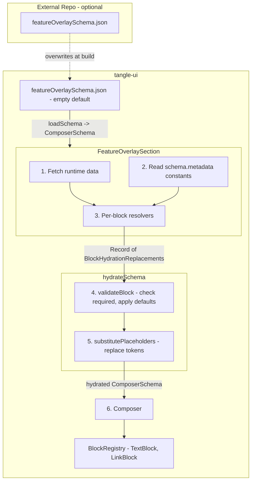
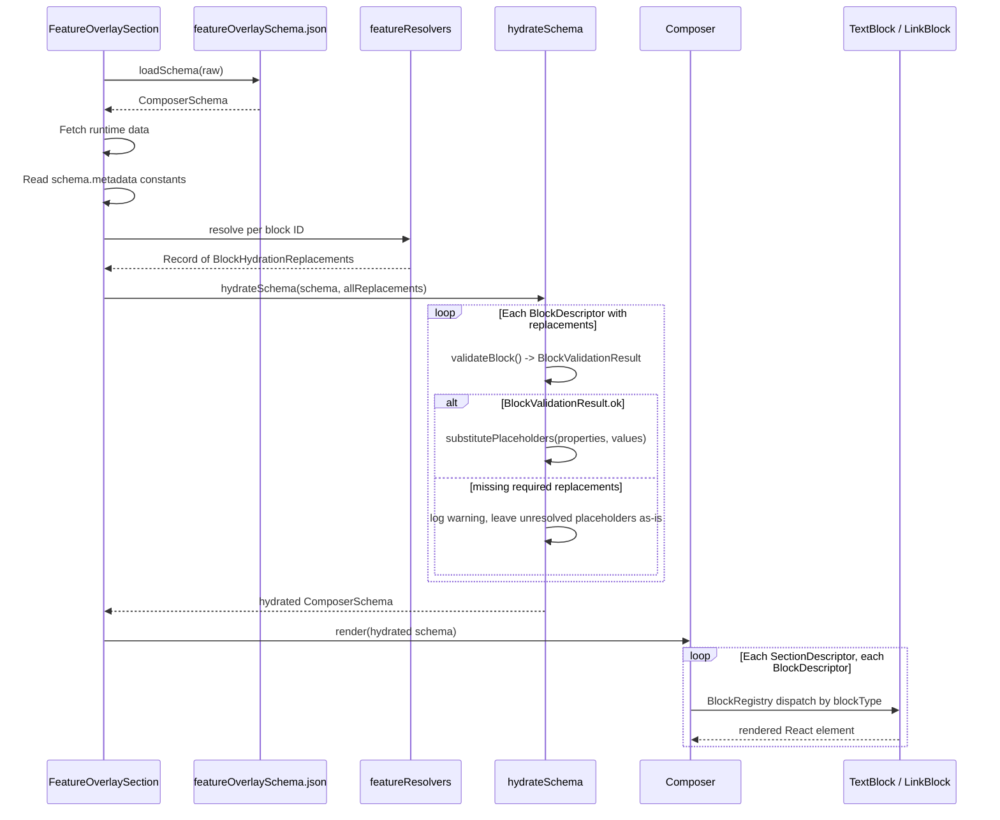

# Generic Overlay Guide

A developer guide for building custom overlays using the Composer system.

---

## Table of Contents

1. [Overview](#overview)
2. [Flow Diagram](#flow-diagram)
3. [Sequence Diagram](#sequence-diagram)
4. [File Structure](#file-structure)
5. [Quick Start: Creating Your First Overlay](#quick-start-creating-your-first-overlay)
6. [Reference Tables](#reference-tables)

---

## Overview

A **Generic Overlay** is a data-driven UI panel rendered from a JSON schema. Instead of hard-coding UI elements, you declare sections, blocks (text, links), and placeholder tokens in a `ComposerSchema` JSON file, then write resolver functions that supply runtime values. The Composer system validates the schema, hydrates placeholders, and renders the final UI through a registry of block components.

This pattern lets you:

- Define overlay content in JSON (no React changes needed for copy/URL tweaks)
- Swap schemas at build time (e.g., an external repo overwrites the default empty JSON)
- Add new overlays by creating three files: a schema JSON, a resolver module, and a section component

---

## Flow Diagram



**Data models at each step:**

| Step       | Data Model                   | Description                                                                      |
| ---------- | ---------------------------- | -------------------------------------------------------------------------------- |
| Load       | `ComposerSchema`             | Raw JSON parsed into `{ metadata, sections[] }`                                  |
| Resolve    | `BlockHydrationReplacements` | Per-block `Record<string, string / number / boolean>` of resolved values         |
| Validate   | `BlockValidationResult`      | Merges defaults, reports missing required replacements                           |
| Substitute | `ComposerSchema` (hydrated)  | Placeholders like `{podName}` replaced with actual values in properties          |
| Render     | `BlockDescriptor`            | Discriminated union dispatched to `TextBlock` or `LinkBlock` via `BlockRegistry` |

---

## Sequence Diagram



---

## File Structure

```
src/
├── config/
│   └── featureOverlaySchema.json          ← per feature
├── types/
│   └── composerSchema.ts
├── services/
│   └── composer/
│       └── hydrateSchema.ts
└── components/
    └── shared/
        ├── Composer/
        │   └── Composer.tsx
        ├── ContextPanel/
        │   └── Blocks/
        │       ├── TextBlock.tsx
        │       └── LinkBlock.tsx
        └── ReactFlow/.../TaskOverview/
            ├── FeatureOverlaySection.tsx   ← per feature
            └── featureResolvers.ts        ← per feature
```

| File                        | Scope       | Purpose                                                                                                          |
| --------------------------- | ----------- | ---------------------------------------------------------------------------------------------------------------- |
| `featureOverlaySchema.json` | Per feature | Schema JSON defining sections, blocks, replacements, and metadata constants                                      |
| `composerSchema.ts`         | Core        | Shared TypeScript types: `ComposerSchema`, `BlockDescriptor`, `TextBlockProperties`, `LinkBlockProperties`, etc. |
| `hydrateSchema.ts`          | Core        | `loadSchema`, `validateSchema`, `hydrateSchema`, `substitutePlaceholders` utilities                              |
| `Composer.tsx`              | Core        | Pure renderer: maps `ComposerSchema` to React components via `BlockRegistry`                                     |
| `TextBlock.tsx`             | Core        | Renders text blocks with tone, wrap, and visibility support                                                      |
| `LinkBlock.tsx`             | Core        | Renders link blocks with `buildUrl` and title fallback                                                           |
| `FeatureOverlaySection.tsx` | Per feature | Consumer component: fetches data, calls resolvers, hydrates schema, renders `Composer`                           |
| `featureResolvers.ts`       | Per feature | Per-block resolver functions that return `BlockHydrationReplacements`                                            |

---

## Quick Start: Creating Your First Overlay

This walkthrough creates a minimal overlay with one text block and one link block. You need to create three **per feature** files.

### Step 1: Define the Schema JSON

Create `src/config/statusOverlaySchema.json`:

```json
{
  "metadata": {
    "maxRetries": 3
  },
  "sections": [
    {
      "id": "statusInfo",
      "title": "Status",
      "blocks": [
        {
          "id": "greeting",
          "blockType": "TextBlock",
          "properties": {
            "text": "Hello, {userName}! You have {retriesLeft} of {maxRetries} retries remaining.",
            "tone": "default",
            "wrap": true
          },
          "replacements": {
            "userName": { "type": "string", "required": true },
            "retriesLeft": { "type": "number", "required": true },
            "maxRetries": { "type": "number", "required": true }
          }
        },
        {
          "id": "profileLink",
          "blockType": "LinkBlock",
          "properties": {
            "title": "View Profile",
            "urlTemplate": "https://example.com/users/profile",
            "queryParams": {
              "id": { "type": "string", "value": "{userId}" }
            }
          },
          "replacements": {
            "userId": { "type": "string", "required": true }
          }
        }
      ]
    }
  ]
}
```

Key points:

- `**metadata.maxRetries**` is a constant — resolvers read it at runtime, it is never a placeholder token
- `**{userName}**`, `**{retriesLeft}**`, and `**{maxRetries}**` are placeholder tokens — they must be declared in `replacements`
- `**maxRetries**` comes from `metadata` (a constant); `**retriesLeft**` comes from an API call — the resolver combines both sources
- `**{userId}**` is a placeholder inside `queryParams` — `substitutePlaceholders` recurses into nested objects

### Step 2: Write Resolvers

Create `statusResolvers.ts` next to your section component:

```typescript
type GreetingReplacements = {
  userName: string;
  retriesLeft: number;
  maxRetries: number;
};

type ProfileLinkReplacements = {
  userId: string;
};

// userProfile comes from an API hook (e.g., useFetchUserProfile)
export function resolveGreetingReplacements(
  metadata: Record<string, unknown>,
  userProfile: { name: string; retriesUsed: number },
): GreetingReplacements {
  const maxRetries =
    typeof metadata.maxRetries === "number" ? metadata.maxRetries : 0;

  return {
    userName: userProfile.name,
    retriesLeft: maxRetries - userProfile.retriesUsed,
    maxRetries,
  };
}

export function resolveProfileLinkReplacements(
  userId: string,
): ProfileLinkReplacements {
  return { userId };
}
```

Each resolver returns a typed object assignable to `BlockHydrationReplacements`. The keys must match the placeholder names declared in the schema's `replacements` for that block.

### Step 3: Create the Section Component

Create `StatusOverlaySection.tsx`:

```typescript
import { Composer } from "@/components/shared/Composer/Composer";
import overlaySchema from "@/config/statusOverlaySchema.json";
import { hydrateSchema, loadSchema } from "@/services/composer/hydrateSchema";
import type { BlockHydrationReplacements } from "@/types/composerSchema";

import {
  resolveGreetingReplacements,
  resolveProfileLinkReplacements,
} from "./statusResolvers";

const schema = loadSchema(overlaySchema);

interface StatusOverlayProps {
  userId: string;
}

export const StatusOverlaySection = ({
  userId,
}: StatusOverlayProps) => {
  // Fetch runtime data via API hook — same pattern as LogsEventsOverlaySection
  const { data: userProfile } = useFetchUserProfile(userId);

  if (schema.sections.length === 0) return null;
  if (!userProfile) return null;

  const { metadata } = schema;

  const allReplacements: Record<string, BlockHydrationReplacements> = {
    greeting: resolveGreetingReplacements(metadata, userProfile),
    profileLink: resolveProfileLinkReplacements(userId),
  };

  const hydrated = hydrateSchema(schema, allReplacements);
  return <Composer schema={hydrated} />;
};
```

The keys in `allReplacements` (`"greeting"`, `"profileLink"`) must match the block `id` values in the schema. `loadSchema` is called once at module level — it validates the schema on import and returns a typed `ComposerSchema`.

### Overwriting the Default Schema

The default schema JSON in `tangle-ui` is typically an empty shell (`{ "metadata": {}, "sections": [] }`). If your deployment uses a wrapper repository, you can overwrite the JSON file at build time with a populated schema. The Composer renders whatever the JSON contains — no code changes needed.

---

## Reference Tables

### TextBlockProperties

| Property    | Type                                             | Required | Default     | Description                                                                                                              |
| ----------- | ------------------------------------------------ | -------- | ----------- | ------------------------------------------------------------------------------------------------------------------------ |
| `text`      | `string`                                         | No       | —           | Display text. Supports `{placeholder}` tokens. Block renders nothing if omitted.                                         |
| `tone`      | `"default"` `"subdued"` `"warning"` `"critical"` | No       | `"subdued"` | Visual tone applied to the text color                                                                                    |
| `wrap`      | `boolean`                                        | No       | `false`     | Wrap long text instead of truncating with ellipsis                                                                       |
| `isVisible` | `boolean`                                        | No       | —           | Conditionally hide the block. Supports `{placeholder}` for runtime control (e.g., `"{isRunning}"` resolved to a boolean) |

### LinkBlockProperties

| Property      | Type                         | Required | Default | Description                                                                       |
| ------------- | ---------------------------- | -------- | ------- | --------------------------------------------------------------------------------- |
| `title`       | `string`                     | No       | —       | Clickable link text. Falls back to the raw URL if omitted (logs a `console.warn`) |
| `urlTemplate` | `string`                     | Yes      | —       | Base URL for the link                                                             |
| `queryParams` | `Record<string, QueryParam>` | No       | —       | Query parameters appended to the URL. Each value supports `{placeholder}` tokens  |

### QueryParam

| Type     | Format                                     | Description                                  |
| -------- | ------------------------------------------ | -------------------------------------------- |
| `string` | `{ "type": "string", "value": "literal" }` | Appended as `key=literal`                    |
| `json`   | `{ "type": "json", "value": { ... } }`     | Value is `JSON.stringify`'d then URL-encoded |

### ReplacementDescriptor

Declared per block under the `replacements` key. Each entry describes a `{placeholder}` token used in that block's properties.

| Property   | Type                              | Required | Default | Description                                                   |
| ---------- | --------------------------------- | -------- | ------- | ------------------------------------------------------------- |
| `type`     | `"string"` `"number"` `"boolean"` | Yes      | —       | Expected value type for the replacement                       |
| `required` | `boolean`                         | Yes      | —       | If `true`, hydration must provide a value or validation warns |
| `default`  | `string / number / boolean`       | No       | —       | Fallback value used when the resolver does not provide one    |

### Schema-Level Properties

| Property                | Type                                    | Description                                                                                                                                 |
| ----------------------- | --------------------------------------- | ------------------------------------------------------------------------------------------------------------------------------------------- |
| `metadata`              | `Record<string, unknown>`               | Constants accessible by resolvers (e.g., `paddingMinutes`, `retentionDays`). Not used as placeholders directly.                             |
| `sections[].id`         | `string`                                | Unique section identifier. Duplicates produce a validation warning.                                                                         |
| `sections[].title`      | `string`                                | Section heading rendered in the UI                                                                                                          |
| `blocks[].id`           | `string`                                | Unique block identifier. Used as the key in the `allReplacements` map passed to `hydrateSchema()`. Duplicates produce a validation warning. |
| `blocks[].blockType`    | `"TextBlock"` or `"LinkBlock"`          | Determines which component renders the block via `BlockRegistry`                                                                            |
| `blocks[].replacements` | `Record<string, ReplacementDescriptor>` | Declares which `{placeholder}` tokens exist in this block's properties. Keys are placeholder names, not block IDs.                          |
