# Tangle AI Dispatcher -- Architecture

## Overview

The Tangle AI Dispatcher is a multi-agent system that assists users with ML pipeline tasks through natural language conversation. It operates as a standalone REST server that the Tangle UI communicates with via HTTP. The system is built on the [Deep Agents SDK](https://docs.langchain.com/oss/javascript/deepagents/overview) (TypeScript) and reuses the CSOM (Component Spec Object Model) from the main application for pipeline manipulation.

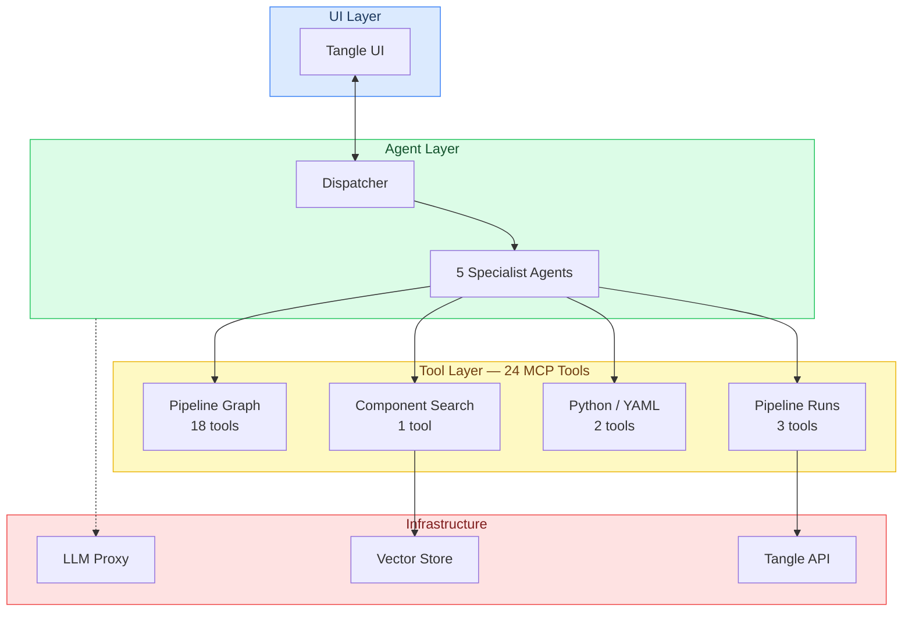

A **Dispatcher** agent classifies user intent and delegates to one of five specialist sub-agents:

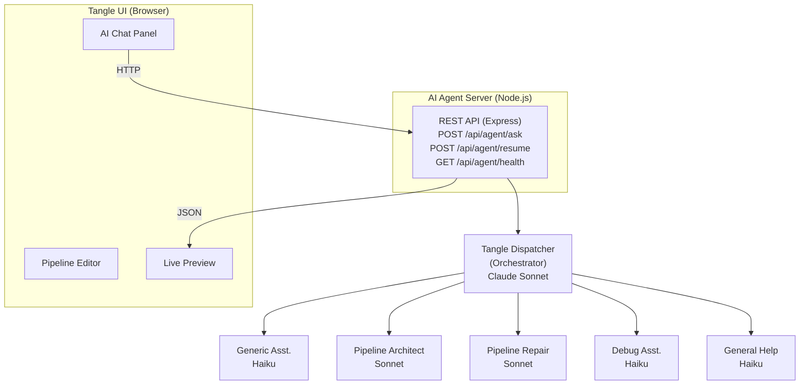

---

## System Architecture

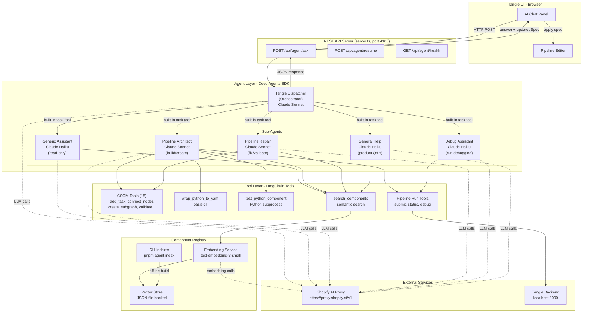

---

## Agent Hierarchy

The system uses a two-tier agent model built on the Deep Agents SDK's `createDeepAgent` and `SubAgent` primitives.

### Tier 0 -- Tangle Dispatcher (Orchestrator)

| Property       | Value                                                                                 |
| -------------- | ------------------------------------------------------------------------------------- |
| **File**       | `agents/tangleDispatcher.ts`                                                          |
| **Model**      | Claude Sonnet (`claude-sonnet-4-6`)                                                   |
| **Role**       | Classifies user intent and delegates to the appropriate specialist sub-agent          |
| **Tools**      | `get_pipeline_state` (for context to aid routing decisions)                           |
| **Sub-agents** | Generic Assistant, Pipeline Architect, Pipeline Repair, Debug Assistant, General Help |
| **Prompt**     | `prompts/dispatcher.md`                                                               |

The dispatcher owns the conversation thread and the pipeline spec. It classifies each user message into one of six categories:

| Intent                      | Sub-Agent                     | Example                       |
| --------------------------- | ----------------------------- | ----------------------------- |
| Understand/explain pipeline | `generic-assistant`           | "What does this pipeline do?" |
| Build a new pipeline        | `pipeline-architect`          | "Build a CSV dedup pipeline"  |
| Fix validation/errors       | `pipeline-repair`             | "Fix validation issues"       |
| Debug a failed run          | `debug-assistant`             | "Why did my run fail?"        |
| General Tangle question     | `general-help`                | "What is artifact retention?" |
| Off-topic                   | _Dispatcher rejects directly_ | "What's the weather in SF?"   |

### Tier 1 -- Generic Assistant (Read-Only)

| Property   | Value                                                         |
| ---------- | ------------------------------------------------------------- |
| **File**   | `agents/subagents/genericAssistant.ts`                        |
| **Model**  | Claude Haiku (`claude-haiku-4-5`)                             |
| **Role**   | Explain pipeline structure, data flow, and component behavior |
| **Tools**  | `get_pipeline_state`, `search_components`                     |
| **Prompt** | `prompts/genericAssistant.md`                                 |

Read-only agent that inspects the current pipeline and explains what it does. Uses component registry search to enrich explanations with component details.

### Tier 1 -- Pipeline Architect (Builder)

| Property   | Value                                                                                                               |
| ---------- | ------------------------------------------------------------------------------------------------------------------- |
| **File**   | `agents/pipelineArchitect.ts`                                                                                       |
| **Model**  | Claude Sonnet (`claude-sonnet-4-6`)                                                                                 |
| **Role**   | Build new pipelines, add stages, discover/create components, assemble graph                                         |
| **Tools**  | 18 CSOM tools, `search_components`, 3 pipeline run tools, `wrap_python_to_yaml`, `test_python_component` (24 total) |
| **Prompt** | `prompts/architect.md`                                                                                              |

Full builder agent that decomposes user intent into pipeline plans. Searches the component registry, creates new components via Python/YAML when needed, and assembles the pipeline graph using CSOM tools.

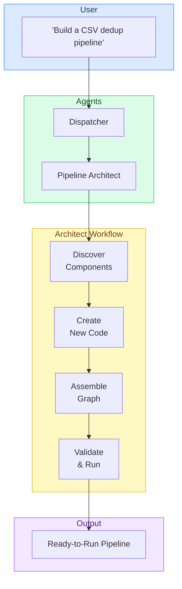

### Tier 1 -- Pipeline Repair (Fixer)

| Property   | Value                                                                  |
| ---------- | ---------------------------------------------------------------------- |
| **File**   | `agents/subagents/pipelineRepair.ts`                                   |
| **Model**  | Claude Sonnet (`claude-sonnet-4-6`)                                    |
| **Role**   | Diagnose and fix validation issues, broken connections, missing inputs |
| **Tools**  | 18 CSOM tools, `search_components` (19 total)                          |
| **Prompt** | `prompts/pipelineRepair.md`                                            |

Runs `validate_pipeline`, analyzes each issue, applies automatic fixes where safe, and asks the user for input when fixes are ambiguous.

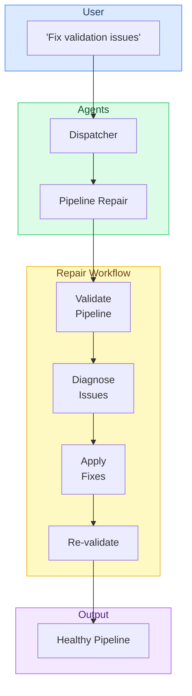

### Tier 1 -- Debug Assistant (Run Debugger)

| Property   | Value                                                                               |
| ---------- | ----------------------------------------------------------------------------------- |
| **File**   | `agents/subagents/debugAssistant.ts`                                                |
| **Model**  | Claude Haiku (`claude-haiku-4-5`)                                                   |
| **Role**   | Analyze failed pipeline runs, explain errors, suggest fixes                         |
| **Tools**  | `get_pipeline_state`, `submit_pipeline_run`, `get_run_status`, `debug_pipeline_run` |
| **Prompt** | `prompts/debugAssistant.md`                                                         |

Fetches run data from the Tangle backend, identifies failed tasks, reads error logs, and explains root causes.

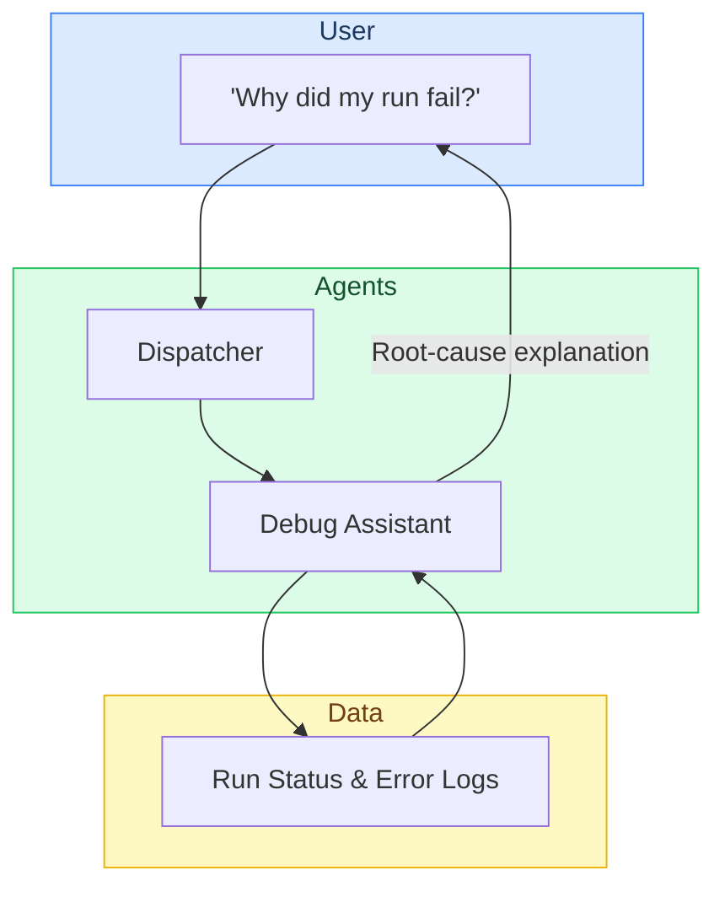

### Tier 1 -- General Help (Product Q&A)

| Property   | Value                                                       |
| ---------- | ----------------------------------------------------------- |
| **File**   | `agents/subagents/generalHelp.ts`                           |
| **Model**  | Claude Haiku (`claude-haiku-4-5`)                           |
| **Role**   | Answer questions about Tangle concepts, features, practices |
| **Tools**  | `search_components`                                         |
| **Prompt** | `prompts/generalHelp.md`                                    |

Answers general product questions using built-in knowledge and the component registry for component-specific queries.

---

## Tool Inventory

### CSOM Tools (18 tools) -- `mcp/csomTools.ts`

These wrap the MobX Keystone models from `src/models/componentSpec/`. All tools operate on a shared in-memory `ComponentSpec` instance.

| Tool                       | CSOM Action                                       | Description                                            |
| -------------------------- | ------------------------------------------------- | ------------------------------------------------------ |
| `get_pipeline_state`       | `serializeComponentSpec()`                        | Serialize current spec to JSON                         |
| `set_pipeline_name`        | `spec.setName()`                                  | Set pipeline name                                      |
| `set_pipeline_description` | `spec.setDescription()`                           | Set pipeline description                               |
| `add_task`                 | `createTaskFromComponentRef()` + `spec.addTask()` | Add a task node with component reference               |
| `delete_task`              | `spec.deleteTaskById()`                           | Delete task + all its bindings                         |
| `rename_task`              | `spec.renameTask()`                               | Rename a task (uniqueness enforced)                    |
| `add_input`                | `new Input()` + `spec.addInput()`                 | Add pipeline-level input                               |
| `delete_input`             | `spec.deleteInputById()`                          | Delete input + bindings                                |
| `rename_input`             | `spec.renameInput()`                              | Rename pipeline input                                  |
| `add_output`               | `new Output()` + `spec.addOutput()`               | Add pipeline-level output                              |
| `delete_output`            | `spec.deleteOutputById()`                         | Delete output + bindings                               |
| `rename_output`            | `spec.renameOutput()`                             | Rename pipeline output                                 |
| `connect_nodes`            | `spec.connectNodes()`                             | Connect source port to target port (replaces existing) |
| `delete_edge`              | `spec.deleteEdgeById()`                           | Delete a binding                                       |
| `set_task_argument`        | `spec.setTaskArgument()`                          | Set literal value on task input (clears binding)       |
| `create_subgraph`          | `createSubgraph()`                                | Group tasks into a subgraph node                       |
| `unpack_subgraph`          | `unpackSubgraph()`                                | Inline subgraph back into parent                       |
| `validate_pipeline`        | `validateSpec()`                                  | Schema, type, cycle, and completeness validation       |

### Component Registry Tools -- `registry/searchService.ts`

| Tool                | Description                                                                                                                                                        |
| ------------------- | ------------------------------------------------------------------------------------------------------------------------------------------------------------------ |
| `search_components` | Semantic search over the component vector store. Embeds the query, runs cosine similarity, returns top-K results with name, description, I/O types, and YAML text. |

### Python / YAML Tools -- `mcp/yamlWrapTools.ts`, `mcp/pythonTestTools.ts`

| Tool                    | Description                                                                                       |
| ----------------------- | ------------------------------------------------------------------------------------------------- |
| `wrap_python_to_yaml`   | Converts a Python function to Tangle component YAML via oasis-cli in a temp directory.            |
| `test_python_component` | Runs a Python function with test code in an isolated subprocess. Returns stdout/stderr/exit code. |

### Pipeline Run Tools -- `mcp/pipelineRunTools.ts`

| Tool                  | Description                                      |
| --------------------- | ------------------------------------------------ |
| `submit_pipeline_run` | `POST /api/runs/` on the Tangle backend          |
| `get_run_status`      | `GET /api/runs/:runId`                           |
| `debug_pipeline_run`  | Fetches run details + per-task statuses and logs |

### Tool Distribution per Sub-Agent

| Sub-Agent              | Tools                                                                                            |
| ---------------------- | ------------------------------------------------------------------------------------------------ |
| **Dispatcher**         | `get_pipeline_state`                                                                             |
| **Generic Assistant**  | `get_pipeline_state`, `search_components`                                                        |
| **Pipeline Architect** | All 18 CSOM, `search_components`, 3 pipeline run, `wrap_python_to_yaml`, `test_python_component` |
| **Pipeline Repair**    | All 18 CSOM, `search_components`                                                                 |
| **Debug Assistant**    | `get_pipeline_state`, 3 pipeline run tools                                                       |
| **General Help**       | `search_components`                                                                              |

---

## RAG Services (Component Registry & Help Docs)

Two RAG pipelines give the agent semantic search over components and product documentation. Both share the same embedding model and vector store infrastructure.

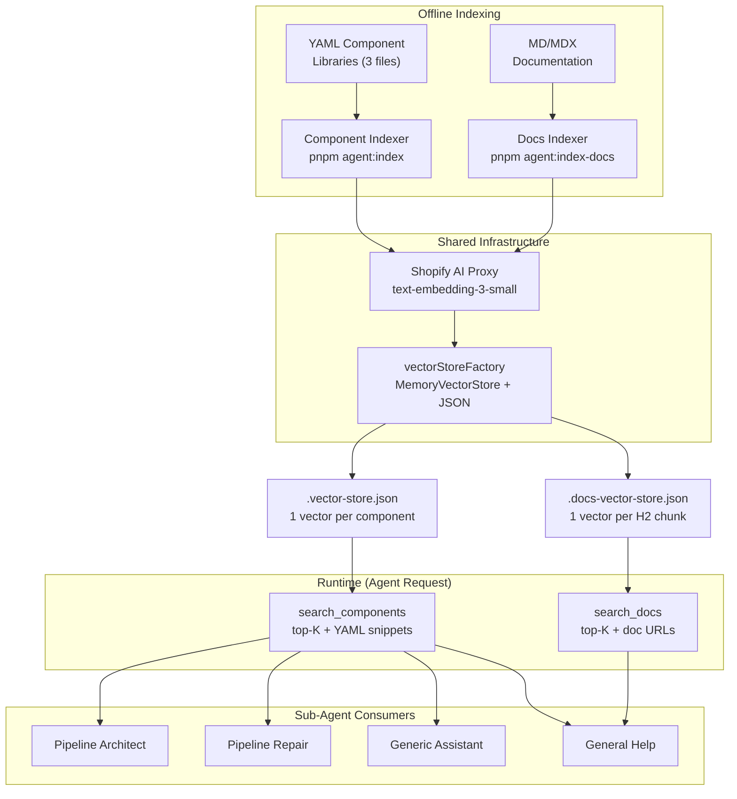

### Component Registry (detail)

The component registry provides semantic search over Tangle components so the agent can find existing components before creating new ones.

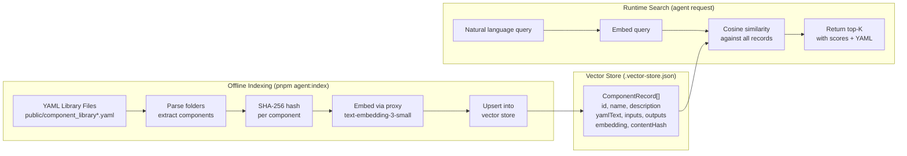

### Indexing

The CLI tool (`scripts/agent/registry/indexer.ts`) reads three YAML library files:

- `public/component_library.yaml` -- hydrated main catalog
- `public/component_library.custom.yaml` -- curated components
- `public/component_library.discovery.yaml` -- Shopify/Discovery components (with inline YAML)

For each component it:

1. Extracts name, description, inputs, outputs from YAML metadata or inline `text` blocks
2. Computes a SHA-256 content hash (skips unchanged components on re-index)
3. Builds an embedding text: `name + description + category path + inputs + outputs`
4. Embeds in batches of 50 via the proxy
5. Upserts into the file-backed vector store

### Search

At runtime, the search service (`registry/searchService.ts`):

1. Loads the vector store from disk on first request
2. Embeds the query string
3. Runs cosine similarity against all stored embeddings
4. Returns top-K results with scores, metadata, and YAML text (truncated to 2000 chars)

### Storage

The vector store (`registry/store.ts`) is a simple JSON file:

```json
{
  "version": 1,
  "embeddingModel": "text-embedding-3-small",
  "records": [
    {
      "id": "...",
      "name": "Train XGBoost model on CSV",
      "description": "...",
      "yamlText": "...",
      "inputs": [{"name": "data", "type": "CSV"}],
      "outputs": [{"name": "model", "type": "XGBoostModel"}],
      "embedding": [0.012, -0.034, ...],
      "contentHash": "5b8bec67..."
    }
  ]
}
```

Designed to be swapped for Qdrant or pgvector later without changing the search interface.

---

## LLM Proxy Configuration

All LLM and embedding API calls route through the Shopify AI Proxy. No direct provider SDK is used at the transport layer -- everything goes through an OpenAI-compatible interface.

```
Agent (Node.js)  --->  https://proxy.shopify.ai/v1  --->  Claude / Embedding Models
                       X-Shopify-Access-Token: $OPENAI_API_KEY
```

This is configured centrally in `config.ts` via two factory functions:

- `createProxyModel(modelName)` -- returns a `ChatOpenAI` instance with proxy `baseURL` and auth header
- `createProxyEmbeddings()` -- returns an `OpenAIEmbeddings` instance with the same proxy config

The proxy transparently routes `claude-sonnet-4-6`, `claude-haiku-4-5`, and `text-embedding-3-small` to the appropriate backend.

---

## REST API

| Endpoint            | Method | Description                                              |
| ------------------- | ------ | -------------------------------------------------------- |
| `/api/agent/ask`    | POST   | Send a message to the Tangle dispatcher                  |
| `/api/agent/resume` | POST   | Resume an interrupted thread (HITL, not yet implemented) |
| `/api/agent/health` | GET    | Health check                                             |

### POST /api/agent/ask

**Request:**

```json
{
  "message": "Build a pipeline that reads CSV and trains an XGBoost model",
  "currentSpec": { ... },
  "threadId": "thread-123",
  "selectedEntityId": "task_abc123"
}
```

- `message` (required) -- user's natural language request
- `currentSpec` (optional) -- current pipeline spec JSON; deserialized into the CSOM model
- `threadId` (optional) -- for multi-turn conversations; auto-generated if omitted
- `selectedEntityId` (optional) -- `$id` of the entity selected in the editor; appended to context so the agent understands "this node"

**Response:**

```json
{
  "answer": "I've built a two-stage pipeline with...",
  "updatedSpec": { ... },
  "threadId": "thread-123"
}
```

- `answer` -- the agent's natural language response
- `updatedSpec` -- the full pipeline spec JSON after all tool calls have been applied
- `threadId` -- thread identifier for follow-up messages

### Request Lifecycle

Every request follows four phases. First, the UI sends the user's message along with the current pipeline spec to the REST server, which hydrates the in-memory spec model. The server then hands the message to the Dispatcher, which asks the LLM to classify the user's intent and pick the right sub-agent. That sub-agent takes over, planning its approach and calling CSOM tools (add tasks, connect nodes, validate, etc.) to mutate the pipeline. Once the sub-agent finishes, the updated spec and a natural-language answer bubble back through the Dispatcher and server to the UI, which applies the changes to the editor in one shot.

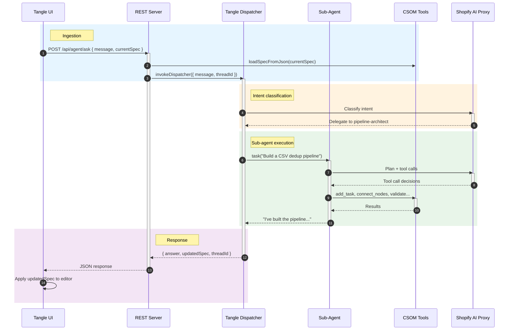

### SSE Command Flow

The server streams events to the UI over a single SSE connection. Sub-agents emit commands as they work; the server relays each one so the UI can apply changes live.

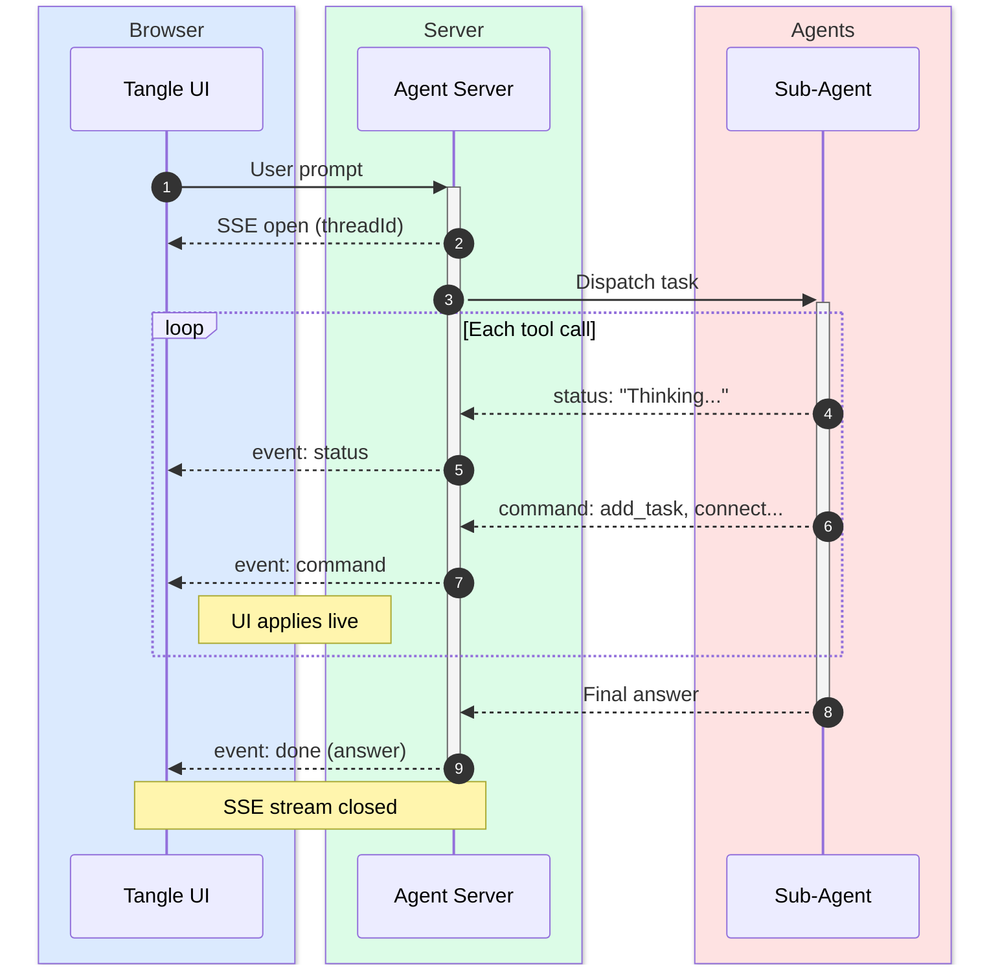

---

## Rich UI Elements (Chips)

Agent responses are rendered as Markdown in the AI Chat panel. Two custom URI protocols -- `entity://` and `component://` -- allow agents to embed interactive chip elements inline within their prose. Standard Markdown link syntax is used; the `renderMarkdown` renderer (`src/routes/v2/pages/Editor/components/AiChat/components/renderMarkdown.tsx`) intercepts these protocols and replaces the link with the corresponding chip component.

### Protocol Syntax

Agents emit standard Markdown links whose `href` uses a custom protocol:

```markdown
<!-- Entity chip — references a task, input, or output in the current pipeline -->
[Preprocess Data](entity://task_abc123)

<!-- Component chip — references a component from the registry -->
[Train XGBoost](component://train-xgboost-on-csv)
```

The link label becomes the chip's display text. The identifier after the protocol prefix is the entity `$id` or component ID respectively.

### `entity://` — Pipeline Entity Chip

Renders an **EntityChip** (`EntityChip.tsx`) for tasks, inputs, and outputs in the current pipeline.

| Aspect          | Detail                                                                                   |
| --------------- | ---------------------------------------------------------------------------------------- |
| **Protocol**    | `entity://<entityId>`                                                                    |
| **Resolved by** | Looks up the entity in the current `rootSpec` (tasks, inputs, outputs)                   |
| **Icon**        | Context-aware: `SquareFunction` (task), `ArrowRightToLine` (input), `ArrowLeftFromLine` (output) |
| **Click**       | Navigates the editor to the referenced entity (selects + focuses the node on the canvas) |

### `component://` — Component Registry Chip

Renders a **ComponentChip** (`ComponentChip.tsx`) for components discovered via the registry.

| Aspect          | Detail                                                                                             |
| --------------- | -------------------------------------------------------------------------------------------------- |
| **Protocol**    | `component://<componentId>`                                                                        |
| **Resolved by** | Looks up `componentId` in the `componentReferences` map returned with the agent's `done` SSE event |
| **Icon**        | `Puzzle`                                                                                           |
| **Click**       | Opens the `ComponentDetailsDialog` showing the component's YAML spec in read-only mode             |
| **Drag**        | Draggable onto the pipeline canvas to add the component as a new task node                         |

### Data Flow

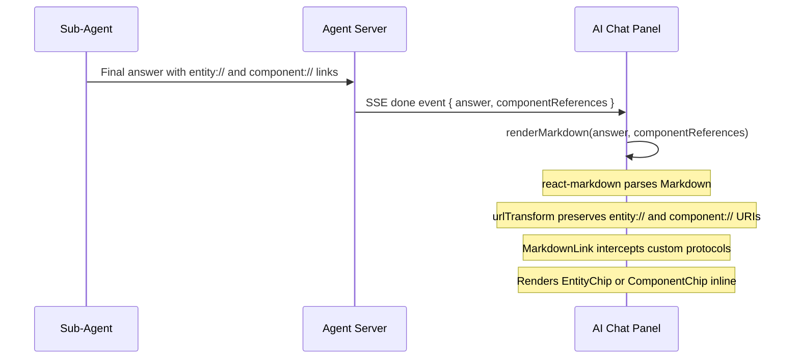

### How It Works

1. **Agent output**: Sub-agents include `entity://` and `component://` links in their Markdown responses. Component references (name + YAML text) are returned alongside the answer in the `done` SSE event as `componentReferences`.
2. **URL preservation**: `react-markdown` normally sanitizes unknown protocols. A custom `urlTransform` function passes `entity://` and `component://` URIs through unchanged while delegating all others to the default sanitizer.
3. **Link rendering**: The custom `MarkdownLink` component checks each link's `href`. If it starts with `entity://`, it renders an `EntityChip`; if `component://`, a `ComponentChipFromContext` that pulls the component's YAML data from React context; otherwise a standard `<a>` tag.
4. **Context injection**: `componentReferences` is passed into the Markdown tree via a React context provider (`ComponentRefsContext`), making it available to any `ComponentChip` rendered inside the Markdown without prop drilling.

---

## CSOM Integration

The CSOM (Component Spec Object Model) from `src/models/componentSpec/` is imported directly into the agent server. Since both the Tangle UI and the agent run on Node.js via tsx, the MobX Keystone models work without modification.

Key integration points:

- **Deserialization**: `YamlDeserializer` converts the JSON spec from the UI into a live `ComponentSpec` model
- **Manipulation**: All 18 CSOM tools operate on the in-memory model using `@modelAction` methods
- **Serialization**: `serializeComponentSpec()` converts back to JSON wire format for the response
- **Validation**: `validateSpec()` runs schema checks, port-type compatibility, cycle detection, and required-input enforcement

The spec is managed per-request: the UI sends the current spec, the agent manipulates it, and returns the updated version.

---

## File Structure

```
scripts/agent/
  ARCHITECTURE.md                # This file
  server.ts                      # Express REST API entry point
  config.ts                      # Proxy config, model names, env vars

  agents/
    tangleDispatcher.ts          # Dispatcher agent (createDeepAgent, entry point)
    pipelineArchitect.ts         # Pipeline Architect sub-agent (builder)
    subagents/
      genericAssistant.ts        # Generic Assistant sub-agent (read-only explainer)
      pipelineRepair.ts          # Pipeline Repair sub-agent (fixer)
      debugAssistant.ts          # Debug Assistant sub-agent (run debugger)
      generalHelp.ts             # General Help sub-agent (product Q&A)

  mcp/
    csomTools.ts                 # 18 CSOM tools (LangChain tool wrappers)
    yamlWrapTools.ts             # wrap_python_to_yaml (oasis-cli)
    pythonTestTools.ts           # test_python_component (subprocess)
    pipelineRunTools.ts          # submit, status, debug pipeline runs
    registry.ts                  # Aggregated tool exports

  registry/
    indexer.ts                   # CLI: pnpm agent:index
    searchService.ts             # In-process semantic search + search_components tool
    embeddingService.ts          # Proxy-routed OpenAI embeddings
    store.ts                     # File-backed vector store (cosine similarity)
    types.ts                     # ComponentRecord, SearchResult, VectorStoreData

  prompts/
    dispatcher.md                # Tangle Dispatcher system prompt
    architect.md                 # Pipeline Architect system prompt
    genericAssistant.md          # Generic Assistant system prompt
    pipelineRepair.md            # Pipeline Repair system prompt
    debugAssistant.md            # Debug Assistant system prompt
    generalHelp.md               # General Help system prompt

  skills/
    tangleBestPractices/
      SKILL.md                   # Pipeline best practices reference
    componentYamlFormat/
      SKILL.md                   # Component YAML format reference
```

---

## Environment Variables

| Variable             | Default                                     | Description                               |
| -------------------- | ------------------------------------------- | ----------------------------------------- |
| `OPENAI_API_KEY`     | (required)                                  | Shopify AI Proxy token                    |
| `AGENT_PORT`         | `4100`                                      | REST server port                          |
| `TANGLE_API_URL`     | `http://localhost:8000`                     | Tangle backend URL                        |
| `AI_PROXY_BASE_URL`  | `https://proxy.shopify.ai/v1`               | LLM proxy base URL                        |
| `ORCHESTRATOR_MODEL` | `claude-sonnet-4-6`                         | Model for dispatcher + architect + repair |
| `SUBAGENT_MODEL`     | `claude-haiku-4-5`                          | Model for read-only sub-agents            |
| `EMBEDDING_MODEL`    | `text-embedding-3-small`                    | Embedding model name                      |
| `VECTOR_STORE_PATH`  | `scripts/agent/registry/.vector-store.json` | Vector store file path                    |

---

## Running

```bash
# 1. Index component libraries (one-time, or when libraries change)
OPENAI_API_KEY=<token> pnpm agent:index

# 2. Start the agent server
OPENAI_API_KEY=<token> pnpm agent:server

# 3. Test with curl
curl -X POST http://localhost:4100/api/agent/ask \
  -H "Content-Type: application/json" \
  -d '{"message": "Build a pipeline that reads CSV, deduplicates rows, and uploads to S3"}'
```

---

## Key Design Decisions

| Decision                                               | Rationale                                                                                                                                                                                 |
| ------------------------------------------------------ | ----------------------------------------------------------------------------------------------------------------------------------------------------------------------------------------- |
| **Dispatcher pattern** over single monolithic agent    | Specialized sub-agents are more focused, produce better results, and use cheaper models (Haiku) for simpler tasks. The dispatcher adds minimal latency for intent classification.         |
| **Deep Agents SDK** over raw LangGraph                 | Built-in planning (`write_todos`), sub-agent spawning (`task` tool), context summarization, and file system tools. Same architecture as the design doc but in TypeScript.                 |
| **REST** over WebSocket                                | Simpler to debug and test. SSE streaming can be added later. Thread state is managed server-side via `MemorySaver`.                                                                       |
| **In-process tools** instead of separate MCP server    | Avoids HTTP overhead for tool calls. Tools are LangChain `tool()` functions that directly call CSOM methods. Can be extracted to a standalone MCP server later.                           |
| **File-backed vector store** instead of Qdrant         | Component catalog is small (hundreds). Cosine similarity over an in-memory array is fast enough. Zero infrastructure dependency. Same interface allows swapping to Qdrant/pgvector later. |
| **Direct CSOM reuse** from `src/models/componentSpec/` | MobX Keystone models work in Node.js via tsx. No duplication of pipeline manipulation logic.                                                                                              |
| **Shopify AI Proxy** for all LLM/embedding             | Single auth mechanism, model routing handled by proxy. Uses `@langchain/openai` with custom `baseURL` -- no direct Anthropic SDK needed.                                                  |
| **Model tiering**                                      | Sonnet for reasoning-heavy tasks (dispatcher, architect, repair). Haiku for simpler tasks (explainer, debug, help). Configurable via env vars.                                            |
| **Off-topic rejection in dispatcher**                  | The dispatcher's system prompt explicitly declines non-Tangle questions without spawning a sub-agent, keeping costs and latency minimal.                                                  |
