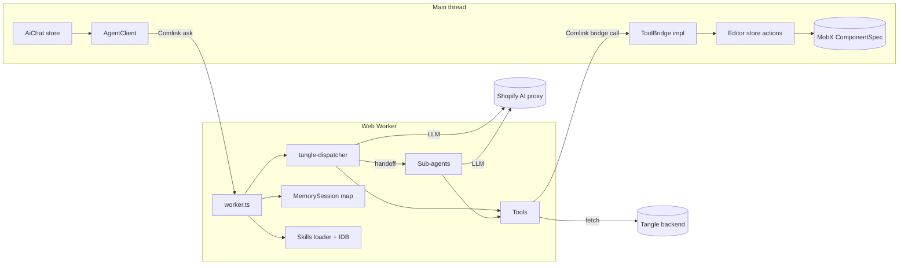
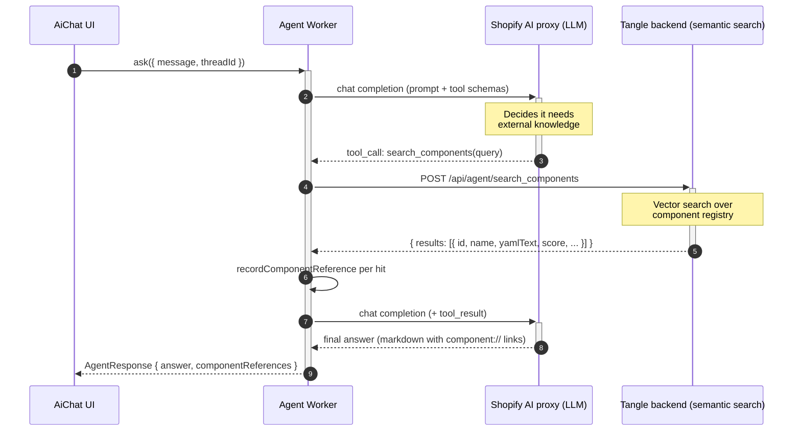
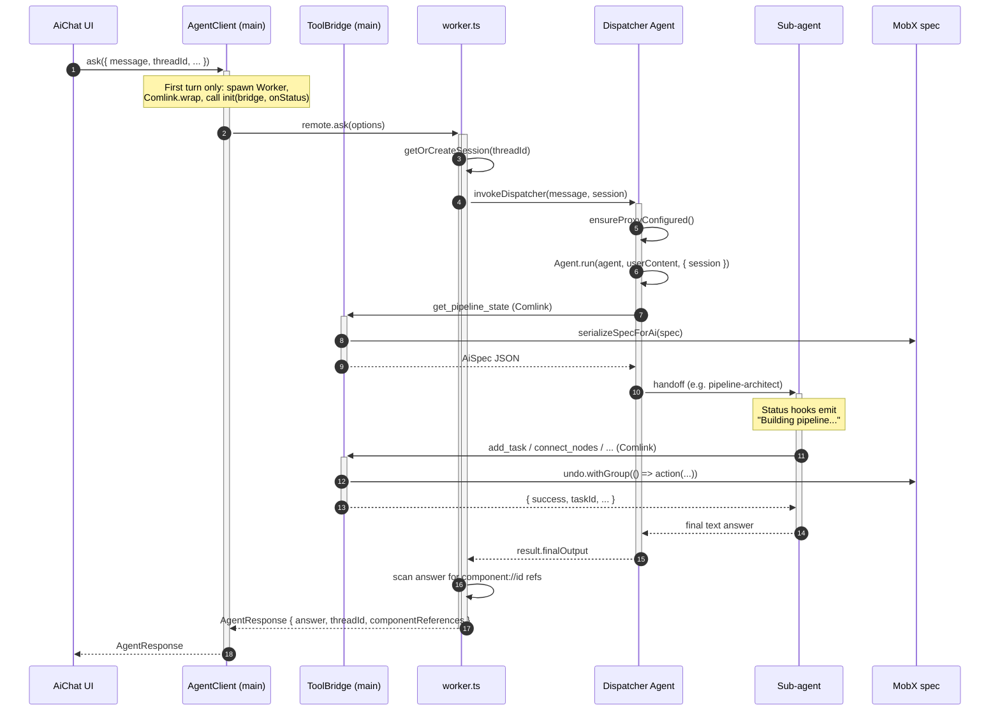
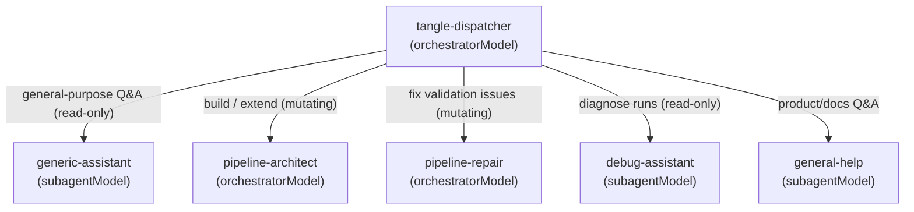
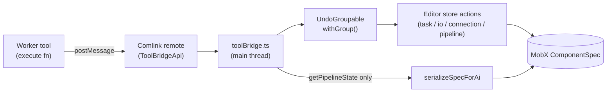

# Agent architecture

This document describes the in-browser agent that lives under [`src/agent/`](src/agent/). It is the implementation behind the AI Chat panel in the v2 editor.

The agent is split across two threads:

- The **main thread** owns the live MobX `ComponentSpec`, the React UI, and the chat store.
- A dedicated **Web Worker** owns all LLM traffic, the OpenAI Agents SDK runtime, tool execution, prompt assembly, and per-thread conversation memory.

The two halves communicate over [Comlink](https://github.com/GoogleChromeLabs/comlink). The worker holds a Comlink-proxied `ToolBridgeApi` that it invokes whenever a tool needs to read or mutate the spec; the bridge implementation on the main thread routes those calls into MobX actions inside an undo group, so the agent's edits show up in the editor immediately and undo as a single user action.

All LLM requests are routed through the Shopify AI proxy, configured at boot in [`config.ts`](src/agent/config.ts).

## Directory layout

- [`worker.ts`](src/agent/worker.ts) — Web Worker entry point. Exposes `init` and `ask` via Comlink.
- [`agents/tangleDispatcher.ts`](src/agent/agents/tangleDispatcher.ts) — Top-level dispatcher agent and the `invokeDispatcher` entry point.
- [`agents/subagents/`](src/agent/agents/subagents/) — Five sub-agents that the dispatcher hands off to.
- [`tools/`](src/agent/tools/) — Tool definitions: CSOM mutations, registry/docs search, run submission, execution debugging.
- [`toolBridgeApi.ts`](src/agent/toolBridgeApi.ts) — The contract between the worker and the main-thread bridge. Pure types.
- [`session.ts`](src/agent/session.ts) — Per-turn `AgentSession` (thread id, bridge proxy, status callback, recent runs, component-reference map).
- [`middleware/observability.ts`](src/agent/middleware/observability.ts) — Translates SDK lifecycle events into status strings for the UI.
- [`skills/loader.ts`](src/agent/skills/loader.ts) — ETag-revalidated fetch of `SKILL.md` documents, cached in IndexedDB.
- [`idb/agentDb.ts`](src/agent/idb/agentDb.ts) — Dexie schema for the skill cache.
- [`prompts/*.md`](src/agent/prompts/) — Raw prompt text imported via Vite `?raw`.
- [`config.ts`](src/agent/config.ts) — Env-driven proxy and model configuration.
- [`types.ts`](src/agent/types.ts) — Shared types (`AgentResponse`, `ComponentRefData`).

## High-level topology



## Request lifecycle

Two views of the same turn. The first is a high-level overview of the LLM round-trip and how external knowledge-base tool calls are resolved through the backend. The second is a detailed trace including handoffs, MobX mutations, and the response shape.

### High-level: chat turn and a knowledge-base tool call

This view collapses the dispatcher / sub-agent topology and the bridge into single boxes. It focuses on the loop between the worker and the LLM proxy, and the round-trip the worker performs to the Tangle backend when the model issues a knowledge-base tool call (`search_components` or `search_docs`).



Key points:

- Steps 2-3: the worker drives the agent loop. Every turn issues one or more chat completions to the proxy; the LLM never talks to the backend directly.
- Steps 4-6: knowledge-base tools (`search_components`, `search_docs`) are plain `fetch` calls inside the worker's tool `execute` body. The backend owns the vector index and embeddings — the worker just forwards the natural-language query and receives ranked hits. See [`searchComponents.ts`](src/agent/tools/searchComponents.ts) and [`searchDocs.ts`](src/agent/tools/searchDocs.ts).
- Step 7: hits are stored in `session.componentReferences` so that any `[Name](component://id)` link in the final answer can be expanded into a chip on the main thread.
- Steps 8-9: the worker re-enters the proxy loop with the tool result appended. This may repeat for additional tool calls before the model emits a final answer.

The same shape applies to other read-only tools (`search_docs`, the execution-debug tools, `get_run_status`): LLM emits a `tool_call`, worker hits an HTTP endpoint, result returns to the model. Mutating tools (CSOM) follow the detailed diagram below instead, because they cross the Comlink boundary back to the main thread.

### Detailed: full turn with handoff and bridge

The diagram below traces a single `ask()` turn end-to-end. The very first turn also performs lazy worker spawn and `init`; subsequent turns reuse the same worker and the `MemorySession` keyed on `threadId`.



Notes on individual steps of the detailed diagram:

- Steps 1-3: lazy spawn is implemented in [`agentClient.ts`](src/routes/v2/pages/Editor/components/AiChat/agentClient.ts). The bridge proxy and status callback must be passed as separate top-level arguments to `init` because Comlink only applies its proxy transfer handler to top-level argument values.
- Step 4: `MemorySession` per `threadId` lives for the lifetime of the worker. Reload drops it.
- Steps 6-9: `Agent.run` is the `@openai/agents` driver loop. It iterates LLM → tool calls → LLM until the agent emits final output or hands off.
- Steps 10-13: a handoff swaps the active agent. Observability hooks are attached to each sub-agent in [`tangleDispatcher.ts`](src/agent/agents/tangleDispatcher.ts) and each subagent factory so status events keep flowing after the handoff.
- Step 19: see [`worker.ts`](src/agent/worker.ts) lines 95-100 for the substring-match that decides which `componentReferences` to surface to the main thread.

## Dispatcher and sub-agents

The dispatcher is built fresh per turn but pinned to the per-thread `MemorySession` so multi-turn conversation memory survives across calls. It carries only `get_pipeline_state` as a direct tool — every other capability is reachable via handoff.



Each sub-agent declares its capability via `handoffDescription`; the dispatcher's prompt ([`prompts/dispatcher.md`](src/agent/prompts/dispatcher.md)) plus the `RECOMMENDED_PROMPT_PREFIX` from `@openai/agents-core` teaches it to pick the right one. The bindings live here:

```30:45:src/agent/agents/tangleDispatcher.ts
function createDispatcherAgent(session: AgentSession) {
  const csom = createCsomTools(session.bridge);
  const agent = Agent.create({
    name: "tangle-dispatcher",
    model: config.orchestratorModel,
    instructions: `${RECOMMENDED_PROMPT_PREFIX}\n\n${dispatcherPrompt}`,
    tools: [csom.getPipelineState],
    handoffs: [
      createGenericAssistantAgent(session),
      createPipelineArchitectAgent(session),
      createPipelineRepairAgent(session),
      createDebugAssistantAgent(session),
      createGeneralHelpAgent(session),
    ],
  });
```

Tool surface per sub-agent:

- **`generic-assistant`** ([genericAssistant.ts](src/agent/agents/subagents/genericAssistant.ts)) — `get_pipeline_state`, `search_components`. Read-only.
- **`pipeline-architect`** ([pipelineArchitect.ts](src/agent/agents/subagents/pipelineArchitect.ts)) — full CSOM toolset, `search_components`, `pipelineRunTools`. Mutating + can submit runs.
- **`pipeline-repair`** ([pipelineRepair.ts](src/agent/agents/subagents/pipelineRepair.ts)) — full CSOM toolset, `search_components`. Mutating.
- **`debug-assistant`** ([debugAssistant.ts](src/agent/agents/subagents/debugAssistant.ts)) — `get_pipeline_state`, `executionDebugTools`. Read-only. Receives recent runs as appended prompt context.
- **`general-help`** ([generalHelp.ts](src/agent/agents/subagents/generalHelp.ts)) — `search_components`, `search_docs`. Read-only.

## Tool registry

All tools are `@openai/agents` `tool()` definitions with Zod parameter schemas. They fall into four groups.

### CSOM (live spec mutations)

Defined in [`tools/csomTools.ts`](src/agent/tools/csomTools.ts) via the `createCsomTools(bridge)` factory. Every tool is a thin wrapper that JSON-serializes the bridge response: `get_pipeline_state`, `set_pipeline_name`, `set_pipeline_description`, `add_task`, `delete_task`, `rename_task`, `add_input`, `delete_input`, `rename_input`, `add_output`, `delete_output`, `rename_output`, `connect_nodes`, `delete_edge`, `set_task_argument`, `create_subgraph`, `unpack_subgraph`, `validate_pipeline`.

Schema convention: OpenAI structured-outputs strict mode rejects bare `.optional()`. Every optional field is declared as `.nullable().optional()` and the execute body normalizes `null` to `undefined` before handing data to the bridge. See [`csomTools.ts`](src/agent/tools/csomTools.ts) lines 10-37 and the `dropNulls` helper.

### Registry / docs search

- [`searchComponents.ts`](src/agent/tools/searchComponents.ts) — `search_components`. POSTs to `${tangleApiUrl}/api/agent/search_components`. Every hit is recorded in `session.componentReferences` so that any `[Name](component://id)` link in the final answer can be resolved to a chip on the main thread.
- [`searchDocs.ts`](src/agent/tools/searchDocs.ts) — `search_docs`. POSTs to `${tangleApiUrl}/api/agent/search_docs`. Result payload includes a pre-formatted `citation` and an explicit `instruction` reminding the model to include the URL.

### Run submission

[`runTools.ts`](src/agent/tools/runTools.ts) — `submit_pipeline_run`, `get_run_status`, `debug_pipeline_run`. Plain `fetch` against the backend, returning `{ success, ... }` JSON.

### Execution debugging

[`debugTools.ts`](src/agent/tools/debugTools.ts) — `get_pipeline_run`, `get_execution_state`, `get_execution_details`, `get_container_state`, `get_container_log`. Read-only. Includes `truncateExecutionDetails` and `truncateContainerState` to keep tool results inside model context windows.

## Tool bridge

The bridge is the only path by which the worker can read or mutate the editor's MobX state. Its contract lives in [`toolBridgeApi.ts`](src/agent/toolBridgeApi.ts) and is imported by both sides for types only. The runtime implementation is on the main thread in [`toolBridge.ts`](src/routes/v2/pages/Editor/components/AiChat/toolBridge.ts).



Behavioural notes worth knowing:

- Every mutating bridge method calls the relevant editor action (`addTask`, `connectNodes`, etc.) wrapped in `deps.undo.withGroup(...)` or implicitly via the action itself, so a multi-step agent edit can be undone as one action.
- `getPipelineState` returns a serialized projection (`AiSpec`) computed by [`serializeSpecForAi.ts`](src/routes/v2/pages/Editor/components/AiChat/serializeSpecForAi.ts), not the raw MobX tree. This is the only spec data the model ever sees.
- `addTask` calls `hydrateComponentReference` so a `search_components` result, which may only carry `url`, is expanded into a full `ComponentReference` before insertion.

## Sessions and memory

Three different "session" concepts coexist; do not confuse them.

- **`AgentSession`** ([`session.ts`](src/agent/session.ts)) — per-turn, in-worker. Carries `threadId`, the Comlink bridge, the status callback, recent pipeline runs (for the debug assistant), and a `componentReferences` map that accumulates hits across all `search_components` calls in the turn.
- **`MemorySession`** (from `@openai/agents`) — per-thread, lives for the lifetime of the worker. Provides the agent's multi-turn message memory. Created lazily in [`tangleDispatcher.ts`](src/agent/agents/tangleDispatcher.ts) lines 18-26 and keyed on `threadId`. It is not persisted across worker reloads.
- **AiChat store** ([`aiChatStore.ts`](src/routes/v2/pages/Editor/components/AiChat/aiChatStore.ts)) — main-thread MobX store. Owns the user-visible chat history and is independent from `MemorySession`.

The `componentReferences` map drives the chip-rendering convention used in prompts: a sub-agent emits `[Display Name](component://component-id)` in markdown, and `worker.ts` filters `session.componentReferences` down to the ones actually referenced before returning:

```95:100:src/agent/worker.ts
    const componentReferences: AgentResponse["componentReferences"] = {};
    for (const [id, ref] of session.componentReferences) {
      if (result.answer.includes(`component://${id}`)) {
        componentReferences[id] = { name: ref.name, yamlText: ref.yamlText };
      }
    }
```

This is a known code smell; see the caveats section.

## Observability

The worker has no access to the React tree, so the only status surface the user sees is a single line of text that the chat panel renders while the agent is running. [`middleware/observability.ts`](src/agent/middleware/observability.ts) wires that surface up by attaching listeners to each agent's `EventEmitter` and translating raw SDK events into pre-mapped status strings, which are forwarded over the Comlink-proxied `onStatus` callback received during `init`.

Events handled:

- `agent_start` → `"Thinking..."`
- `agent_end` → `"Preparing response..."`
- `agent_tool_start` → tool-specific label (see `TOOL_STATUS_LABELS` in [observability.ts](src/agent/middleware/observability.ts) lines 18-43)
- `agent_handoff` → sub-agent-specific label (`SUB_AGENT_LABELS` lines 45-51)

Because each sub-agent has its own emitter, `attachObservabilityHooks` is called on the dispatcher and on every sub-agent (inside each factory) — otherwise the status line would freeze immediately after a handoff.

SDK tracing is disabled in [`config.ts`](src/agent/config.ts) line 71. The official exporter would try to POST to `api.openai.com`, which is unreachable through the Shopify proxy.

## Skills loader and IndexedDB

[`skills/loader.ts`](src/agent/skills/loader.ts) implements lazy, ETag-revalidated loading of `SKILL.md` files from the configured `skillsBaseUrl`. Each load:

1. Reads any cached `{ content, version }` from IndexedDB.
2. Issues `fetch` with `If-None-Match: <version>` when the cache exists.
3. On `304` returns the cached content; on `200` overwrites the cache; on any other error falls back to the cache if one exists, otherwise throws.

Results are deduped via an `inflight` map so concurrent callers in the same worker share one request.

The cache lives in Dexie. The schema went from v1 to v2 to drop the now-unused `vectorStores` table — semantic search is delegated to the backend now (see [`searchComponents.ts`](src/agent/tools/searchComponents.ts) and [`searchDocs.ts`](src/agent/tools/searchDocs.ts)):

```23:32:src/agent/idb/agentDb.ts
agentDb.version(1).stores({
  vectorStores: "key",
  skills: "id",
});

agentDb.version(2).stores({
  vectorStores: null,
  skills: "id",
});
```

The worker eagerly warms two skill caches at `init` time: `tangleBestPractices` and `componentYamlFormat`. No sub-agent currently injects skill content into its prompt — the loader is infrastructure for the next iteration.

## Configuration

All runtime knobs come from Vite env vars at build time. Defaults live in [`config.ts`](src/agent/config.ts):

- `VITE_AI_PROXY_BASE_URL` (default `https://proxy.shopify.ai/v1`) — base URL for the proxy.
- `VITE_AI_PROXY_TOKEN` — required at runtime. The proxy token is currently shipped to the browser; securing it is out of scope for this experiment.
- `VITE_AGENT_ORCHESTRATOR_MODEL` (default `claude-sonnet-4-6`) — used for the dispatcher and the two mutating sub-agents.
- `VITE_AGENT_SUBAGENT_MODEL` (default `claude-haiku-4-5`) — used for the read-only sub-agents.
- `VITE_BACKEND_API_URL` (default `http://localhost:8000`) — Tangle backend; `searchComponents`, `searchDocs`, run tools, and debug tools all hit this host.
- `VITE_AGENT_SKILLS_BASE_URL` (default `/agent-skills`) — root used by the skills loader.

`ensureProxyConfigured()` is idempotent and runs at the start of every `invokeDispatcher`. It points `@openai/agents` at the Shopify proxy using `setDefaultOpenAIClient`, forces the Chat Completions surface (Claude is served through it), and disables tracing.

## Caveats and known smells

These are documented because they are easy to trip over when changing the agent.

- **`process` polyfill in `worker.ts`**. `@openai/agents-core` v0.4.x reads `process.env.OPENAI_AGENTS__DEBUG_SAVE_SESSION` without a `typeof process` guard. The polyfill at [`worker.ts`](src/agent/worker.ts) lines 28-39 stubs `globalThis.process = { env: {} }` and deliberately omits `.on` / `.exit` so the SDK's `typeof process.on === "function"` checks still skip Node-only branches. A second `hasOwnProperty` check defeats Rolldown tree-shaking in `vite build`. SDK upgrades may break this.
- **`@openai/agents-core/_shims` alias** in `vite.config.js`. Same root cause; resolves the SDK's shim module to its browser variant inside the worker bundle.
- **Comlink top-level proxy rule**. `Comlink.proxy(bridge)` and `Comlink.proxy(onStatus)` MUST be passed as separate top-level arguments to `init`. Wrapping them in a single object argument would cause Comlink to structured-clone the bridge methods and fail. See [`agentClient.ts`](src/routes/v2/pages/Editor/components/AiChat/agentClient.ts) lines 62-69.
- **`componentReferences` substring match**. [`worker.ts`](src/agent/worker.ts) lines 95-100 filters the per-turn references map by whether the final answer text contains `component://<id>`. It works in practice but is brittle: any markdown reformat that changes the link shape silently drops the chip. Replacing it with explicit tool-result reference emission is a documented follow-up.
- **No `useCallback` / `useMemo`** anywhere downstream of this module. The v2 scope is under React Compiler, which handles memoization automatically — see the workflow rules.

For the broader decision tree on worker-vs-main-thread and the future of this stack, see [`.local/agent-loop-tech-design.md`](.local/agent-loop-tech-design.md).
