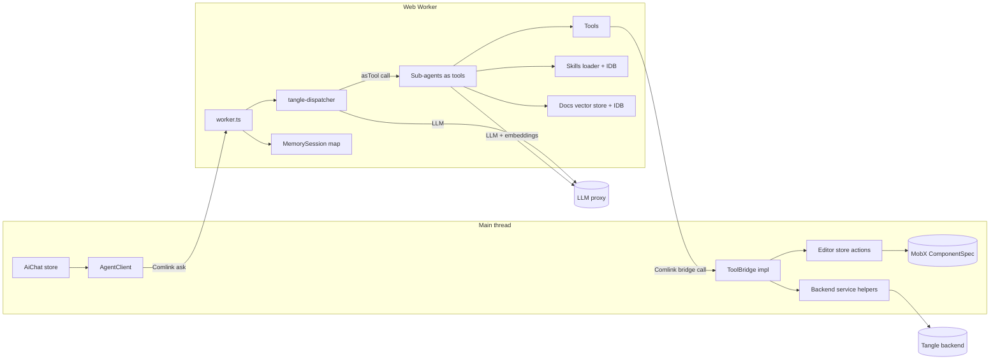
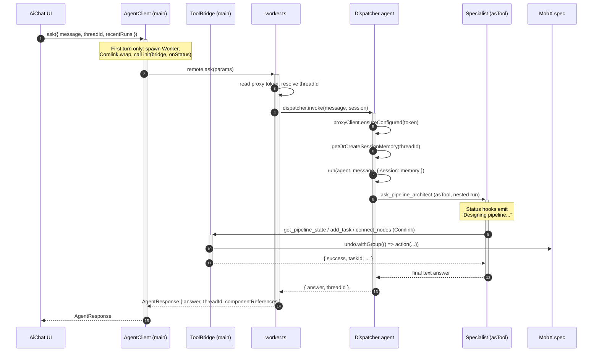
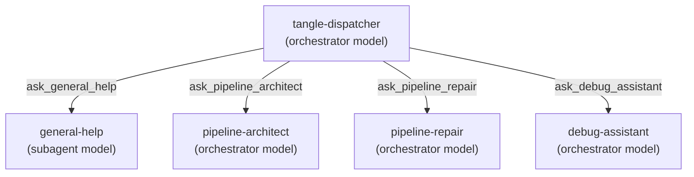
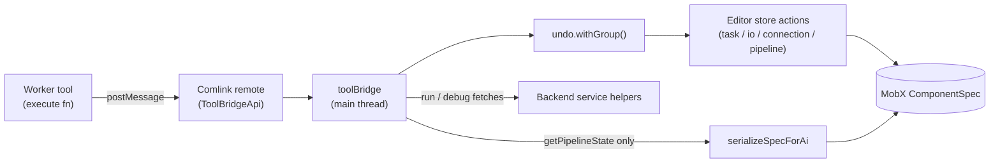

# Agent architecture

This document describes the in-browser agent that lives under `src/agent/`. It is the implementation behind the AI Chat panel in the v2 editor.

The agent is split across two threads:

- The **main thread** owns the live MobX `ComponentSpec`, the React UI, and the chat store.
- A dedicated **Web Worker** owns all LLM traffic, the OpenAI Agents SDK runtime, tool execution, prompt assembly, and per-thread conversation memory.

The two halves communicate over [Comlink](https://github.com/GoogleChromeLabs/comlink). The worker holds a Comlink-proxied `ToolBridgeApi` that it invokes whenever a tool needs to read or mutate the spec, submit a run, or fetch execution data. The bridge implementation on the main thread routes those calls into MobX actions (inside an undo group) and existing service helpers, so the agent's edits show up in the editor immediately and undo as a single user action.

LLM requests go through a configurable LLM proxy. In the current `browser-direct` mode the worker talks to the proxy directly using a token the user pastes into the AI panel; a future `backend-proxy` mode is reserved in config.

## Directory layout

- `worker.ts` is the Web Worker entry point. It exposes `init`, `ping`, and `ask` via Comlink.
- `agents/tangleDispatcher.ts` builds the top-level dispatcher agent and owns per-thread conversation memory.
- `agents/subagents/` holds the four specialist sub-agents the dispatcher delegates to.
- `tools/` holds the tool definitions: CSOM spec mutations, in-browser docs search, run submission, and execution debugging.
- `toolBridgeApi.ts` is the type-only contract between the worker and the main-thread bridge.
- `session.ts` defines the per-turn `AgentSession` (thread id, proxy client, bridge proxy, skills loader, status callback, recent runs).
- `middleware/observability.ts` translates SDK lifecycle events into status strings for the UI.
- `skills/loader.ts` fetches `SKILL.md` documents and caches them in IndexedDB.
- `idb/agentDb.ts` is the Dexie schema for the docs-vector and skill caches.
- `prompts/*.md` are raw prompt texts imported via Vite `?raw`.
- `config.ts` reads proxy/model configuration and owns the `ProxyClient` that wires the OpenAI SDK to the proxy.
- `aiTokenStore.ts` persists the proxy token in IndexedDB.
- `types.ts` holds shared types (`AgentResponse`, `StatusCallback`).

On the main thread, the bridge implementation lives under `AiChat/toolBridge/` and is composed from three slices: `csomBridge` (spec mutations), `runBridge` (run lifecycle), and `debugBridge` (read-only execution fetches).

## High-level topology

The worker's only direct network calls are to the proxy (chat completions and embeddings) and to the static docs-index JSON. Everything backend-related (spec data, run submission, execution details) is reached through the bridge so the main-thread services, caches, and auth are reused as-is.

## Request lifecycle

The diagram below traces a single `ask()` turn end-to-end. The very first turn also performs lazy worker spawn and `init`; subsequent turns reuse the same worker and the `MemorySession` keyed on `threadId`.

Notes on individual steps:

- Lazy spawn is implemented in the main-thread `AgentClient`. The bridge proxy and status callback must be passed as separate top-level arguments to `init` because Comlink only applies its proxy transfer handler to top-level argument values.
- The `MemorySession` for a `threadId` lives for the lifetime of the worker. Reload drops it.
- `run` is the `@openai/agents` driver loop. It iterates LLM, tool calls, LLM until the agent emits final output.
- Specialists are invoked as nested runs via `Agent.asTool(...)`, so the dispatcher's own LLM loop can chain them (for example "investigate then fix" calls `ask_debug_assistant` followed by `ask_pipeline_repair`).

## Dispatcher and sub-agents

The dispatcher is the only top-level agent. It is built fresh per turn but pinned to the per-thread `MemorySession` so multi-turn conversation memory survives across calls. It owns orchestration only: it never edits the spec or fetches runs directly. Every specialist is exposed to it as a tool through the `Agent.asTool(...)` adapter, and the dispatcher's own LLM loop is what chains those tool calls together.

The dispatcher's prompt plus the tool descriptions on each `ask_*` wrapper teach it which specialist to call. Tool surface per sub-agent:

- **`general-help`** (subagent model) — `search_docs`. Read-only. Answers concept, feature, and documentation questions.
- **`pipeline-architect`** (orchestrator model) — full CSOM toolset plus `submit_pipeline_run`. Designs and builds new pipelines or stages. Injects the `tangleBestPractices` and `componentYamlFormat` skill documents into its prompt at construction time.
- **`pipeline-repair`** (orchestrator model) — full CSOM toolset plus `submit_pipeline_run`. Diagnoses and fixes validation issues, broken connections, and missing inputs.
- **`debug-assistant`** (orchestrator model) — `get_pipeline_state`, `get_run_status`, `debug_pipeline_run`, and the fine-grained debug tools. Read-only. Receives the recent runs as appended prompt context so it can resolve "my last run" without a tool call.

## Tool registry

All tools are `@openai/agents` `tool()` definitions with Zod parameter schemas. They fall into four groups.

### CSOM (live spec mutations)

Created via the `createCsomTools(bridge)` factory. Every tool is a thin wrapper that JSON-serializes the bridge response: `get_pipeline_state`, `set_pipeline_name`, `set_pipeline_description`, `add_task`, `delete_task`, `rename_task`, `add_input`, `delete_input`, `rename_input`, `add_output`, `delete_output`, `rename_output`, `connect_nodes`, `delete_edge`, `set_task_argument`, `create_subgraph`, `unpack_subgraph`, `validate_pipeline`.

Schema convention: OpenAI structured-outputs strict mode rejects bare `.optional()`. Every optional field is declared as `.nullable().optional()` and the execute body normalizes `null` to `undefined` before handing data to the bridge.

### Docs search

`search_docs` is an in-browser RAG tool. It embeds the user's query through the configured proxy `OpenAI` client, ranks a local docs vector store by cosine similarity, and returns the top-K hits with a pre-formatted `citation` and an `instruction` reminding the model to include the documentation URL. The vector store is fetched once from a static `/agent-index/docs-vector-store.json` asset and cached in IndexedDB. The cache is invalidated when the configured embedding model no longer matches the persisted one, since queries embedded with one model cannot be ranked against vectors built by another.

### Run submission

`submit_pipeline_run`, `get_run_status`, `debug_pipeline_run`. These call `ToolBridgeApi` methods rather than fetching the backend directly; the main-thread bridge reuses existing service helpers (and their cache invalidation) to talk to the backend.

### Execution debugging

`get_execution_details`, `get_execution_state`, `get_container_state`, `get_container_log`. Read-only, also routed through the bridge. Each result is truncated before returning to the model so a single large pod log or artifact map cannot blow the context window. For the one-shot path use `debug_pipeline_run`, which returns a composite snapshot; these fine-grained tools are for surgical follow-ups.

## Tool bridge

The bridge is the only path by which the worker can read or mutate the editor's MobX state or reach the backend. Its contract is type-only and imported by both sides; the runtime implementation lives on the main thread and is composed from the CSOM, run, and debug slices.

Behavioural notes worth knowing:

- Every mutating bridge method calls the relevant editor action wrapped in `undo.withGroup(...)`, so a multi-step agent edit can be undone as one action.
- `getPipelineState` returns a serialized projection (`AiSpec`) computed by `serializeSpecForAi`, not the raw MobX tree. The shape is intentionally narrower than the wire format, flags subgraph tasks, and surfaces the active subgraph breadcrumb. This is the only spec data the model ever sees.
- `addTask` hydrates the component reference so a partial reference (which may carry only a `url`) is expanded into a full `ComponentReference` before insertion.

## Sessions and memory

Three different "session" concepts coexist; do not confuse them.

- **`AgentSession`** — per-turn, in-worker. Carries `threadId`, the proxy client, the Comlink bridge, the skills loader, the status callback, and the recent pipeline runs used by the debug assistant.
- **`MemorySession`** (from `@openai/agents`) — per-thread, lives for the lifetime of the worker. Provides the agent's multi-turn message memory. Created lazily inside the dispatcher and keyed on `threadId`. It is not persisted across worker reloads.
- **AiChat store** — main-thread MobX store. Owns the user-visible chat history and is independent from `MemorySession`.

The `AgentResponse` carries a `componentReferences` map intended to drive component chips in the chat. This is currently a stubbed empty map in `worker.ts` with a TODO: the `search_components` tool that would populate it has not been wired in this iteration.

## Observability

The worker has no access to the React tree, so the only status surface the user sees is a single line of text the chat panel renders while the agent is running. `attachObservabilityHooks` wires that up by attaching listeners to each agent's `EventEmitter` and translating raw SDK events into pre-mapped status strings, forwarded over the Comlink-proxied `onStatus` callback received during `init`.

Events handled:

- `agent_start` becomes `"Thinking..."`.
- `agent_end` becomes `"Preparing response..."`.
- `agent_tool_start` becomes a tool-specific label. This includes the `ask_*` specialist wrappers, so delegating to a sub-agent emits labels like `"Designing pipeline..."` or `"Analyzing run failure..."`.
- `agent_handoff` is still wired but no longer fires, because the dispatcher exposes specialists as tools rather than handoffs.

Because each specialist runs as a nested run with its own emitter, `attachObservabilityHooks` is called on the dispatcher and on every sub-agent; otherwise the status line would freeze while a specialist is working.

## Skills loader and IndexedDB

The skills loader implements lazy loading of `SKILL.md` files from the configured skills base URL. Each load reads any cached entry from IndexedDB, and if its version no longer matches the current build it refetches over HTTP and overwrites the cache; on a fetch failure it falls back to the cached content if one exists. Cache freshness is keyed off the Git-commit prefix, since skills change only when the app is deployed. Concurrent callers in the same worker share one in-flight promise per skill id.

Skills are loaded on demand at sub-agent construction. The pipeline-architect awaits the `tangleBestPractices` and `componentYamlFormat` documents and appends them to its prompt; the loader resolves them from cache when warm.

The cache lives in a single Dexie database with two tables: `vectors` (the docs vector store used by `search_docs`) and `skills`.

## Configuration

Runtime configuration is read from `src/config/aiAssistantConfig.json`:

- `proxyBaseUrl` — base URL of the LLM proxy.
- `proxyMode` — `"browser-direct"` (current) or `"backend-proxy"` (reserved for a future routing change).
- `orchestratorModel` — used for the dispatcher and the architect, repair, and debug specialists.
- `subagentModel` — used for the read-only general-help specialist.
- `embeddingModel` — used to embed `search_docs` queries and to validate the docs index cache.
- `skillsBaseUrl` — root used by the skills loader.

The proxy token is not part of the config file. The user pastes it into the AI panel and it is persisted in IndexedDB via `aiTokenStore`. The worker reads it at the start of every turn and passes it to `ProxyClient.ensureConfigured(token)`, which is idempotent: it rebuilds the underlying `OpenAI` client only when the token rotates, points the SDK at the proxy, forces the Chat Completions surface, and disables tracing.

## Caveats and known smells

These are documented because they are easy to trip over when changing the agent.

- **`process` polyfill in `worker.ts`**. `@openai/agents-core` reads `process.env.OPENAI_AGENTS__DEBUG_SAVE_SESSION` without a `typeof process` guard. The polyfill stubs `globalThis.process = { env: {} }` and deliberately omits `.on` / `.exit` so the SDK's `typeof process.on === "function"` checks still skip Node-only branches. A second `hasOwnProperty` check defeats Rolldown tree-shaking in `vite build`. SDK upgrades may break this.
- **`@openai/agents-core/_shims` alias**. The worker bundle resolves the SDK's shim module to its browser variant via the worker plugins block in `vite.config.js`. Same root cause as the `process` polyfill.
- **Comlink top-level proxy rule**. `Comlink.proxy(bridge)` and `Comlink.proxy(onStatus)` must be passed as separate top-level arguments to `init`. Wrapping them in a single object argument would cause Comlink to structured-clone the bridge methods and fail.
- **Stubbed `componentReferences`**. The chip-rendering map returned to the main thread is currently empty. Wiring the `search_components` tool that would populate it is a documented follow-up.
- **No `useCallback` / `useMemo`** anywhere downstream of this module. The v2 scope is under React Compiler, which handles memoization automatically.
