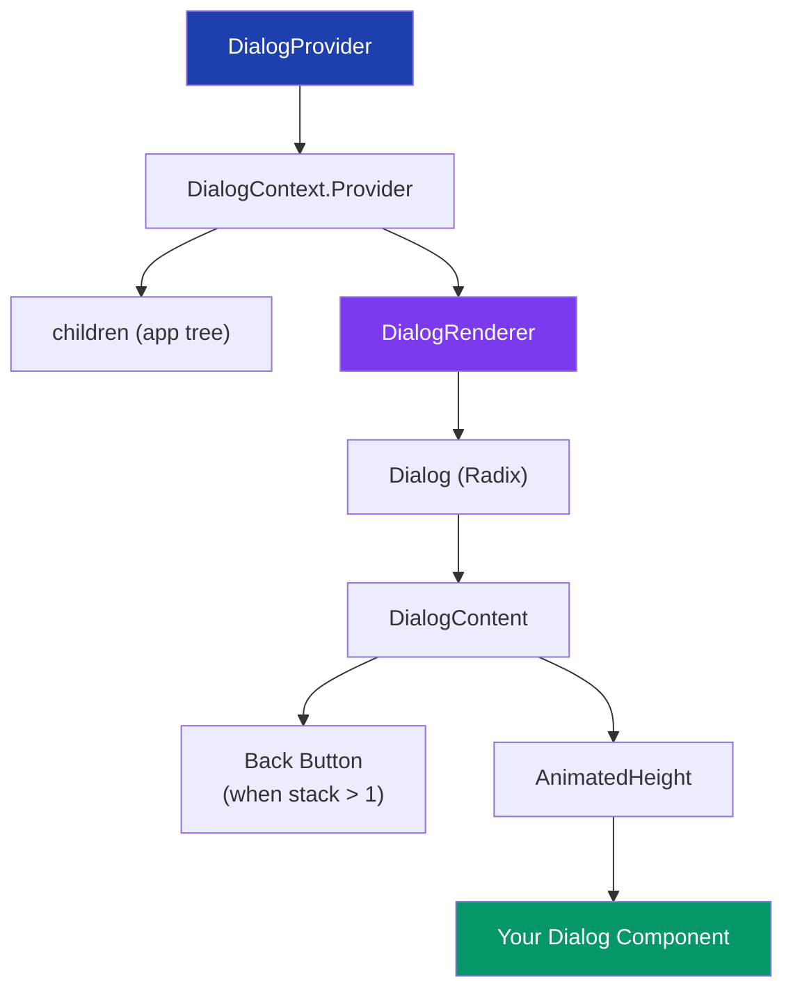
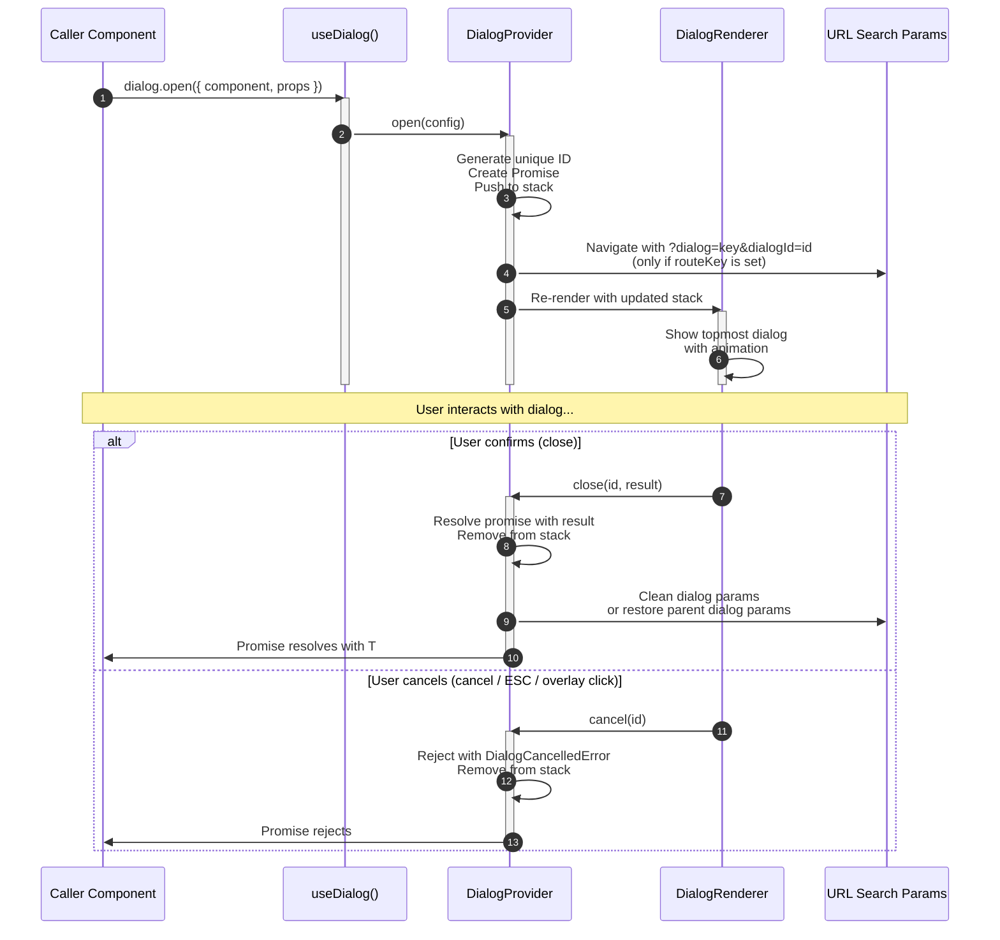
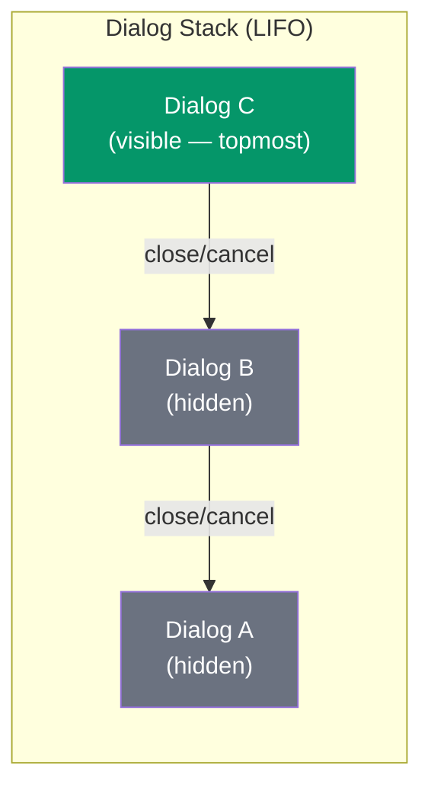
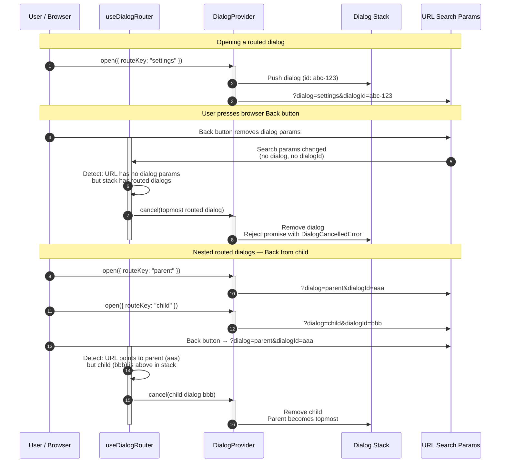

# DialogProvider

A promise-based, stack-driven dialog system with optional URL routing support. Dialogs are opened imperatively via `useDialog()`, return typed results through promises, and support stacking (nested dialogs), animated transitions, and browser back-button integration.

## Architecture

### File Structure

```
src/providers/DialogProvider/
├── DialogProvider.tsx       # Provider component — manages stack, open/close/cancel/closeAll
├── DialogContext.tsx         # React context definition
├── DialogRenderer.tsx        # Renders the topmost dialog with animations and back button
├── types.ts                  # All TypeScript types and DialogCancelledError class
├── utils.ts                  # Helpers: ID generation, URL param management, error factories
├── useDialogRouter.ts        # Syncs dialog stack ↔ URL search params (browser back support)
├── hooks/
│   └── useDialog.ts          # Consumer hook — the primary public API
└── DialogProvider.md         # This documentation
```

### Component Hierarchy



### Data Flow



## Core Concepts

### Promise-Based Dialog Results

Every `dialog.open()` call returns a `Promise<T>`. The promise:

- **Resolves** when the dialog component calls `close(result)` — the result is the resolved value.
- **Rejects** with `DialogCancelledError` when the dialog is cancelled (via `cancel()`, ESC key, overlay click, or browser back).

### Dialog Stack

Dialogs are managed as a LIFO stack. Only the **topmost** dialog is rendered at any time. When the top dialog closes, the previous dialog in the stack becomes visible again. A "Back" button appears automatically when multiple dialogs are stacked.



### URL Router Sync

Dialogs with a `routeKey` get synced to URL search params (`?dialog=key&dialogId=uuid`). This enables:

- **Browser back button** closes the topmost routed dialog.
- **Shareable URLs** that indicate a dialog is open (though the dialog itself won't reopen from a cold load — only the param is present).
- **Nested back navigation** — going back from a nested routed dialog restores the parent dialog's URL params.

## API Reference

### `useDialog()`

The primary consumer hook. Must be used within a `DialogProvider`.

```typescript
const { open, close, closeAll } = useDialog();
```

| Method     | Signature                                                    | Description                        |
|------------|--------------------------------------------------------------|------------------------------------|
| `open`     | `<T, TProps>(config: DialogConfig<T, TProps>) => Promise<T>` | Open a dialog, returns a promise   |
| `close`    | `(id: string, result?: any) => void`                         | Close a specific dialog by ID      |
| `closeAll` | `() => void`                                                 | Close all dialogs, rejects all promises |

### `DialogConfig<T, TProps>`

Configuration object passed to `open()`.

| Property              | Type                                   | Required | Default | Description                                         |
|-----------------------|----------------------------------------|----------|---------|-----------------------------------------------------|
| `component`           | `ComponentType<DialogProps<T, TProps>>` | Yes      | —       | The React component to render inside the dialog     |
| `props`               | `TProps`                               | No       | —       | Extra props forwarded to the component              |
| `routeKey`            | `string`                               | No       | —       | Enables URL sync. Value appears as `?dialog=<key>`  |
| `size`                | `"sm" \| "md" \| "lg" \| "xl" \| "full"` | No    | `"md"`  | Controls dialog width                               |
| `closeOnEsc`          | `boolean`                              | No       | `true`  | Whether pressing ESC closes the dialog              |
| `closeOnOverlayClick` | `boolean`                              | No       | `true`  | Whether clicking outside closes the dialog          |

### `DialogProps<T, TProps>`

Props injected into every dialog component by the provider.

```typescript
type DialogProps<T, TProps> = {
  close: (result?: T) => void;
  cancel: () => void;
} & TProps;
```

| Prop     | Type                  | Description                                       |
|----------|-----------------------|---------------------------------------------------|
| `close`  | `(result?: T) => void`| Call to close the dialog with a success result     |
| `cancel` | `() => void`          | Call to cancel the dialog (rejects the promise)    |

### Dialog Size Classes

| Size   | CSS Class         | Approximate Width |
|--------|-------------------|-------------------|
| `sm`   | `sm:max-w-sm`     | 384px             |
| `md`   | `sm:max-w-lg`     | 512px             |
| `lg`   | `sm:max-w-2xl`    | 672px             |
| `xl`   | `sm:max-w-4xl`    | 896px             |
| `full` | `sm:max-w-[90vw]` | 90% viewport      |

### Utility Functions

#### `convertCancelErrorTo<T>(cancelValue: T)`

A catch handler factory that converts `DialogCancelledError` into a fallback value instead of throwing. Re-throws all other errors.

```typescript
import { convertCancelErrorTo } from "@/providers/DialogProvider/utils";

const confirmed = await dialog
  .open({ component: ConfirmDialog, props: { message: "Delete?" } })
  .catch(convertCancelErrorTo(false));
// confirmed: true | false (never throws for cancellation)
```

#### `DialogCancelledError`

A custom error class used for all cancellation scenarios (ESC, overlay click, browser back, `cancel()`).

```typescript
import { DialogCancelledError } from "@/providers/DialogProvider/types";

try {
  await dialog.open({ component: MyDialog });
} catch (error) {
  if (error instanceof DialogCancelledError) {
    // User cancelled — this is expected, not a bug
  }
}
```

## Usage Examples

### Basic Confirmation Dialog

**1. Define the dialog component:**

```typescript
import { Button } from "@/components/ui/button";
import { DialogFooter, DialogHeader, DialogTitle } from "@/components/ui/dialog";
import type { DialogProps } from "@/providers/DialogProvider/types";

interface ConfirmDeleteProps {
  itemName: string;
}

export function ConfirmDeleteDialog({
  close,
  cancel,
  itemName,
}: DialogProps<boolean, ConfirmDeleteProps>) {
  return (
    <>
      <DialogHeader>
        <DialogTitle>Delete {itemName}?</DialogTitle>
      </DialogHeader>
      <DialogFooter>
        <Button variant="outline" onClick={cancel}>Cancel</Button>
        <Button variant="destructive" onClick={() => close(true)}>Delete</Button>
      </DialogFooter>
    </>
  );
}
```

**2. Open the dialog from a consumer:**

```typescript
import { useDialog } from "@/providers/DialogProvider/hooks/useDialog";
import { convertCancelErrorTo } from "@/providers/DialogProvider/utils";

function MyComponent() {
  const { open } = useDialog();

  const handleDelete = async () => {
    const confirmed = await open<boolean, { itemName: string }>({
      component: ConfirmDeleteDialog,
      props: { itemName: "Pipeline Alpha" },
      size: "sm",
    }).catch(convertCancelErrorTo(false));

    if (!confirmed) return;

    // proceed with deletion...
  };

  return <Button onClick={handleDelete}>Delete</Button>;
}
```

### Dialog That Returns Data

```typescript
interface FormResult {
  name: string;
  description: string;
}

function RenameDialog({ close, cancel, currentName }: DialogProps<FormResult, { currentName: string }>) {
  const [name, setName] = useState(currentName);

  return (
    <>
      <DialogHeader>
        <DialogTitle>Rename</DialogTitle>
      </DialogHeader>
      <input value={name} onChange={(e) => setName(e.target.value)} />
      <DialogFooter>
        <Button variant="outline" onClick={cancel}>Cancel</Button>
        <Button onClick={() => close({ name, description: "" })}>Save</Button>
      </DialogFooter>
    </>
  );
}

// Consumer:
const result = await open<FormResult, { currentName: string }>({
  component: RenameDialog,
  props: { currentName: "Old Name" },
});
console.log(result.name); // typed as FormResult
```

### Dialog with URL Routing (Browser Back Support)

```typescript
const result = await open({
  component: SettingsDialog,
  props: { tab: "general" },
  routeKey: "settings",
  // URL becomes: ?dialog=settings&dialogId=<uuid>
});
```

### Nested Dialogs

A dialog component can open another dialog from within itself:

```typescript
function ParentDialog({ close, cancel }: DialogProps<boolean>) {
  const { open } = useDialog();

  const handleAdvanced = async () => {
    const advancedResult = await open({
      component: AdvancedSettingsDialog,
      routeKey: "advanced-settings",
    }).catch(convertCancelErrorTo(undefined));

    if (advancedResult) {
      close(true);
    }
  };

  return (
    <>
      <DialogHeader><DialogTitle>Settings</DialogTitle></DialogHeader>
      <Button onClick={handleAdvanced}>Advanced Settings</Button>
      <DialogFooter>
        <Button onClick={cancel}>Cancel</Button>
        <Button onClick={() => close(true)}>Save</Button>
      </DialogFooter>
    </>
  );
}
```

### Non-Dismissible Dialog

```typescript
await open({
  component: CriticalConfirmation,
  closeOnEsc: false,
  closeOnOverlayClick: false,
  // User MUST interact with dialog buttons to close
});
```

## URL Routing Flow



## Rules and Restrictions

### Provider Placement

1. `DialogProvider` must wrap any component tree that uses `useDialog()`.
2. There should be **one provider per isolated UI scope** (e.g., per page). Do not nest multiple `DialogProvider` instances unless they are truly independent scopes.
3. `useDialog()` throws if called outside a `DialogProvider`.

### Dialog Component Contract

1. Every dialog component **must** accept `close` and `cancel` as props via `DialogProps<T, TProps>`.
2. Dialog components should **not** render their own `<Dialog>` or `<DialogContent>` — the `DialogRenderer` handles the shell. Only render the **inner content** (`DialogHeader`, `DialogTitle`, body, `DialogFooter`, etc.).
3. Dialog components must call either `close(result)` or `cancel()` to dismiss. There is no auto-close mechanism.

### Promise Handling

1. **Always handle the rejection.** Every `open()` promise can reject with `DialogCancelledError`. Unhandled rejections will surface as console errors.
2. Use `convertCancelErrorTo(fallback)` for fire-and-forget or boolean confirmation patterns.
3. Use `try/catch` when you need to distinguish between cancellation and real errors.

### URL Routing

1. `routeKey` values should be **unique per dialog type** within a page. They appear in the URL as `?dialog=<routeKey>`.
2. Dialogs without `routeKey` are invisible to the URL — the browser back button will not close them.
3. URL params are cleaned up automatically when dialogs close. Do not manually manage `dialog` or `dialogId` search params.
4. Use `disableRouterSync` on `DialogProvider` in tests to avoid router-related side effects.

### Stack Behavior

1. Only the **topmost** dialog is rendered. Lower dialogs are kept in memory but not in the DOM.
2. Closing the topmost dialog automatically reveals the one below it.
3. `closeAll()` rejects **all** dialog promises and clears the entire stack.

## Best Practices

### Do

- **Type your dialog results.** Use generics on `open<T, TProps>()` and `DialogProps<T, TProps>` for compile-time safety.
- **Use `convertCancelErrorTo`** for simple confirmations where cancellation equals `false`/`undefined`.
- **Use ShadCN `DialogHeader`/`DialogTitle`/`DialogFooter`** inside your dialog components for consistent layout.
- **Keep dialog components focused.** A dialog should do one thing. If a dialog grows complex, break it into sub-components.
- **Use `routeKey`** for user-facing dialogs that benefit from back-button support (settings, forms, confirmations in flows).
- **Use `size` prop** to match content needs. Default (`"md"`) works for most confirmations and small forms.
- **Use `closeOnEsc: false` and `closeOnOverlayClick: false`** for destructive or critical confirmations where accidental dismissal is dangerous.

### Don't

- **Don't render `<Dialog>` or `<DialogContent>` inside your dialog component.** The `DialogRenderer` wraps your component automatically.
- **Don't ignore the rejected promise.** Always `.catch()` or `try/catch` the `open()` call.
- **Don't store dialog state externally.** The dialog stack is the source of truth. Don't duplicate open/closed state in a parent component.
- **Don't manually manipulate URL `dialog`/`dialogId` params.** The provider manages them.
- **Don't call `close()` and `cancel()` from the same interaction.** Pick one. `close(result)` for success, `cancel()` for dismissal.
- **Don't nest `DialogProvider` inside another `DialogProvider`** unless you intentionally want isolated dialog stacks.
- **Don't use `useDialog()` outside the React component tree** (e.g., in plain utility functions). It is a hook and must follow React hook rules.

## Testing

### Unit Testing Dialog Components

Use `disableRouterSync` on the provider wrapper to avoid router mocking complexity:

```typescript
const wrapper = ({ children }: { children: ReactNode }) => (
  <DialogProvider disableRouterSync>{children}</DialogProvider>
);

it("should return result on confirm", async () => {
  const { result } = renderHook(() => useDialog(), { wrapper });

  let dialogResult: string | undefined;

  act(() => {
    result.current
      .open({ component: MyDialog, props: { message: "Test" } })
      .then((r) => { dialogResult = r; });
  });

  await waitFor(() => {
    expect(screen.getByTestId("dialog-confirm")).toBeInTheDocument();
  });

  fireEvent.click(screen.getByTestId("dialog-confirm"));

  await waitFor(() => {
    expect(dialogResult).toBe("expected value");
  });
});
```

### E2E Testing

Dialog components are rendered inside Radix `Dialog`, which uses `[data-slot="dialog-content"]`. Target inner elements with `data-testid` attributes for stable selectors.
