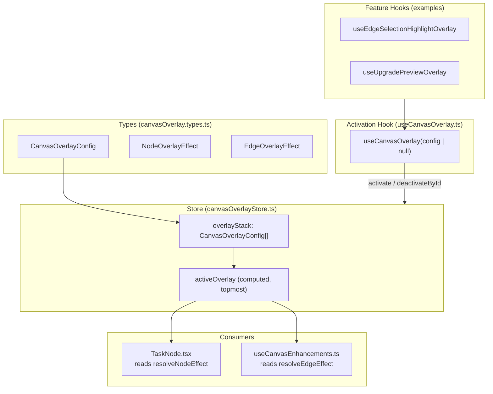
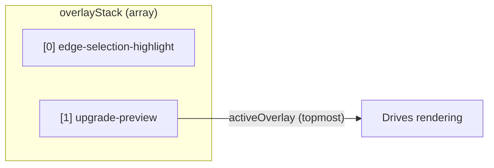
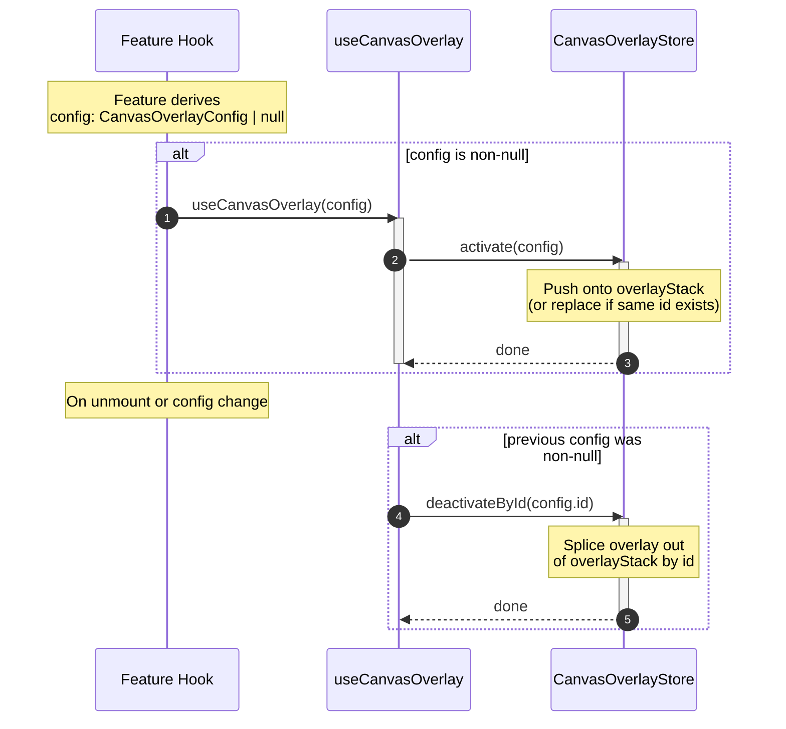
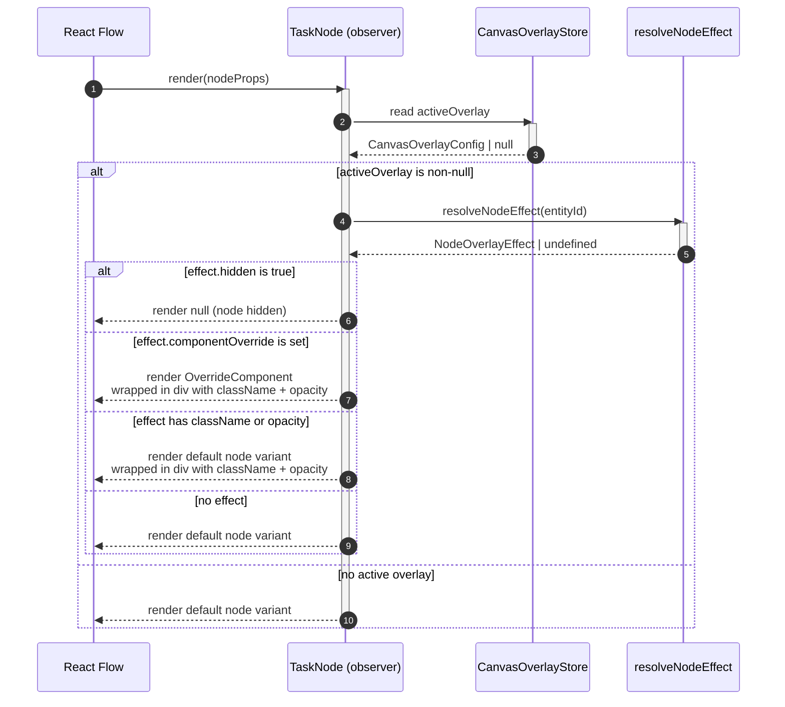
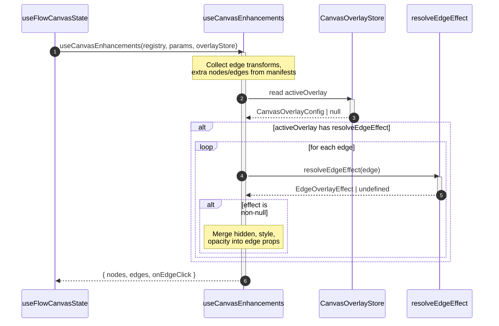

# Canvas Overlay System

The Canvas Overlay system provides a mechanism for temporarily altering the visual appearance of nodes and edges on the React Flow canvas **without mutating the underlying pipeline `ComponentSpec`**. It is used by features that need to visually emphasise, dim, hide, or completely replace node renderings in response to transient UI states (e.g. edge selection highlighting, upgrade preview).

## Architecture



### Layer responsibilities

| Layer         | File                                    | Purpose                                                                                                    |
| ------------- | --------------------------------------- | ---------------------------------------------------------------------------------------------------------- |
| Types         | `shared/store/canvasOverlay.types.ts`   | Defines `CanvasOverlayConfig`, `NodeOverlayEffect`, `EdgeOverlayEffect`                                    |
| Store         | `shared/store/canvasOverlayStore.ts`    | MobX store managing a stack of overlays. `activeOverlay` is a computed getter returning the topmost entry. |
| Hook          | `shared/hooks/useCanvasOverlay.ts`      | Bridges React lifecycle to the store: activates on mount/change, deactivates on unmount/change.            |
| Node consumer | `shared/nodes/TaskNode/TaskNode.tsx`    | Reads `activeOverlay.resolveNodeEffect(entityId)` and applies visual effects.                              |
| Edge consumer | `shared/hooks/useCanvasEnhancements.ts` | Calls `activeOverlay.resolveEdgeEffect(edge)` and merges effects into edge props.                          |

---

## Overlay Stack

The store holds an **ordered stack** of overlay configs. Only the **topmost** entry is rendered (via the `activeOverlay` computed getter). Lower entries are preserved in the stack and become active again once overlays above them are removed.



### Store API

| Method                       | Behaviour                                                                                                                                 |
| ---------------------------- | ----------------------------------------------------------------------------------------------------------------------------------------- |
| `activate(config)`           | Pushes `config` onto the stack. If an overlay with the same `id` already exists, it is **replaced in place** (preserving stack position). |
| `deactivateById(id)`         | Removes the overlay matching `id` from anywhere in the stack. Other overlays are unaffected.                                              |
| `deactivate()`               | Clears the entire stack.                                                                                                                  |
| `activeOverlay` (computed)   | Returns `overlayStack.at(-1)` or `null`.                                                                                                  |
| `isActive` (computed)        | `true` when `activeOverlay !== null`.                                                                                                     |
| `activeOverlayId` (computed) | Shorthand for `activeOverlay?.id ?? null`.                                                                                                |

---

## Activation and Deactivation Flow



### How `useCanvasOverlay` works

The hook accepts `CanvasOverlayConfig | null`. Inside a `useEffect`:

1. When `config` is **non-null**, it calls `canvasOverlay.activate(config)`.
2. The effect cleanup calls `canvasOverlay.deactivateById(config.id)` -- this runs on unmount or when `config` changes.
3. When `config` is **null**, neither activate nor deactivate is called, so the overlay is simply absent from the stack.

This design lets feature hooks derive `config` as a nullable value: the overlay is automatically active when the condition is met and removed when it is not.

---

## Rendering Flow

### Node effects



### Edge effects

Edge overlay effects are applied inside `useCanvasEnhancements`, which runs **after** all node-type canvas enhancements have been collected:



---

## Type Reference

### `NodeOverlayEffect`

Defined in `shared/store/canvasOverlay.types.ts`. All fields are optional; `undefined` means "no change".

| Field               | Type                               | Description                                                                          |
| ------------------- | ---------------------------------- | ------------------------------------------------------------------------------------ |
| `opacity`           | `number`                           | CSS opacity applied to the node wrapper `div`.                                       |
| `className`         | `string`                           | Tailwind classes applied to the node wrapper `div` (e.g. ring highlights).           |
| `hidden`            | `boolean`                          | When `true`, the node renders `null` (completely hidden).                            |
| `componentOverride` | `ComponentType<TaskNodeViewProps>` | Replaces the default node component entirely. Receives the same `TaskNodeViewProps`. |

**Precedence in `TaskNode`:**

1. `hidden` -- if `true`, returns `null` immediately.
2. `componentOverride` -- if set, renders `<OverrideComponent {...viewProps} />` inside a wrapper `div` with `className` and `opacity`.
3. `className` / `opacity` -- wraps the default node variant (`TaskNodeFull`, `TaskNodeClassic`, or `TaskNodeCollapsed`) in a `div`.

### `EdgeOverlayEffect`

Defined in `shared/store/canvasOverlay.types.ts`. All fields are optional.

| Field     | Type            | Description                                                       |
| --------- | --------------- | ----------------------------------------------------------------- |
| `opacity` | `number`        | Merged into the edge's `style.opacity`.                           |
| `style`   | `CSSProperties` | Merged into the edge's `style` object (e.g. `{ stroke: color }`). |
| `hidden`  | `boolean`       | Sets `edge.hidden = true`, removing the edge from the canvas.     |

### `CanvasOverlayConfig`

Defined in `shared/store/canvasOverlay.types.ts`.

| Field               | Type                                                 | Description                                                                                                       |
| ------------------- | ---------------------------------------------------- | ----------------------------------------------------------------------------------------------------------------- |
| `id`                | `string`                                             | **Required.** Unique identifier for this overlay. Used by the store for stack management and by `deactivateById`. |
| `resolveNodeEffect` | `(nodeId: string) => NodeOverlayEffect \| undefined` | Optional. Called for every visible `TaskNode` to determine its visual effect. Return `undefined` for no change.   |
| `resolveEdgeEffect` | `(edge: Edge) => EdgeOverlayEffect \| undefined`     | Optional. Called for every edge inside `useCanvasEnhancements`. Return `undefined` for no change.                 |

---

## Rules and Restrictions

### 1. Stack-based, last-wins rendering

Multiple overlays can coexist in `overlayStack`, but only the **topmost** overlay drives rendering via `activeOverlay`. Lower overlays are preserved and become active when overlays above them are removed. Features should not assume they are the only overlay in the stack.

### 2. Unique `id` per overlay

Every overlay **must** use a unique, constant string `id`. When `activate()` is called with an `id` that already exists in the stack, the existing entry is **replaced in place** (preserving its stack position) rather than creating a duplicate. Failing to use a unique `id` will cause overlays from different features to silently overwrite each other.

### 3. `deactivateById` is scoped

`deactivateById(id)` removes only the overlay matching that `id`. It is safe to call even if the overlay is not currently in the stack (it is a no-op). `deactivate()` clears the **entire** stack and should only be used for global reset scenarios.

### 4. No spec mutation

Overlays are **purely visual**. They must never modify the underlying `ComponentSpec` or any React Flow node/edge data that feeds back into the spec. The overlay system reads from the spec and produces visual overrides as a separate rendering layer.

### 5. Resolver purity

`resolveNodeEffect` and `resolveEdgeEffect` must be **pure functions** of their arguments. They are called during the React render cycle and must not:

- Trigger side effects (API calls, state mutations, logging)
- Read mutable external state that is not captured in the config closure
- Throw exceptions

### 6. React Compiler compatibility

The `src/routes/v2` scope is opted into React Compiler. **Do not use `useCallback` or `useMemo`** in overlay hooks -- the compiler handles memoization automatically.

### 7. Observer requirement

`TaskNode` is wrapped in `observer` from `mobx-react-lite`, which is required because it reads `canvasOverlay.activeOverlay` (a MobX computed). Any component that directly reads from the `CanvasOverlayStore` must also be wrapped in `observer`.

---

## Best Practices

### Derive config as `CanvasOverlayConfig | null`

Structure your feature hook so the config is `null` when the overlay should be inactive. `useCanvasOverlay` handles activation and deactivation automatically based on nullability.

```typescript
// Good: null when inactive, config when active
const config: CanvasOverlayConfig | null = hasCondition
  ? { id: OVERLAY_ID, resolveNodeEffect: ... }
  : null;

useCanvasOverlay(config);
```

### Use a stable string constant for the overlay ID

Define the ID as a module-level constant, not an inline string:

```typescript
const OVERLAY_ID = "my-feature-overlay";
```

### Extract resolver logic into standalone functions

Keep the hook body lean by extracting config construction and resolver logic into functions defined outside the hook. This improves readability and testability.

```typescript
// From useEdgeSelectionHighlightOverlay.ts -- resolver logic is extracted:

const HIGHLIGHT_EFFECT: NodeOverlayEffect = {
  className: "ring-4 ring-edge-selected/30 rounded-xl",
};

const DIMMED_EFFECT: NodeOverlayEffect = {
  opacity: 0.3,
};

function buildConfig(connectedIds: ReadonlySet<string>): CanvasOverlayConfig {
  return {
    id: OVERLAY_ID,
    resolveNodeEffect: (nodeId) =>
      connectedIds.has(nodeId) ? HIGHLIGHT_EFFECT : DIMMED_EFFECT,
    resolveEdgeEffect: (edge) =>
      connectedIds.has(edge.source) && connectedIds.has(edge.target)
        ? { ...HIGHLIGHT_EFFECT, style: { stroke: EdgeColor.Selected } }
        : DIMMED_EFFECT,
  };
}
```

### Use `componentOverride` for full node replacement

When you need to render an entirely different component in place of a node, use `componentOverride`. The override receives the same `TaskNodeViewProps` as the default node variants:

```typescript
// From useUpgradePreviewOverlay.tsx:

resolveNodeEffect: (nodeId) => {
  const wrapper = wrapperMap.get(nodeId);
  if (!wrapper) return { opacity: 0.3 };
  return {
    componentOverride: wrapper,
    className: issueIds.has(nodeId)
      ? "ring-2 ring-amber-400 rounded-xl"
      : undefined,
  };
},
```

### File placement conventions

| Overlay scope          | Location                                                            |
| ---------------------- | ------------------------------------------------------------------- |
| Shared / cross-feature | `shared/overlays/<overlay-name>/use<Name>Overlay.ts`                |
| Feature-specific       | `pages/<Feature>/components/<SubFeature>/hooks/use<Name>Overlay.ts` |

---

## Creating a New Overlay

### Step 1 -- Define the overlay ID

Create a constant at the module level:

```typescript
const OVERLAY_ID = "my-feature-overlay";
```

### Step 2 -- Define effect constants (if static)

If your effects do not depend on per-node data, define them as module-level constants:

```typescript
const ACTIVE_EFFECT: NodeOverlayEffect = {
  className: "ring-2 ring-blue-400 rounded-xl",
};

const DIMMED_EFFECT: NodeOverlayEffect = {
  opacity: 0.3,
};
```

### Step 3 -- Build the config

Write a function (or inline logic) that constructs a `CanvasOverlayConfig` from feature state. Return `null` when the overlay should be inactive:

```typescript
function buildConfig(activeIds: ReadonlySet<string>): CanvasOverlayConfig {
  return {
    id: OVERLAY_ID,
    resolveNodeEffect: (nodeId) =>
      activeIds.has(nodeId) ? ACTIVE_EFFECT : DIMMED_EFFECT,
  };
}
```

### Step 4 -- Create the hook

```typescript
export function useMyFeatureOverlay(activeIds: Set<string>): void {
  const config: CanvasOverlayConfig | null =
    activeIds.size > 0 ? buildConfig(activeIds) : null;

  useCanvasOverlay(config);
}
```

### Step 5 -- Wire into the component tree

Call your overlay hook from a component that is mounted inside the React Flow provider and `SharedStoreProvider` tree. The overlay will activate when the condition is met and clean up automatically on unmount.

```typescript
function MyFeaturePanel() {
  const activeIds = useMyFeatureState();
  useMyFeatureOverlay(activeIds);

  return <div>...</div>;
}
```

---

## Existing Overlays

### Edge Selection Highlight

- **File:** `shared/overlays/edgeSelectionHighlight/useEdgeSelectionHighlightOverlay.ts`
- **ID:** `"edge-selection-highlight"`
- **Trigger:** One or more edges are selected on the canvas.
- **Node effect:** Connected nodes get a ring highlight; all other nodes are dimmed to 30% opacity.
- **Edge effect:** Edges between connected nodes get the selected stroke colour; others are dimmed.
- **Activated from:** `useFlowCanvasState` (shared by Editor and RunView).

### Upgrade Preview

- **File:** `pages/Editor/components/UpgradeComponents/hooks/useUpgradePreviewOverlay.tsx`
- **ID:** `"upgrade-preview"`
- **Trigger:** Upgrade candidates are present.
- **Node effect:** Candidate nodes are replaced with `UpgradePreviewTaskNode` via `componentOverride`; nodes with predicted issues additionally get an amber ring. Non-candidate nodes are dimmed to 30% opacity.
- **Edge effect:** None (no `resolveEdgeEffect` defined).
- **Activated from:** `UpgradeComponentsContent` panel.
