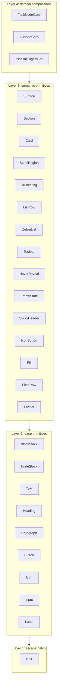

# v2 Design System

The single rule for v2 feature code:

> **Do not pass `className` to a Tangle UI primitive.** Use a semantic prop or a layer-3 pattern.

`tangle-ui/no-classname-on-primitives` warns today (340 legacy sites). It is promoted to `error` once the warnings reach zero. Every primitive's `className?: string` is `@deprecated`.

## The four layers



| Layer                   | Where                                                         | Use it when                                                                               |
| ----------------------- | ------------------------------------------------------------- | ----------------------------------------------------------------------------------------- |
| 4 — domain compositions | `pages/*/components/`, `pages/*/nodes/`                       | The component encodes business behavior specific to a page.                               |
| 3 — semantic primitives | `@/components/ui/patterns/*`                                  | An intent is named (a panel, a scroll region, a clickable row, an icon-only button, ...). |
| 2 — base primitives     | `@/components/ui/{layout,typography,button,icon,input,label}` | You need raw layout, text, or interactive controls.                                       |
| 1 — `Box`               | `@/components/ui/box`                                         | Nothing higher fits and you need a styled container. Soft-warned in `src/routes/v2/**`.   |

Code is expected to live in the upper layers. Reaching for a lower one is a smell.

## Surface — finite, nesting-aware

`Surface` is **not** a configurable container. It is a 3-level enumeration with predefined visual treatment, inspired by Polaris spatial organization and Material Design surfaces.

```tsx
<Surface>
  {" "}
  {/* level 1: card on app background */}
  <BlockStack gap="3">
    <Heading level={3}>Inputs</Heading>
    <Surface>
      {" "}
      {/* level 2: inset section */}
      <Surface>
        {" "}
        {/* level 3: nested-inset strip */}
        ...key/value...
      </Surface>
    </Surface>
  </BlockStack>
</Surface>
```

Rules (all encoded in code, not docs):

- `level` is auto-derived from `SurfaceLevelContext`.
- `padding`, `borderRadius`, `background` are derived from `level` — never user-set.
- Nesting depth > 3 throws in dev mode (Polaris rule: stop nesting).
- `tone` (`default | critical | warning | info | success | magic`) tints the background per level.
- `hoverable` + `onClick` make the surface clickable.
- `level={1|2|3}` is allowed only as an explicit override for portal'd content (popovers, dialogs, dropdowns).
- `Card` is an alias for `<Surface level={1}>` with header/content/footer slots and a `density` prop.
- `Section` is `<Surface>` with a built-in title + actions + optional `divider` (dividers are for data-like content only).

See [src/components/ui/patterns/surface.tsx](../../components/ui/patterns/surface.tsx) for the implementation and [.claude/skills/ui-primitives/SKILL.md](../../../.claude/skills/ui-primitives/SKILL.md) for the full prop tables.

## Intent catalog

Use these when you find yourself reaching for the listed className signature.

| Layer-3 primitive                            | Replaces className signature                                                       |
| -------------------------------------------- | ---------------------------------------------------------------------------------- |
| `<Surface>` / `<Section>` / `<Card>`         | `bg-* rounded-* border-* p-*` panels                                               |
| `<ScrollRegion axis="y">`                    | `flex-1 min-h-0 overflow-y-auto`                                                   |
| `<Truncating>`                               | `min-w-0 flex-1` around a shrinkable cell (apply `truncate` on the inner `<Text>`) |
| `<ListRow hoverable onClick>`                | `<InlineStack className="group hover:bg-* px-* py-*">` rows                        |
| `<ZebraList>`                                | `even:bg-* odd:bg-*` lists                                                         |
| `<HoverReveal>`                              | `opacity-0 group-hover:opacity-100 focus-within:opacity-100 transition-opacity`    |
| `<Toolbar density chrome sticky>`            | `InlineStack gap-1 shrink-0 px-* py-*` action bars                                 |
| `<EmptyState icon title description action>` | centered `flex items-center justify-center text-center p-*` placeholders           |
| `<StickyHeader>`                             | `sticky top-0 z-* bg-*` inside a `ScrollRegion`                                    |
| `<IconButton icon size variant tone>`        | `<Button h-5 w-5 p-0><Icon /></Button>`                                            |
| `<Pill tone size>`                           | `text-xs rounded-md px-2 py-1 bg-black/5` chips                                    |
| `<FieldRow label help error required>`       | `<Label> + control + help/error` form rows                                         |
| `<Divider inset orientation>`                | `<Separator className="mx-0.5 self-stretch">`                                      |

For text-only patterns the equivalent is a `Text` / `Paragraph` / `Heading` prop:

| Prop on `Text` / `Paragraph` / `Heading`                                  | Replaces                                                                                                                                |
| ------------------------------------------------------------------------- | --------------------------------------------------------------------------------------------------------------------------------------- |
| `truncate={true \| N}`                                                    | `truncate`, `line-clamp-N`                                                                                                              |
| `align="center"`                                                          | `text-center`                                                                                                                           |
| `italic`                                                                  | `italic`                                                                                                                                |
| `wrap="break-anywhere"` / `"nowrap"` / `"pre-wrap"`                       | `wrap-anywhere`, `whitespace-nowrap`, `whitespace-pre-wrap`                                                                             |
| `tone="subdued" \| "critical" \| "warning" \| "success" \| "info" \| ...` | `text-muted-foreground`, `text-destructive`, `text-amber-*`, `text-green-*`, `text-blue-*`, `text-red-*`, `text-gray-*`, `text-slate-*` |
| `font="mono"`                                                             | `font-mono`                                                                                                                             |

Same idea for `Icon`: `tone`, `rotate`, `spin`, `pulse`, default `shrink-0`.

For `Button`: `tone`, `fullWidth`, `align`, `truncate`, plus `variant="menubar" | "menubar-light" | "toolbar"`.

## Escalation ladder

When writing new code, work top-down:

1. **Is the visual intent named by a base primitive?** Use it. `<Text tone="subdued">`, `<BlockStack gap="2">`, `<Button variant="ghost">`.
2. **Does a layer-3 primitive name the _combination_ you need?** Use it. A clickable row → `<ListRow hoverable>`. A scrollable pane → `<ScrollRegion>`. A nested panel → `<Surface>`.
3. **Is this domain-specific (a TaskNode header, a pipeline digest bar)?** Add a layer-4 component under `pages/<page>/components/` or `pages/<page>/nodes/`. It is allowed to use any layer below.
4. **Still no fit?** Use `<Box>` (soft-warned in v2). `Box` takes only token-bound props — never `className`.
5. **Reaching for `Box` repeatedly with the same shape?** That is a missing layer-3 primitive. File an issue or open a PR adding it to `@/components/ui/patterns/`.

## Migration workflow for existing code

```bash
# Preview the mechanical conversions
node scripts/codemods/ban-classname-on-primitives.mjs --dry

# Apply them
node scripts/codemods/ban-classname-on-primitives.mjs

# See what is left
pnpm lint
```

The codemod handles the high-volume mechanical cases (Icon `text-*` → `tone`, Icon `shrink-0` → drop, Text `truncate`/`italic`/`text-center`/`font-mono`/`text-*` → corresponding props). Anything more structural is hand-fixed using the intent catalog above.

Before/after example, taken from the real migration of [pages/Editor/components/AnnotationsBlock/AnnotationsBlock.tsx](pages/Editor/components/AnnotationsBlock/AnnotationsBlock.tsx):

Before:

```tsx
<InlineStack
  gap="2"
  wrap="nowrap"
  blockAlign="center"
  className="group w-full rounded-xs px-1 py-0.5 hover:bg-gray-50"
>
  <BlockStack className="flex-1 min-w-0">…</BlockStack>
  <InlineStack className="shrink-0 opacity-0 group-hover:opacity-100 focus-within:opacity-100">
    <Button variant="ghost" size="xs" onClick={onStartEdit}>
      <Icon name="Pencil" size="xs" />
    </Button>
    <Button variant="ghost" size="xs" onClick={handleRemove}>
      <Icon name="Trash" className="text-destructive" />
    </Button>
  </InlineStack>
</InlineStack>
```

After:

```tsx
<ListRow density="compact" gap="2">
  <Truncating>
    <BlockStack>…</BlockStack>
  </Truncating>
  <HoverReveal>
    <IconButton
      icon="Pencil"
      size="xs"
      onClick={onStartEdit}
      aria-label="Edit annotation"
    />
    <IconButton
      icon="Trash"
      size="xs"
      tone="critical"
      onClick={handleRemove}
      aria-label="Remove annotation"
    />
  </HoverReveal>
</ListRow>
```

No `className`. No `flex-1 min-w-0`. No `opacity-0 group-hover:opacity-100`. Every intent is named.

## Acceptable escape hatches

`className` (or `style={{...}}`) is still acceptable in a narrow set of cases — the ESLint rule does not flag these because they are not on Tangle UI primitives:

- Raw HTML elements: `<div>`, `<dl>`, `<table>`, `<svg>`, etc.
- `style={{ ... }}` for _dynamic_ CSS values inside a layer-4 component (e.g. per-node palette colours computed at runtime). Never for static styling.
- xyflow `<Handle>` styling (it isn't a Tangle primitive and has its own conventions).
- The internal implementation of new layer-3 primitives — they own their own `cn` / `cva` calls.

If you find yourself adding `// eslint-disable-next-line tangle-ui/no-classname-on-primitives`, that is a signal to instead extract a new layer-3 primitive or extend an existing one.

## See also

- [.claude/skills/ui-primitives/SKILL.md](../../../.claude/skills/ui-primitives/SKILL.md) — full prop tables for every primitive.
- [.cursor/rules/required-workflow.mdc](../../../.cursor/rules/required-workflow.mdc) — workspace rule that points back here.
- [CVA_COMPOUND_VARIANTS.md](./CVA_COMPOUND_VARIANTS.md) — pattern for priority-based variant styling (selected > hovered > ...) used inside layer-3 and layer-4 components.
- [ARCHITECTURE.md](./ARCHITECTURE.md) — where v2 code lives (shared/, pages/) and the dependency rules.
- [eslint-rules/no-classname-on-primitives.js](../../../eslint-rules/no-classname-on-primitives.js) — the enforcement rule and its options.
- [scripts/codemods/ban-classname-on-primitives.mjs](../../../scripts/codemods/ban-classname-on-primitives.mjs) — the codemod that handles mechanical conversions.
