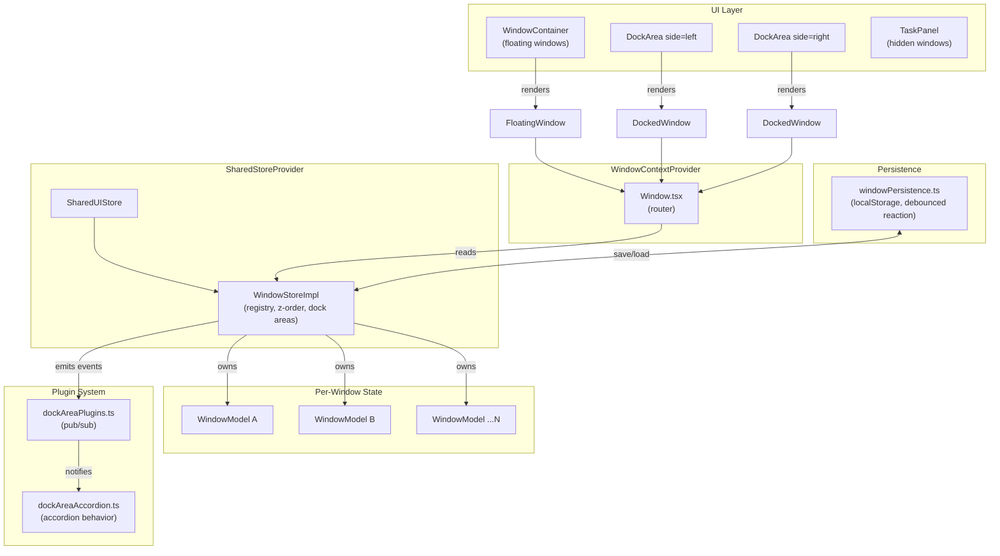
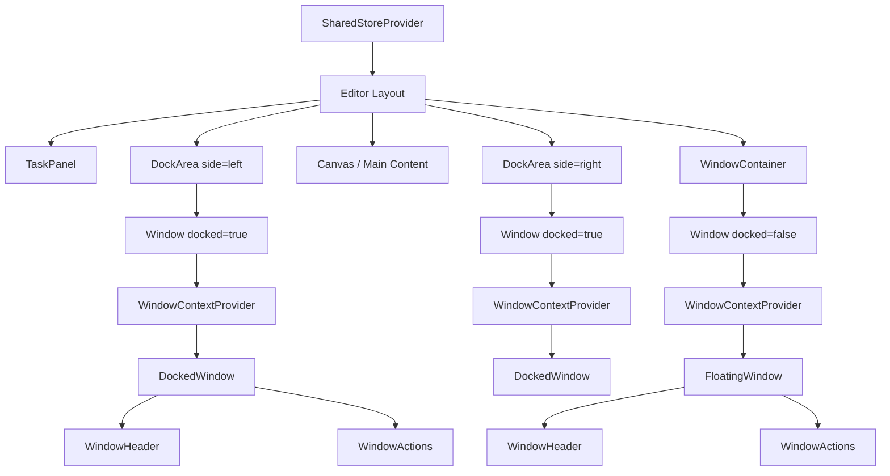
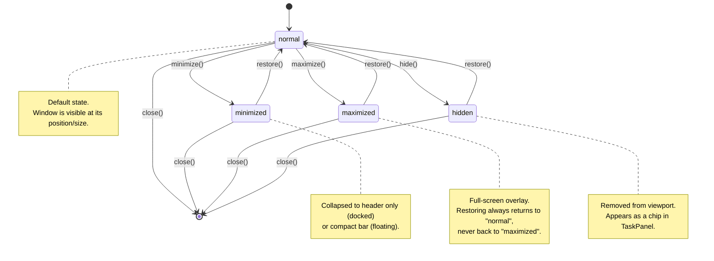
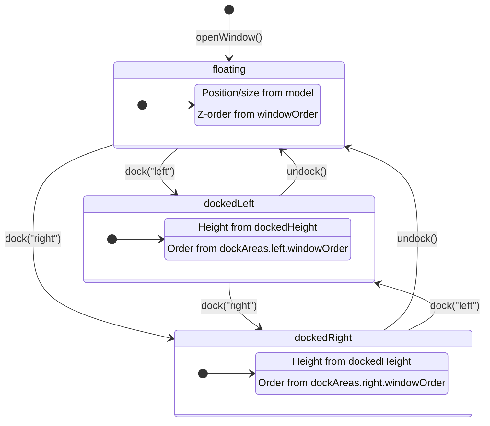
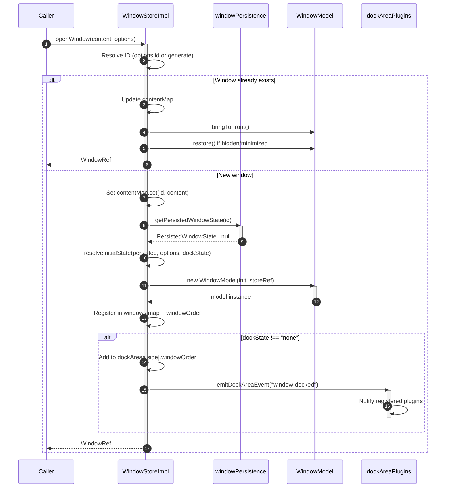
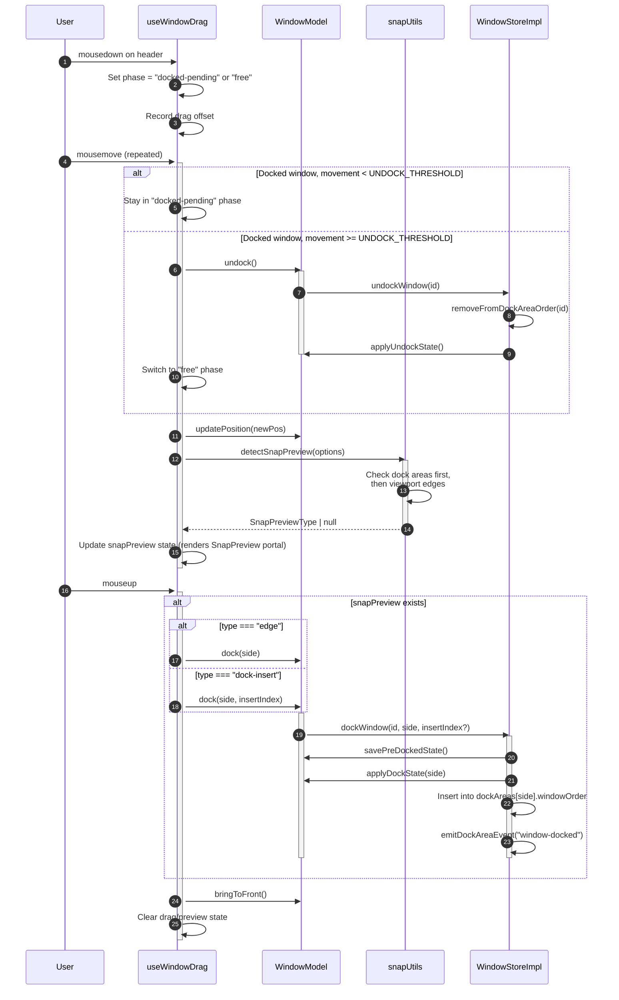
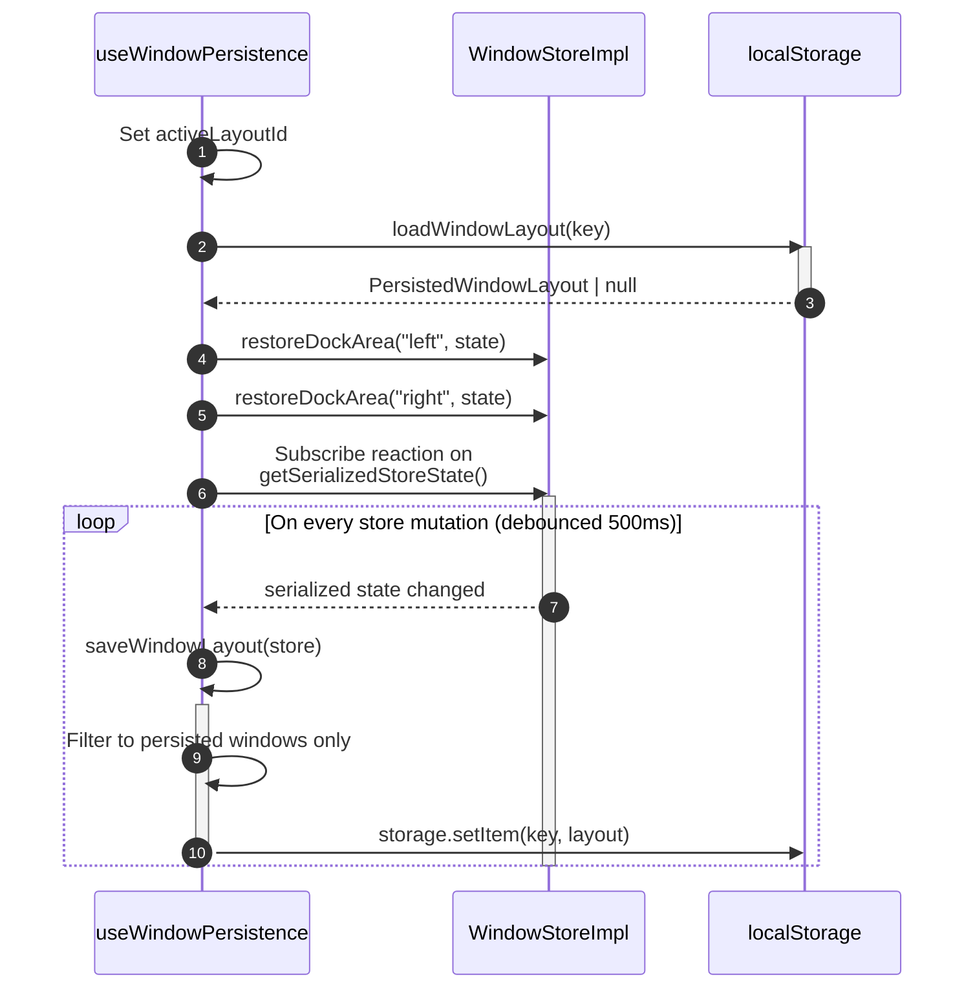
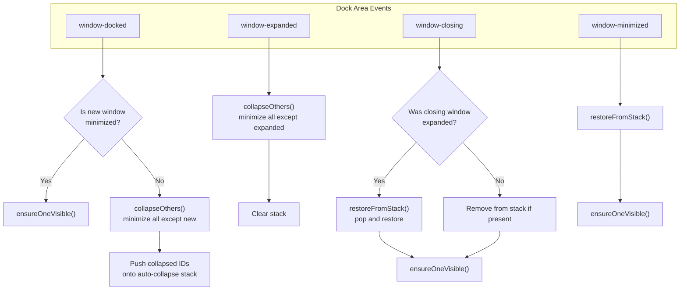

# Window Management System

A floating and dockable window manager built on MobX observables. Provides IDE-style panels that users can drag, dock to left/right edges, minimize, maximize, hide to a task bar, and persist across page reloads.

## Architecture Overview



## File Inventory

### Root

| File | Role |
|------|------|
| `types.ts` | Shared TypeScript types (`WindowState`, `DockState`, `WindowOptions`, `WindowRef`, etc.) and layout constants (`DEFAULT_WINDOW_SIZE`, thresholds, widths) |
| `windowModel.ts` | `WindowModel` class -- per-window MobX observable state with actions for minimize/maximize/hide/restore/dock/undock and snapshot mechanism |
| `windowStore.ts` | `WindowStoreImpl` class -- window registry, z-order, dock area config, open/close/dock/undock, content map, query helpers |
| `windowPersistence.ts` | `useWindowPersistence` hook and `getPersistedWindowState` -- debounced localStorage save via MobX reaction, versioned schema |
| `dockAreaPlugins.ts` | Lightweight pub/sub for dock area lifecycle events (`window-docked`, `window-expanded`, `window-closing`, `window-minimized`) |
| `Window.tsx` | Entry component: resolves model + content from store, provides `WindowContextProvider`, routes to `DockedWindow` or `FloatingWindow` |
| `WindowContainer.tsx` | Renders all floating (`dockState === "none"`) windows |
| `DockArea.tsx` | Renders a dock column (left or right): enables dock side on mount, observes width via `ResizeObserver`, lists docked `Window` instances |
| `TaskPanel.tsx` | Horizontal bar showing `hidden` windows as chips with restore/close actions |
| `SnapPreview.tsx` | Visual overlay during drag: edge dock hint or horizontal insert line |
| `snapUtils.ts` | DOM registration for dock areas and snap detection logic (`detectSnapPreview`) |
| `ContentWindowStateContext.tsx` | React context providing `{ model: WindowModel, content: ReactNode }` to the window subtree |

### `components/`

| File | Role |
|------|------|
| `DockedWindow.tsx` | Docked window chrome: header with grip, vertical resize handle, minimized/maximized states, portal for maximized overlay |
| `FloatingWindow.tsx` | Floating window chrome: fixed positioning, header drag, SE corner resize, z-order via `model.zIndex` |
| `WindowActions.tsx` | Observer toolbar with minimize, maximize, hide, close buttons (respects `disabledActions`) |
| `WindowHeader.tsx` | Presentational header: title, optional leading icon, drag `onMouseDown`, trailing actions slot |

### `hooks/`

| File | Role |
|------|------|
| `useWindowDrag.ts` | Pointer-driven move + snap-to-dock: docked pending-undock threshold, live position updates, snap preview, dock-on-drop |

### `plugins/`

| File | Role |
|------|------|
| `dockAreaAccordion.ts` | Accordion behavior plugin: only one expanded window per dock side, auto-collapse stack with restore-on-close |

## Component Tree



- `WindowContainer` renders floating windows (those with `dockState === "none"`).
- Each `DockArea` renders docked windows for its side in the order defined by `dockAreas[side].windowOrder`.
- `Window.tsx` is the routing layer: it resolves the model, injects context, and delegates to `DockedWindow` or `FloatingWindow`.
- `TaskPanel` renders chips for windows with `state === "hidden"` (independent of `Window`).

## Window States



**Key rule**: restoring from `maximized` always transitions to `normal`, not back to `maximized`. This prevents a user from getting stuck in a maximize loop.

### Snapshot Mechanism

Every state transition away from `normal` saves a snapshot (`previousState`, `previousPosition`, `previousSize`). Restoring replays the snapshot and clears it. This enables round-trip transitions like `normal -> minimized -> normal` without losing geometry.

## Dock States



When docking:

1. `savePreDockedState()` preserves floating position/size (only if currently floating).
2. `applyDockState(side)` sets `dockState` and defaults `dockedHeight`.
3. The window ID is inserted into `dockAreas[side].windowOrder`.

When undocking:

1. The window ID is removed from the dock area order.
2. `applyUndockState()` restores the pre-dock position/size and clears dock fields.

## Opening a Window (Sequence)



## Drag-to-Dock Flow



## Persistence

### Lifecycle



### What Gets Persisted

Only windows with `persisted: true` are included. The persisted layout schema:

```typescript
interface PersistedWindowLayout {
  windows: Record<string, PersistedWindowState>;
  windowOrder: string[];               // filtered to persisted IDs only
  dockAreas: {
    left: PersistedDockAreaState;       // windowOrder filtered to persisted IDs
    right: PersistedDockAreaState;
  };
  version: number;                      // currently 4
}

interface PersistedWindowState {
  position: Position;
  size: Size;
  dockState: DockState;
  isHidden: boolean;
  isMinimized: boolean;
  preDockedPosition?: Position;
  preDockedSize?: Size;
  dockedHeight?: number;
}
```

### Initial State Resolution

When a persisted window is opened, `resolveInitialState` determines the starting state:

| Persisted Hidden | `startVisible` | Persisted Minimized | Docked | Result |
|---|---|---|---|---|
| true | false | - | - | `"hidden"` + seed `previous*` |
| true | true | - | - | `"normal"` (override hidden) |
| false | - | true | yes | `"minimized"` + seed `previous*` |
| false | - | true | no | `"normal"` (minimized only honored for docked) |
| false | - | false | - | `"normal"` |

## Plugin System

### Event Types

| Event | Emitted When |
|-------|-------------|
| `window-docked` | A window is added to a dock area (via `dockWindow` or `openWindow` with persisted dock state) |
| `window-expanded` | A docked window is restored from minimized/hidden state (non-quiet) |
| `window-closing` | A docked window is about to be closed |
| `window-minimized` | A docked window is minimized (non-quiet) |

### Registration

```typescript
const unsubscribe = registerDockAreaPlugin("right", (event: DockAreaEvent) => {
  // event.type, event.side, event.windowId
});

// Later:
unsubscribe();
```

### Accordion Plugin

The built-in `dockAreaAccordion` plugin enforces that only one window can be expanded at a time within a dock side. It maintains a stack of auto-collapsed window IDs per side:



The `quiet` flag on `minimize()` and `restore()` prevents recursive event emission when the accordion plugin itself is collapsing/restoring windows.

## Context and Content

`ContentWindowStateContext` provides the current window's model and content to descendant components:

```typescript
interface WindowContextValue {
  model: WindowModel;
  content: ReactNode;
}
```

- `Window.tsx` creates the provider after resolving model + content from the store.
- `useWindowContext()` throws if used outside a `WindowContextProvider` (fail-fast).
- `useOptionalWindowContext()` returns `null` when outside (for optional access).

### Why `contentMap` Is Not Observable

`WindowStoreImpl.contentMap` is a plain `Map<string, ReactNode>`, deliberately kept outside MobX. React elements (JSX) must never be stored in MobX observables because:

1. MobX deep-wraps objects in proxies, which breaks React element identity checks.
2. React Compiler expects stable element references; proxy wrapping violates this.
3. Reactions tracking content would fire on every render, defeating the purpose of fine-grained reactivity.

## Constants Reference

| Constant | Value | Purpose |
|----------|-------|---------|
| `DEFAULT_WINDOW_SIZE` | `320 x 420` | Default width/height for new floating windows |
| `DEFAULT_MIN_SIZE` | `280 x 200` | Minimum resize dimensions |
| `CASCADE_OFFSET` | `24px` | Offset between cascaded new windows |
| `EDGE_SNAP_THRESHOLD` | `2px` | Distance from viewport edge to trigger dock preview |
| `DOCK_AREA_SNAP_THRESHOLD` | `40px` | Distance from dock area edge to trigger insert preview |
| `DEFAULT_DOCK_AREA_WIDTH` | `320px` | Initial dock column width |
| `MIN_DOCK_AREA_WIDTH` | `220px` | Minimum dock column width (resize handle) |
| `MAX_DOCK_AREA_WIDTH` | `600px` | Maximum dock column width (resize handle) |
| `COLLAPSED_DOCK_AREA_WIDTH` | `36px` | Width of a collapsed dock column |
| `DEFAULT_DOCKED_HEIGHT` | `300px` | Default height for a docked window |
| `MIN_DOCKED_HEIGHT` | `100px` | Minimum height for a docked window (resize handle) |
| `TASK_PANEL_HEIGHT` | `43px` | Height of the TaskPanel bar (used for floating window offset) |

## Rules and Restrictions

### MobX Integration

1. **Every component reading MobX state MUST be wrapped in `observer`.**
   `Window`, `DockArea`, `WindowContainer`, `TaskPanel`, `DockedWindow`, `FloatingWindow`, and `WindowActions` are all wrapped.

2. **State mutations MUST use `@action` methods.**
   Never modify `WindowModel` or `WindowStoreImpl` properties directly from a component. Call the model/store action methods.

3. **React content MUST NOT be stored in observables.**
   The `contentMap` is a plain `Map` for this reason. Do not move it into an `@observable` property.

### Docking

4. **Dock sides must be enabled before docking works.**
   `DockArea` calls `enableDockSide(side)` on mount and `disableDockSide(side)` on unmount. If no `DockArea` is rendered for a side, `dockWindow` for that side is a no-op.

5. **Dock area ordering is per-side, not global.**
   `dockAreas.left.windowOrder` and `dockAreas.right.windowOrder` control the vertical stacking within each dock column. The global `windowOrder` controls z-index for floating windows.

6. **Pre-dock geometry is saved only once.**
   `savePreDockedState()` only copies position/size when `dockState === "none"`. Moving between dock sides does not re-save the floating geometry.

### Persistence

7. **Only `persisted: true` windows are saved to localStorage.**
   Transient windows (e.g., temporary dialogs) should not set `persisted`.

8. **Persisted windows MUST use stable, explicit `id` values.**
   Auto-generated IDs (`window-<timestamp>-<random>`) change on every session and will never match persisted state.

9. **Layout version must match `CURRENT_VERSION` to load.**
   If the schema changes, bump `CURRENT_VERSION`. Old layouts are silently discarded.

### Context

10. **`useWindowDrag` must only be used inside observer components within `WindowContextProvider`.**
    The hook reads from `useWindowContext()` and `useSharedStores()`.

### React Compiler

11. **Do NOT use `useCallback` or `useMemo` in this directory.**
    The `src/routes/v2/` scope is opted into React Compiler, which handles memoization automatically.

## Best Practices

### Do

- **Use `WindowRef` for external window control.** The `openWindow()` return value provides a stable API (`close`, `minimize`, `maximize`, `hide`, `restore`) without needing to import the model.

  ```typescript
  const ref = windows.openWindow(<MyContent />, {
    id: "my-panel",
    title: "My Panel",
  });

  // Later:
  ref.close();
  ```

- **Provide a stable `id` for any persisted window.** This ensures the window reconnects with its saved layout on reload.

  ```typescript
  windows.openWindow(<Settings />, {
    id: "settings-panel",
    title: "Settings",
    persisted: true,
  });
  ```

- **Use `linkedEntityId` to auto-close windows tied to a domain entity.** When the entity is deleted, call `closeWindowsByLinkedEntity(entityId)`.

  ```typescript
  windows.openWindow(<TaskDetails task={task} />, {
    id: `task-${task.id}`,
    title: task.name,
    linkedEntityId: task.id,
  });

  // When the task node is deleted:
  windows.closeWindowsByLinkedEntity(task.id);
  ```

- **Use `disabledActions` to restrict window behavior.**

  ```typescript
  windows.openWindow(<HelpPanel />, {
    id: "help",
    title: "Help",
    disabledActions: ["close"],  // User cannot close this window
  });
  ```

- **Use the `quiet` flag in plugins** when programmatically minimizing/restoring to prevent recursive event emission.

  ```typescript
  win.minimize({ quiet: true });   // No "window-minimized" event emitted
  win.restore({ quiet: true });    // No "window-expanded" event emitted
  ```

- **Use `startVisible: true` for selection-driven windows** that should always appear when the user selects something, even if they were previously hidden.

  ```typescript
  windows.openWindow(<NodeInspector node={node} />, {
    id: `inspector-${node.id}`,
    title: "Inspector",
    persisted: true,
    startVisible: true,  // Override persisted hidden state
  });
  ```

### Don't

- **Don't store React nodes in MobX observables.**

  ```typescript
  // BAD: observable wraps React elements in proxies
  @observable accessor content: ReactNode = null;

  // GOOD: use a plain Map
  private contentMap = new Map<string, ReactNode>();
  ```

- **Don't mutate model properties outside of actions.**

  ```typescript
  // BAD: direct mutation
  model.state = "minimized";

  // GOOD: use the action method
  model.minimize();
  ```

- **Don't read `contentMap` inside MobX reactions or computed values.** It is not observable, so reactions will not track it. Access it only in render methods.

- **Don't use `useCallback` or `useMemo`** in any file under `src/routes/v2/`. React Compiler handles this automatically.

- **Don't render window content without an `observer` wrapper.** If a component reads any `WindowModel` property, it must be an observer.

  ```typescript
  // BAD: not wrapped in observer
  function MyWindowConsumer() {
    const { model } = useWindowContext();
    return <div>{model.title}</div>; // Won't re-render on title change
  }

  // GOOD
  const MyWindowConsumer = observer(function MyWindowConsumer() {
    const { model } = useWindowContext();
    return <div>{model.title}</div>;
  });
  ```

- **Don't use auto-generated IDs for persisted windows.** They change every session.

  ```typescript
  // BAD: no id + persisted — will never restore
  windows.openWindow(<Panel />, { title: "X", persisted: true });

  // GOOD: stable id + persisted
  windows.openWindow(<Panel />, { id: "x-panel", title: "X", persisted: true });
  ```

- **Don't call `dockWindow` without ensuring the dock side is enabled.** The call is silently ignored if the side's `DockArea` is not mounted. This is by design, but can be surprising if you expect docking to work before the layout renders.

## Usage Examples

### Opening a Basic Floating Window

```typescript
const { windows } = useSharedStores();

const ref = windows.openWindow(
  <MyContent />,
  {
    title: "My Window",
    size: { width: 400, height: 500 },
  },
);
```

The window appears at a cascaded position (`100 + N * 24, 100 + N * 24`), where N is the current window count.

### Opening a Persisted Dockable Window

```typescript
const ref = windows.openWindow(
  <PropertiesPanel />,
  {
    id: "properties",
    title: "Properties",
    persisted: true,
    disabledActions: ["close"],
    minSize: { width: 300, height: 250 },
  },
);
```

On first load, the window opens floating. If the user docks it to the right and reloads, it reopens docked to the right with the same dimensions.

### Controlling a Window via WindowRef

```typescript
const ref = windows.openWindow(<Dashboard />, {
  id: "dashboard",
  title: "Dashboard",
});

// Programmatic control:
ref.minimize();
ref.restore();
ref.hide();
ref.maximize();
ref.close();
```

### Registering a Custom Dock Area Plugin

```typescript
import { registerDockAreaPlugin, type DockAreaEvent } from "./dockAreaPlugins";

function initMyPlugin(side: "left" | "right"): () => void {
  return registerDockAreaPlugin(side, (event: DockAreaEvent) => {
    switch (event.type) {
      case "window-docked":
        console.log(`Window ${event.windowId} docked to ${event.side}`);
        break;
      case "window-closing":
        console.log(`Window ${event.windowId} closing from ${event.side}`);
        break;
    }
  });
}

// Initialize:
const cleanup = initMyPlugin("right");

// Teardown:
cleanup();
```

### Opening a Window Re-Focuses If Already Open

Calling `openWindow` with the same `id` does not create a duplicate. Instead, it:

1. Updates the content (in case JSX changed).
2. Brings the window to the front.
3. Restores it if hidden or minimized.

```typescript
// First call: creates the window
windows.openWindow(<Details v={1} />, { id: "details", title: "Details" });

// Second call: focuses existing window, updates content
windows.openWindow(<Details v={2} />, { id: "details", title: "Details" });
```
