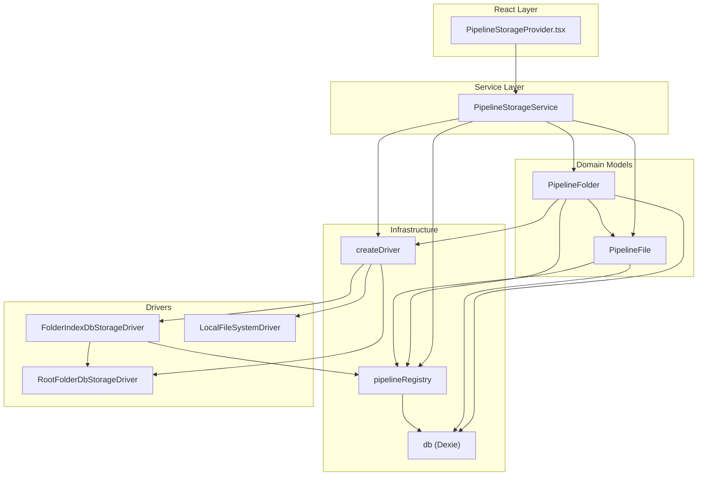
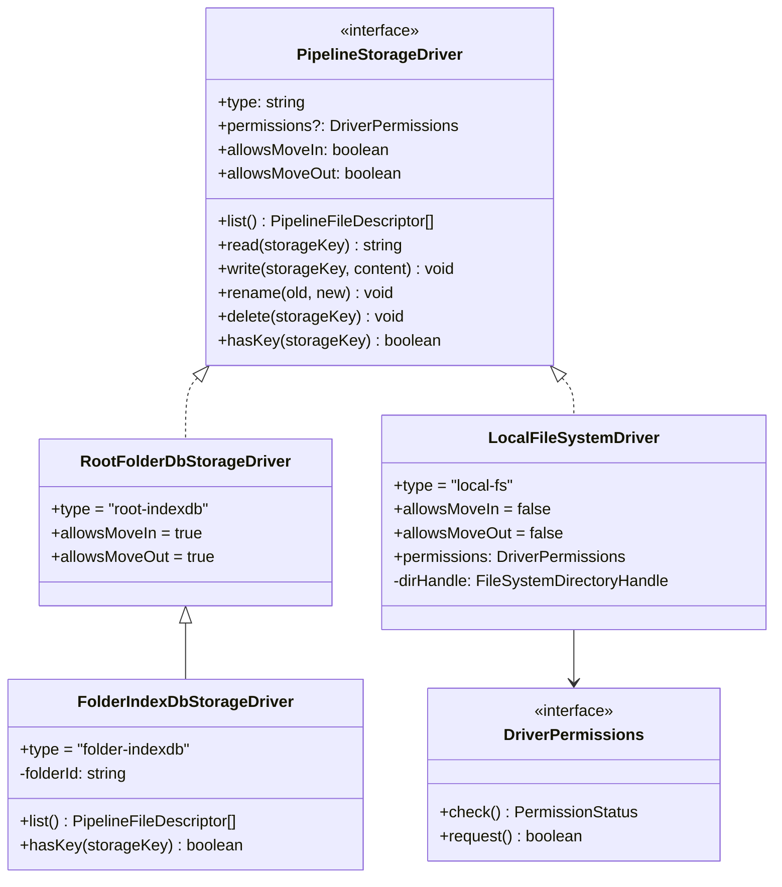
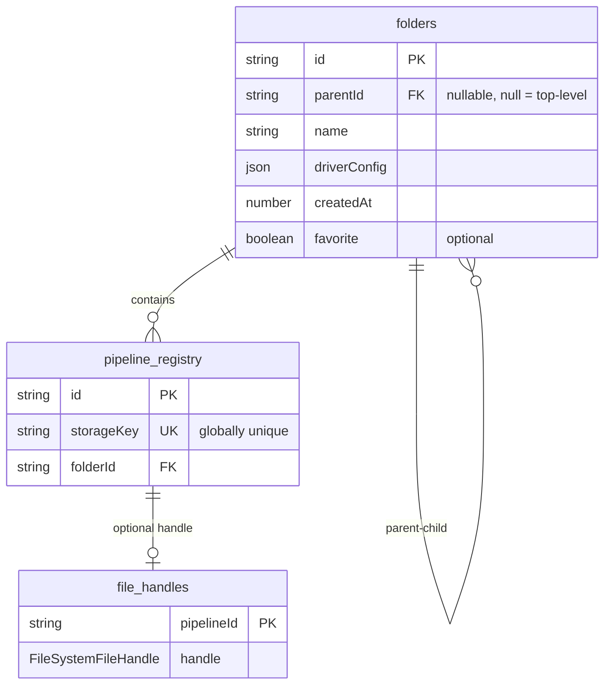
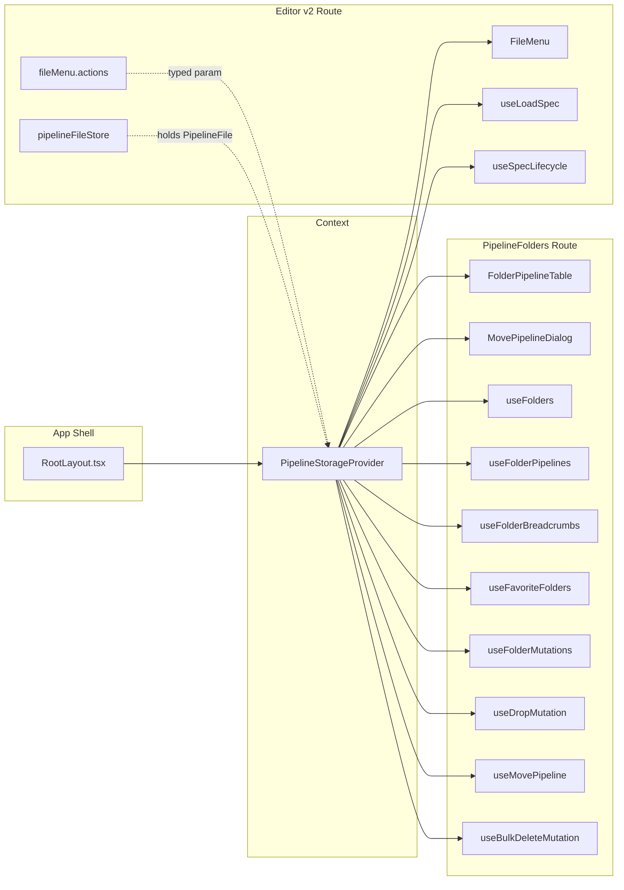
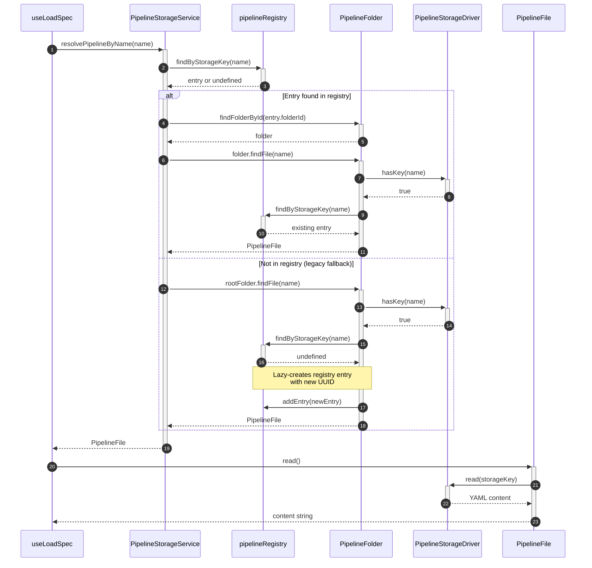
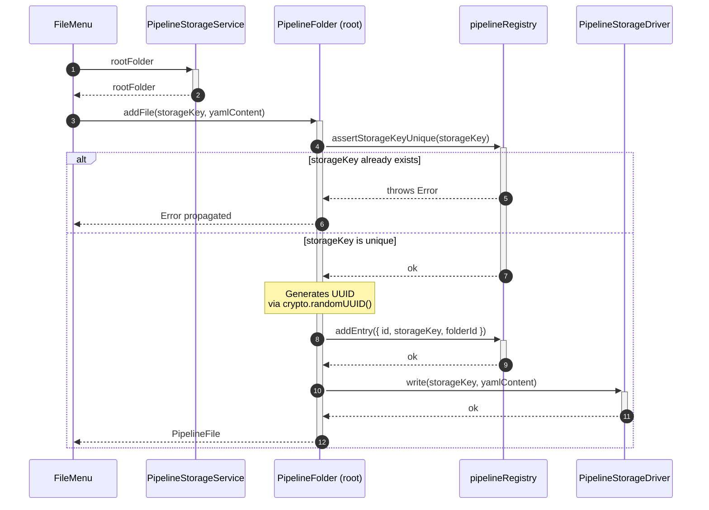
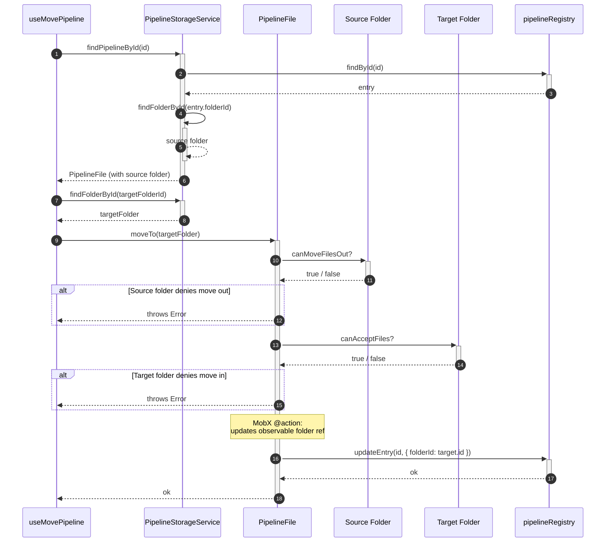
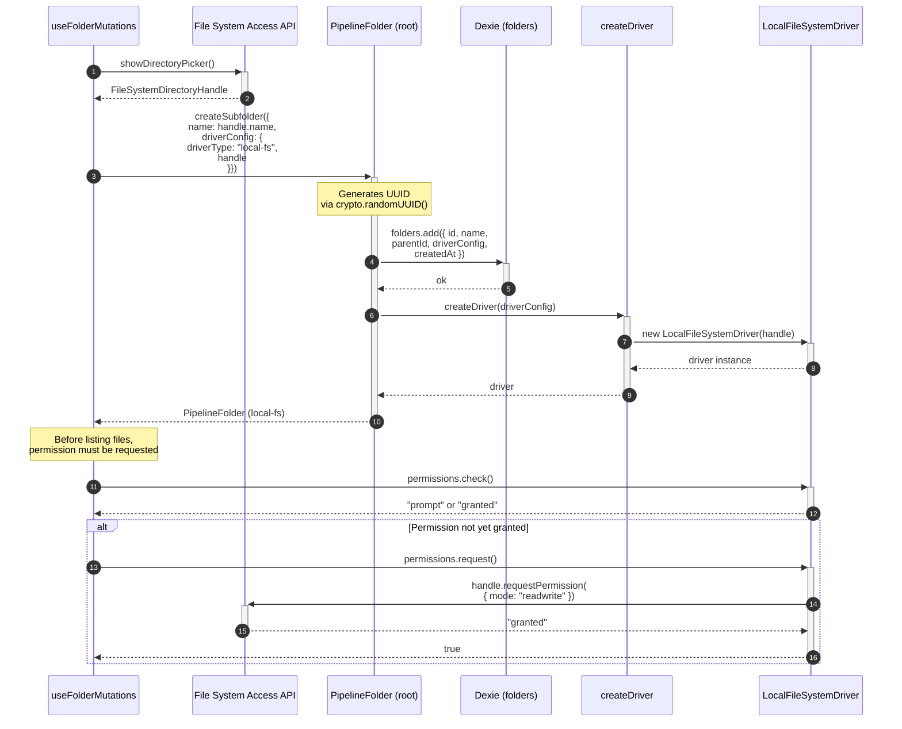
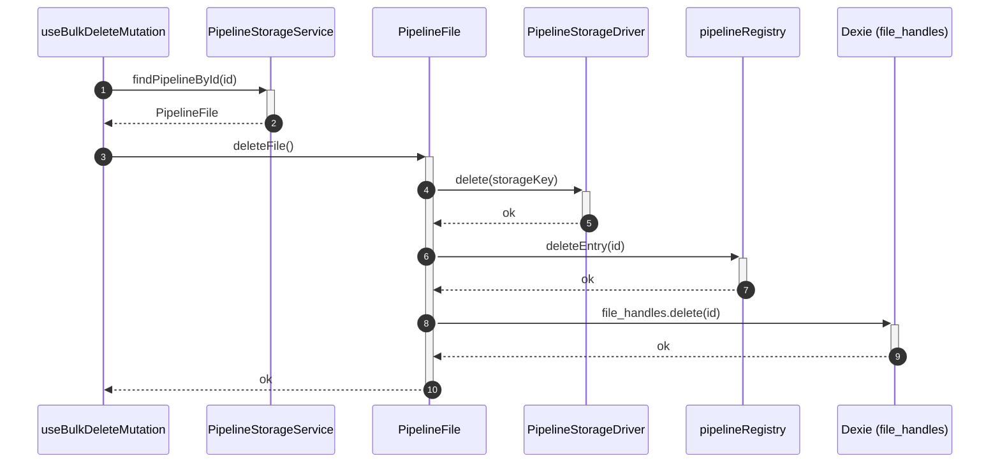
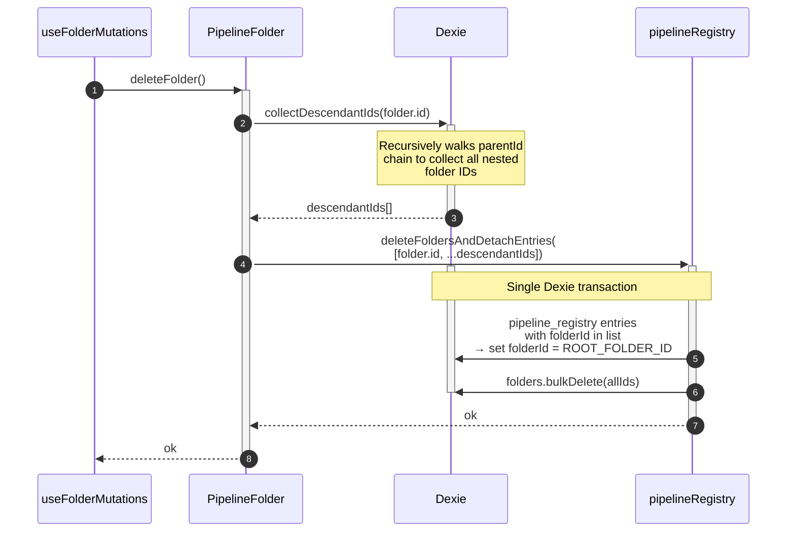

# Pipeline Storage Architecture

Client-side pipeline file storage abstraction that supports multiple storage backends (IndexedDB, local file system) behind a unified driver interface. Every pipeline file lives inside a folder; every folder owns a storage driver that handles the actual I/O.

## Module Structure

```
pipelineStorage/
├── types.ts                        # Contracts, discriminated union DriverConfig
├── db.ts                           # Dexie database schema and migrations
├── pipelineRegistry.ts             # Registry CRUD (pipeline_registry table)
├── createDriver.ts                 # Factory: DriverConfig → PipelineStorageDriver
├── PipelineFile.ts                 # Domain model for a single pipeline file
├── PipelineFolder.ts               # Domain model for a folder of pipeline files
├── PipelineStorageService.ts       # Service layer — entry point for all operations
├── PipelineStorageProvider.tsx      # React context provider + usePipelineStorage hook
└── drivers/
    ├── RootFolderDbStorageDriver.ts    # Legacy IndexedDB component list
    ├── FolderIndexDbStorageDriver.ts   # Folder-scoped IndexedDB (extends Root driver)
    └── LocalFileSystemDriver.ts        # File System Access API (local directory)
```



---

## Driver Pattern

### PipelineStorageDriver Interface

Every driver implements this contract (defined in `types.ts`):

```typescript
interface PipelineStorageDriver {
  readonly type: string;
  readonly permissions?: DriverPermissions;
  readonly allowsMoveIn: boolean;
  readonly allowsMoveOut: boolean;

  list(): Promise<PipelineFileDescriptor[]>;
  read(storageKey: string): Promise<string>;
  write(storageKey: string, content: string): Promise<void>;
  rename(oldStorageKey: string, newStorageKey: string): Promise<void>;
  delete(storageKey: string): Promise<void>;
  hasKey(storageKey: string): Promise<boolean>;
}
```

### DriverConfig Discriminated Union

Each folder persists a `DriverConfig` in Dexie. The `createDriver` factory resolves it to a live driver instance at runtime:

```typescript
type DriverConfig =
  | { driverType: "root-indexdb" }
  | { driverType: "folder-indexdb"; folderId: string }
  | { driverType: "local-fs"; handle: FileSystemDirectoryHandle };
```

### Driver Implementations

| Driver                       | `driverType`     | Backing Store                                      | `allowsMoveIn` | `allowsMoveOut` | `permissions`       |
| ---------------------------- | ---------------- | -------------------------------------------------- | -------------- | --------------- | ------------------- |
| `RootFolderDbStorageDriver`  | `root-indexdb`   | Legacy `localforage` component list                | `true`         | `true`          | none                |
| `FolderIndexDbStorageDriver` | `folder-indexdb` | Same backing store, scoped via `pipeline_registry` | `true`         | `true`          | none                |
| `LocalFileSystemDriver`      | `local-fs`       | File System Access API directory handle            | `false`        | `false`         | `DriverPermissions` |

### Class Hierarchy



**Key details:**

- `FolderIndexDbStorageDriver` **extends** `RootFolderDbStorageDriver`. It inherits `read`, `write`, `rename`, and `delete` but **overrides** `list()` and `hasKey()` to scope results through the `pipeline_registry` table using `folderId`.
- `LocalFileSystemDriver` only lists files matching `*.pipeline.component.yaml`. The `toFileName()` helper appends `.pipeline.component.yaml` to bare storage keys.
- `LocalFileSystemDriver` requires explicit permission via `DriverPermissions.request()` before any I/O. The permission model uses the browser's File System Access API (`queryPermission` / `requestPermission`).

---

## Database Schema

Dexie database name: `tangle_pipelines`



### Tables and Indexes

| Table               | Primary Key  | Indexed Fields                                                         | Notes                                                |
| ------------------- | ------------ | ---------------------------------------------------------------------- | ---------------------------------------------------- |
| `pipeline_registry` | `id`         | `&storageKey` (unique), `folderId`, `[folderId+storageKey]` (compound) | Maps pipeline names to folders                       |
| `folders`           | `id`         | `parentId`                                                             | Stores folder tree with `driverConfig`               |
| `file_handles`      | `pipelineId` | —                                                                      | Stores `FileSystemFileHandle` for local-fs pipelines |

### Migrations

- **v1**: Creates all three tables. Runs an upgrade that reads the legacy `RootFolderDbStorageDriver.list()` and seeds `pipeline_registry` with every known pipeline assigned to `ROOT_FOLDER_ID` (`"__root__"`).
- **v2**: Adds the compound index `[folderId+storageKey]` to `pipeline_registry` for efficient folder-scoped lookups.

---

## Pipeline Registry

`pipelineRegistry.ts` provides thin Dexie CRUD functions over the `pipeline_registry` table. **Only internal module code should import from this file.**

### Functions

| Function                                   | Purpose                                                                                                       |
| ------------------------------------------ | ------------------------------------------------------------------------------------------------------------- |
| `addEntry(entry)`                          | Insert a new registry row                                                                                     |
| `updateEntry(id, updates)`                 | Partial update (e.g., change `folderId` on move, `storageKey` on rename)                                      |
| `deleteEntry(id)`                          | Remove a single row                                                                                           |
| `findById(id)`                             | Lookup by primary key                                                                                         |
| `findByStorageKey(key)`                    | Lookup by unique `storageKey` index                                                                           |
| `getAllEntries()`                          | Return every row                                                                                              |
| `getAllByFolderId(folderId)`               | Return all pipelines in a folder                                                                              |
| `findByFolderAndStorageKey(folderId, key)` | Compound index lookup                                                                                         |
| `assertStorageKeyUnique(key)`              | Throws if `storageKey` already exists                                                                         |
| `deleteFoldersAndDetachEntries(folderIds)` | **Transactional**: moves entries from deleted folders back to `ROOT_FOLDER_ID`, then bulk-deletes the folders |

### Constraint: Global Uniqueness of `storageKey`

The `storageKey` column has a **unique index** (`&storageKey`). This means pipeline names are globally unique across all folders. The `assertStorageKeyUnique` guard must be called before creating new pipelines.

---

## Domain Models

### PipelineFile

Represents a single pipeline file. Delegates all I/O to its parent folder's driver.

| Property / Method      | Type              | Observable | Description                                                                |
| ---------------------- | ----------------- | ---------- | -------------------------------------------------------------------------- |
| `id`                   | `string`          | no         | Stable UUID from `pipeline_registry`                                       |
| `storageKey`           | `string`          | **yes**    | Pipeline name (globally unique)                                            |
| `folder`               | `PipelineFolder`  | **yes**    | Parent folder (changes on move)                                            |
| `createdAt`            | `Date?`           | no         | From driver metadata                                                       |
| `modifiedAt`           | `Date?`           | no         | From driver metadata                                                       |
| `read()`               | `Promise<string>` | —          | Delegates to `folder.driver.read(storageKey)`                              |
| `write(content)`       | `Promise<void>`   | —          | Delegates to `folder.driver.write(storageKey, content)`                    |
| `rename(newName)`      | `Promise<void>`   | —          | `@action`: renames via driver, updates registry, then sets `storageKey`    |
| `moveTo(targetFolder)` | `Promise<void>`   | —          | `@action`: checks permissions on both folders, updates registry `folderId` |
| `deleteFile()`         | `Promise<void>`   | —          | Deletes via driver, registry entry, and `file_handles` row                 |

### PipelineFolder

Represents a folder that contains pipeline files and subfolders.

| Property / Method    | Type                    | Observable | Description                                     |
| -------------------- | ----------------------- | ---------- | ----------------------------------------------- |
| `id`                 | `string`                | no         | UUID or `ROOT_FOLDER_ID`                        |
| `name`               | `string`                | **yes**    | Display name                                    |
| `isRoot`             | `boolean`               | no         | `true` when `id === ROOT_FOLDER_ID`             |
| `parentId`           | `string \| null`        | no         | `null` for top-level folders                    |
| `driver`             | `PipelineStorageDriver` | no         | Resolved from `driverConfig` via `createDriver` |
| `favorite`           | `boolean`               | **yes**    | User-toggled favorite flag                      |
| `requiresPermission` | `boolean`               | no         | `true` when `driver.permissions` is present     |
| `canMoveFilesOut`    | `boolean`               | no         | From `driver.allowsMoveOut`                     |
| `canAcceptFiles`     | `boolean`               | no         | From `driver.allowsMoveIn`                      |

**Static constructors:**

- `PipelineFolder.fromEntry(entry: FolderEntry)` — hydrates from a Dexie row.
- `PipelineFolder.resolveById(id: string)` — reads from Dexie, throws `FolderNotFoundError` if missing.

**Key methods:**

| Method                         | Description                                                                                  |
| ------------------------------ | -------------------------------------------------------------------------------------------- |
| `listPipelines()`              | Lists all files via driver, lazy-creates registry entries via `resolveOrCreateRegistryEntry` |
| `findFile(storageKey)`         | Checks `driver.hasKey`, returns `PipelineFile` or `undefined`                                |
| `assignFile(storageKey)`       | Resolves or creates a registry entry without checking the driver                             |
| `addFile(storageKey, content)` | Asserts uniqueness, creates registry entry, writes content via driver                        |
| `listSubfolders()`             | Queries `folders` table for children, sorted by name                                         |
| `createSubfolder(options)`     | Creates a Dexie row with default `folder-indexdb` driver config                              |
| `renameFolder(newName)`        | `@action`: updates Dexie and observable `name`                                               |
| `toggleFavorite()`             | `@action`: flips and persists `favorite`                                                     |
| `moveToParent(newParentId)`    | Updates `parentId` in Dexie                                                                  |
| `breadcrumbPath()`             | Walks `parentId` chain upward, returns array of `PipelineFolder`                             |
| `deleteFolder()`               | Collects descendant folder IDs, calls `deleteFoldersAndDetachEntries`                        |

**`resolveOrCreateRegistryEntry`** is a private helper that ensures every pipeline file has a registry entry. If the registry already has an entry for the `storageKey`, it reuses it; otherwise it creates a new UUID and inserts a row. This handles the migration case where files exist in the legacy store but have no registry entry yet.

---

## Service Layer and Provider

### PipelineStorageService

The top-level entry point. Owns the `rootFolder` (a `PipelineFolder` with `folder-indexdb` driver for `ROOT_FOLDER_ID`).

```typescript
class PipelineStorageService {
  rootFolder: PipelineFolder; // @observable

  findPipelineById(id: string): Promise<PipelineFile>;
  resolvePipelineByName(name: string): Promise<PipelineFile | undefined>;
  findFolderById(id: string): Promise<PipelineFolder>;
  getAllFolders(): Promise<PipelineFolder[]>;
  getFavoriteFolders(): Promise<PipelineFolder[]>;
}
```

`resolvePipelineByName` first checks the registry by `storageKey`. If found, it resolves the owning folder. If not, it falls back to `rootFolder.findFile(name)` for legacy compatibility.

### PipelineStorageProvider

Provides a **singleton** `PipelineStorageService` per React tree:

```typescript
function PipelineStorageProvider({ children }: { children: ReactNode });
function usePipelineStorage(): PipelineStorageService;
```

The service is instantiated lazily via `useState(() => new PipelineStorageService())` so there is exactly one instance per mount. The provider is mounted in `RootLayout.tsx`, making the service available to the entire application.

### Consumer Map



---

## Key Flows

### Load Pipeline by Name

The Editor opens a pipeline by name via the URL. The storage service resolves the name to a `PipelineFile`, then reads its content.



### Create New Pipeline

A new pipeline is saved to the root folder with a unique name.



### Move Pipeline to Another Folder

Moving a pipeline updates its folder reference and registry entry. Both the source and target folders must permit the operation.



### Connect Local Folder

Connecting a local filesystem directory creates a new folder entry backed by the `local-fs` driver.



### Delete Pipeline

Deleting a pipeline removes the file from the driver, the registry entry, and any associated file handle.



### Delete Folder (Cascade)

Deleting a folder collects all descendant folder IDs, detaches their pipeline entries back to root, and bulk-deletes the folders in a single transaction.



---

## Rules, Restrictions, and Best Practices

### Public API Boundary

- **Always** access storage through `usePipelineStorage()`. This returns the singleton `PipelineStorageService`.
- **Never** import `pipelineRegistry`, `db`, `createDriver`, or driver classes directly from outside the `pipelineStorage/` module. These are implementation details.
- **Never** instantiate `PipelineStorageService` manually. Use the provider.
- The only public exports for external consumers are: `PipelineStorageProvider`, `usePipelineStorage`, `PipelineFile`, `PipelineFolder`, `PipelineStorageService`, `ROOT_FOLDER_ID`, and the types from `types.ts`.

### Storage Key Uniqueness

- `storageKey` is **globally unique** across all folders (enforced by the `&storageKey` unique index).
- Always call `assertStorageKeyUnique` before creating a new pipeline.
- Renaming a pipeline changes its `storageKey` in both the driver and the registry.

### Move Permissions

- Before moving a file, check both `sourceFolder.canMoveFilesOut` and `targetFolder.canAcceptFiles`.
- `LocalFileSystemDriver` sets `allowsMoveIn = false` and `allowsMoveOut = false`. Pipelines in local folders cannot be moved in or out — they stay on disk.
- IndexedDB-backed folders (`root-indexdb` and `folder-indexdb`) allow both move-in and move-out.

### File System Permissions

- `LocalFileSystemDriver` requires `readwrite` permission from the browser's File System Access API.
- Always check `folder.requiresPermission` before listing or reading files.
- Call `folder.driver.permissions.check()` to test the current status, then `folder.driver.permissions.request()` to prompt the user if needed.
- Permission may be revoked by the browser between sessions. Always handle `"prompt"` and `"denied"` statuses.

### Local File System Conventions

- Only files matching `*.pipeline.component.yaml` are listed by `LocalFileSystemDriver`.
- When writing, the driver appends `.pipeline.component.yaml` to bare storage keys.
- The pattern match is case-insensitive and accepts both `.yml` and `.yaml` extensions.

### MobX Observability

- `PipelineFile.storageKey` and `PipelineFile.folder` are `@observable`. Components reading these **must** be wrapped in `observer`.
- `PipelineFolder.name` and `PipelineFolder.favorite` are `@observable`. Same rule applies.
- All mutations (`rename`, `moveTo`, `toggleFavorite`, `renameFolder`) are `@action`s. State is updated inside `runInAction` after async operations complete.
- `PipelineStorageService.rootFolder` is `@observable` in case the root needs to be swapped.

### Folder Deletion

- Use `PipelineFolder.deleteFolder()` for cascading deletes. It collects all descendant folder IDs recursively and runs a single Dexie transaction.
- Detached pipeline entries are reassigned to `ROOT_FOLDER_ID`, not deleted. This preserves the pipeline files while removing the folder structure.
- The transaction guarantees atomicity: either all entries are detached and all folders deleted, or none are.

### Registry Lazy-Creation

- `resolveOrCreateRegistryEntry` (called by `listPipelines` and `findFile`) ensures every pipeline file has a registry entry. This handles the migration from the legacy store where files existed without registry tracking.
- This is an internal mechanism. External code should not rely on or call this function.

### Database Migrations

- v1 migration reads all pipelines from the legacy `RootFolderDbStorageDriver` and seeds the `pipeline_registry` with `ROOT_FOLDER_ID` as their folder.
- v2 adds the compound index `[folderId+storageKey]` for the `findByFolderAndStorageKey` query used by `FolderIndexDbStorageDriver.hasKey()`.
- New migrations must follow Dexie's versioning rules: increment the version number and never modify existing version schemas.
