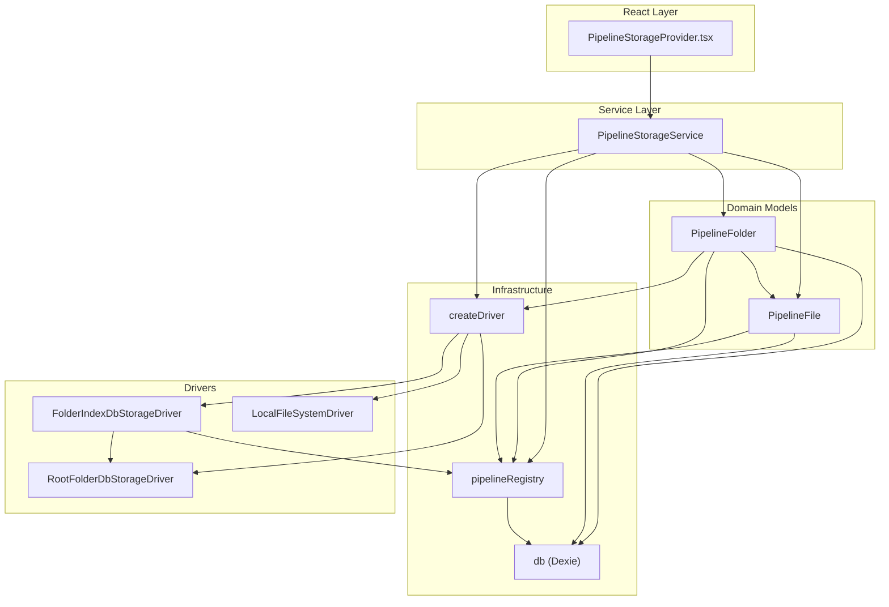
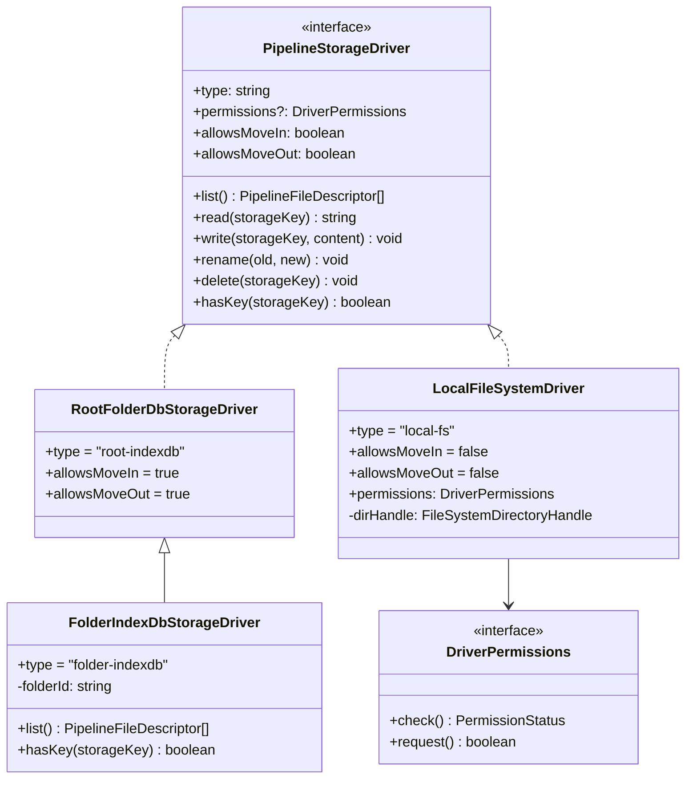
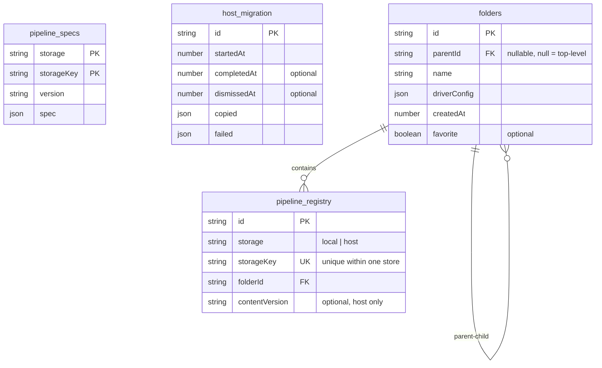
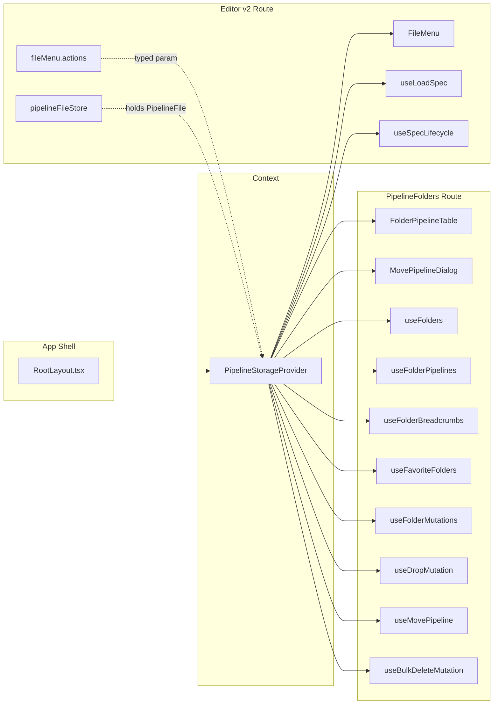
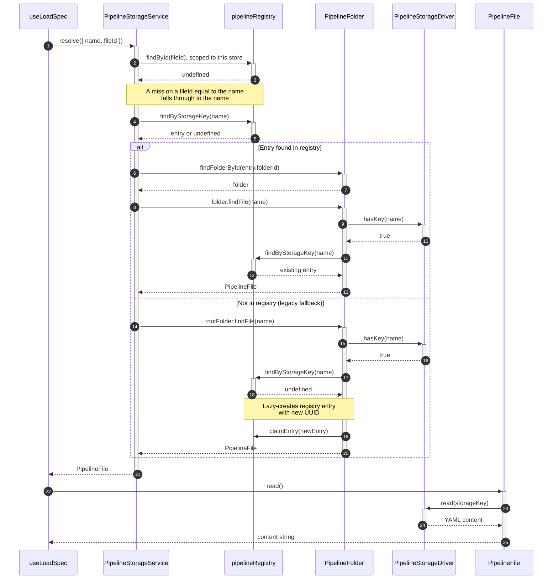
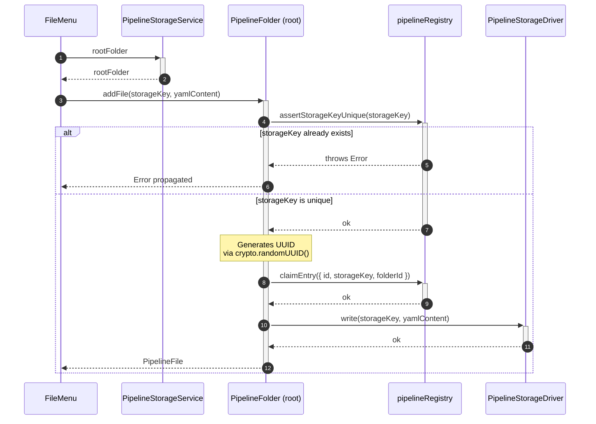
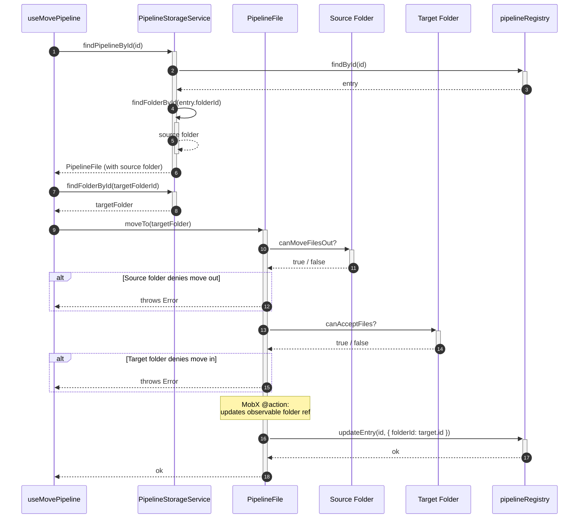
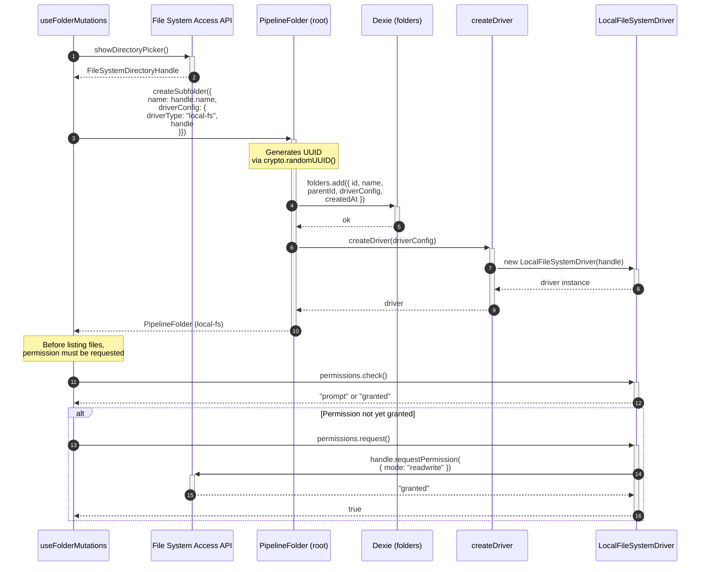
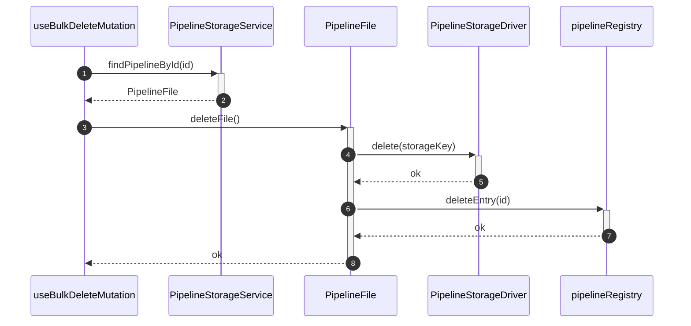
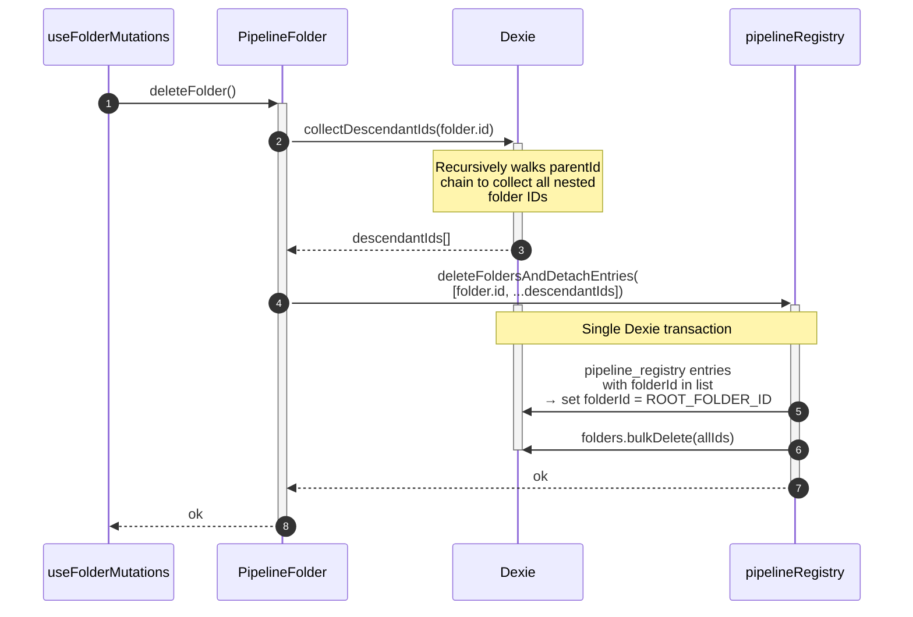

# Pipeline Storage Architecture

Pipeline file storage behind one driver interface, over browser storage (IndexedDB, local file system) or over a store the embedding page provides. Every pipeline file lives inside a folder; every folder owns a driver that does the I/O.

Which store the app uses is decided once, as it boots, and never revisited — see [Storage mode](#storage-mode).

## Module Structure

```
pipelineStorage/
├── types.ts                        # Contracts, discriminated union DriverConfig
├── db.ts                           # Dexie database schema and migrations
├── pipelineRegistry.ts             # Registry CRUD (pipeline_registry table)
├── createDriver.ts                 # Factory: DriverConfig → PipelineStorageDriver
├── PipelineFile.ts                 # Domain model for a single pipeline file
├── PipelineFolder.ts               # Domain model for a folder of pipeline files
├── PipelineStorageService.ts       # Service layer — entry point for all operations
├── PipelineStorageProvider.tsx     # React context provider + usePipelineStorage hook
├── storageMode.ts                  # Which store this page load uses; decided once
├── storageErrors.ts                # Which failures are worth another attempt
├── pipelineSpecCache.ts            # Pipeline contents, keyed by the store's own version
├── hostMigration.ts                # One-time copy of browser pipelines into a host store
├── host/
│   ├── contract.ts                 # The window global an embedding page provides
│   └── detectHost.ts               # Reads and version-checks that global
└── drivers/
    ├── RootFolderDbStorageDriver.ts    # Legacy IndexedDB component list
    ├── FolderIndexDbStorageDriver.ts   # Folder-scoped IndexedDB (extends Root driver)
    ├── LocalFileSystemDriver.ts        # File System Access API (local directory)
    ├── HostStorageDriver.ts            # The store the embedding page provides
    └── UnavailableStorageDriver.ts     # Refuses everything; see host-missing below
```


```mermaid
graph TD
    subgraph react [React Layer]
        Provider["PipelineStorageProvider.tsx"]
    end

    subgraph service [Service Layer]
        Service["PipelineStorageService"]
    end

    subgraph domain [Domain Models]
        File["PipelineFile"]
        Folder["PipelineFolder"]
    end

    subgraph infra [Infrastructure]
        Registry["pipelineRegistry"]
        DB["db (Dexie)"]
        Factory["createDriver"]
    end

    subgraph drivers [Drivers]
        RootDriver["RootFolderDbStorageDriver"]
        FolderDriver["FolderIndexDbStorageDriver"]
        LocalDriver["LocalFileSystemDriver"]
    end

    Provider --> Service
    Service --> Folder
    Service --> File
    Service --> Registry
    Service --> Factory
    Folder --> File
    Folder --> Registry
    Folder --> Factory
    Folder --> DB
    File --> Registry
    File --> DB
    Registry --> DB
    Factory --> RootDriver
    Factory --> FolderDriver
    Factory --> LocalDriver
    FolderDriver --> RootDriver
    FolderDriver --> Registry
```

---

## Driver Pattern

### PipelineStorageDriver Interface

Every driver implements this contract (defined in `types.ts`):

```typescript
interface PipelineStorageDriver {
  readonly type: string;
  readonly permissions?: DriverPermissions;
  readonly allowsMoveIn: boolean;
  readonly allowsMoveOut: boolean;

  list(): Promise<PipelineFileDescriptor[]>;
  read(storageKey: string): Promise<string>;
  write(storageKey: string, content: string): Promise<void>;
  rename(oldStorageKey: string, newStorageKey: string): Promise<void>;
  delete(storageKey: string): Promise<void>;
  hasKey(storageKey: string): Promise<boolean>;
}
```

### DriverConfig Discriminated Union

Each folder persists a `DriverConfig` in Dexie. The `createDriver` factory resolves it to a live driver instance at runtime:

```typescript
type DriverConfig =
  | { driverType: "root-indexdb" }
  | { driverType: "folder-indexdb"; folderId: string }
  | { driverType: "local-fs"; handle: FileSystemDirectoryHandle }
  | { driverType: "host" };
```

### Driver Implementations

| Driver                       | `driverType`     | Backing Store                                      | `allowsMoveIn` | `allowsMoveOut` | `permissions`       |
| ---------------------------- | ---------------- | -------------------------------------------------- | -------------- | --------------- | ------------------- |
| `RootFolderDbStorageDriver`  | `root-indexdb`   | Legacy `localforage` component list                | `true`         | `true`          | none                |
| `FolderIndexDbStorageDriver` | `folder-indexdb` | Same backing store, scoped via `pipeline_registry` | `true`         | `true`          | none                |
| `LocalFileSystemDriver`      | `local-fs`       | File System Access API directory handle            | `false`        | `false`         | `DriverPermissions` |
| `HostStorageDriver`          | `host`           | `window.__TANGLE_PIPELINE_STORAGE_HOST__`          | `false`        | `false`         | none                |

### Class Hierarchy


```mermaid
classDiagram
    class PipelineStorageDriver {
        <<interface>>
        +type: string
        +permissions?: DriverPermissions
        +allowsMoveIn: boolean
        +allowsMoveOut: boolean
        +list() PipelineFileDescriptor[]
        +read(storageKey) string
        +write(storageKey, content) void
        +rename(old, new) void
        +delete(storageKey) void
        +hasKey(storageKey) boolean
    }

    class RootFolderDbStorageDriver {
        +type = "root-indexdb"
        +allowsMoveIn = true
        +allowsMoveOut = true
    }

    class FolderIndexDbStorageDriver {
        +type = "folder-indexdb"
        -folderId: string
        +list() PipelineFileDescriptor[]
        +hasKey(storageKey) boolean
    }

    class LocalFileSystemDriver {
        +type = "local-fs"
        +allowsMoveIn = false
        +allowsMoveOut = false
        +permissions: DriverPermissions
        -dirHandle: FileSystemDirectoryHandle
    }

    class DriverPermissions {
        <<interface>>
        +check() PermissionStatus
        +request() boolean
    }

    PipelineStorageDriver <|.. RootFolderDbStorageDriver
    RootFolderDbStorageDriver <|-- FolderIndexDbStorageDriver
    PipelineStorageDriver <|.. LocalFileSystemDriver
    LocalFileSystemDriver --> DriverPermissions
```

**Key details:**

- `FolderIndexDbStorageDriver` **extends** `RootFolderDbStorageDriver`. It inherits `read`, `write`, `rename`, and `delete` but **overrides** `list()` and `hasKey()` to scope results through the `pipeline_registry` table using `folderId`.
- `LocalFileSystemDriver` only lists files matching `*.pipeline.component.yaml`. The `toFileName()` helper appends `.pipeline.component.yaml` to bare storage keys.
- `LocalFileSystemDriver` requires explicit permission via `DriverPermissions.request()` before any I/O. The permission model uses the browser's File System Access API (`queryPermission` / `requestPermission`).

---

## Storage mode

A deployment declares whether pipelines live outside the browser. It is not
inferred from whether a host happens to be present, because a page that failed
to install one would otherwise read as "browser storage" and quietly strand a
user's work where nobody else can see it.

```
VITE_PIPELINE_STORAGE_BETA = "true"   → a host is required
anything else, or unset               → browser storage (the open-source build)
```

`storageMode.ts` resolves this once per page load and freezes the answer,
holding the host object itself rather than re-reading the global:

| `StorageMode`              | When                  | Root folder                                   |
| -------------------------- | --------------------- | --------------------------------------------- |
| `{ kind: "local" }`        | flag off              | `folder-indexdb` on `ROOT_FOLDER_ID`, folders |
| `{ kind: "host", label }`  | flag on, host present | `HostStorageDriver`, `isFlat`, no folders     |
| `{ kind: "host-missing" }` | flag on, no host      | `UnavailableStorageDriver`; the app blocks    |

In host mode the root folder **is** the host-backed folder, so every existing
`folderId === null ? rootFolder : findFolderById(id)` branch lands on the host
unchanged. `isFlat` is the property to test for "this store has no folders" —
it is what hides folder creation, the parent row, and move-to-folder.

`host-missing` renders `PipelineStorageUnavailable` in place of the whole app.
Nothing can be read or written, and a blank library would be a lie.

### The host contract

`window.__TANGLE_PIPELINE_STORAGE_HOST__`, version-checked against
`PIPELINE_STORAGE_HOST_VERSION`. Five methods: `list`, `read`, `write`,
`delete`, `has`. Three properties of it shape the code above:

- **`write(key, spec)` upserts on the caller's key.** The app chooses the key —
  a new pipeline is written under its name — and the host returns its own
  `externalId`, which becomes the pipeline's id and the editor url.
- **Renaming is a write.** A store that does not key on the name only learns a
  new one from the spec, so `rename` and `write` are one operation
  (`renamePipelineByName`).
- **Writes are last-write-wins**; the host does not reject on conflict.
  `contentVersion` still detects "changed since we listed it" on the next
  listing, which is what invalidates the spec cache.

Errors cross a window boundary, where `instanceof` does not survive, so
`HostStorageDriver` duck-types a `code` off the rejection and turns it into a
`HostStorageError` carrying prose that names the store. `storageErrors.ts`
decides what is worth another attempt: an expired session or an ambiguous name
will answer the same way next time; an unreachable store may not.

### Copying browser pipelines in

`hostMigration.ts` copies everything in browser storage into the host once,
keyed on each pipeline's local name. Nothing local is deleted — a build with no
host still has to find its pipelines. The claim is a Dexie transaction, honoured
only while its holder keeps making progress, so two tabs cannot both copy and a
tab that died does not block the next one. It starts wherever the app opens;
the pipeline list reports progress and offers to retry anything that failed.

---

## Database Schema

Dexie database name: `tangle_pipelines`


```mermaid
erDiagram
    pipeline_registry {
        string id PK
        string storage "local | host"
        string storageKey UK "unique within one store"
        string folderId FK
        string contentVersion "optional, host only"
    }

    pipeline_specs {
        string storage PK
        string storageKey PK
        string version
        json spec
    }

    host_migration {
        string id PK
        number startedAt
        number completedAt "optional"
        number dismissedAt "optional"
        json copied
        json failed
    }

    folders {
        string id PK
        string parentId FK "nullable, null = top-level"
        string name
        json driverConfig
        number createdAt
        boolean favorite "optional"
    }

    folders ||--o{ pipeline_registry : "contains"
    folders ||--o{ folders : "parent-child"
```

### Tables and Indexes

| Table               | Primary Key            | Indexed Fields                                                                                        | Notes                                        |
| ------------------- | ---------------------- | ----------------------------------------------------------------------------------------------------- | -------------------------------------------- |
| `pipeline_registry` | `id`                   | `storage`, `folderId`, `&[storage+storageKey]`, `[storage+folderId]`, `[storage+folderId+storageKey]` | Maps storage keys to folders, per store      |
| `folders`           | `id`                   | `parentId`                                                                                            | Folder tree with `driverConfig`; local only  |
| `pipeline_specs`    | `[storage+storageKey]` | —                                                                                                     | Cached contents, validated by `version`      |
| `host_migration`    | `id`                   | —                                                                                                     | One row, `"v1"`: the copy's claim and result |

### Migrations

- **v1**: Creates `pipeline_registry` and `folders`.
- **v2**: Adds `remoteStorageKey`, for an earlier design where the host was a folder beside browser storage.
- **v3**: Drops it again, and deletes the host folder and its rows — the host is the root now, not a child.
- **v4**: Adds `pipeline_specs`.
- **v5**: Adds `host_migration`.
- **v6**: Drops `pipeline_specs`; a primary key cannot be changed in place and it is about to gain one.
- **v7**: Remakes `pipeline_specs` keyed by store, and scopes `pipeline_registry` the same way. Rows written before this do not say which store they describe: only a host reports a `contentVersion`, and a row filed in a folder can only be the browser's, which is enough to attribute them.

On open (not in a migration), `seedRegistryFromLegacyList` claims every pipeline in the legacy list that has no local row. It is skipped in host mode, where those names mean nothing.

---

## Pipeline Registry

`pipelineRegistry.ts` provides thin Dexie CRUD functions over the `pipeline_registry` table. **Only internal module code should import from this file.**

### Functions

| Function                                   | Purpose                                                                                                       |
| ------------------------------------------ | ------------------------------------------------------------------------------------------------------------- |
| `claimEntry(entry)`                        | Insert a row, or return the one already holding that key — in a transaction, so two listings cannot both add  |
| `updateEntry(id, updates)`                 | Partial update (e.g., change `folderId` on move, `storageKey` on rename)                                      |
| `deleteEntry(id)`                          | Remove a single row                                                                                           |
| `findById(id)`                             | Lookup by primary key                                                                                         |
| `findByStorageKey(key)`                    | Lookup by key **within the current store**                                                                    |
| `getAllByFolderId(folderId)`               | Return all pipelines in a folder                                                                              |
| `findByFolderAndStorageKey(folderId, key)` | Compound index lookup                                                                                         |
| `assertStorageKeyUnique(key)`              | Throws if `storageKey` already exists                                                                         |
| `deleteFoldersAndDetachEntries(folderIds)` | **Transactional**: moves entries from deleted folders back to `ROOT_FOLDER_ID`, then bulk-deletes the folders |

### Constraint: one key, one store

Every lookup is scoped to the store this page load is using, and `storageKey` is
unique **within** that store (`&[storage+storageKey]`). The scope is read from
`currentStorageKind()` rather than passed in, because storage mode is fixed for
the life of the page and a caller that could get it wrong eventually does.

This matters because the two stores share a namespace by nature: browser storage
keys a pipeline on its name, and the key sent to a host is that same name. An
unscoped row was therefore found by whichever store asked first — a link to a
host pipeline, opened in the browser-storage build, paired the host's identity
with the browser's driver and read, then saved over, whatever pipeline happened
to share the name.

Within browser storage, pipeline names remain globally unique across folders;
`assertStorageKeyUnique` must still be called before creating a pipeline there.

---

## Domain Models

### PipelineFile

Represents a single pipeline file. Delegates all I/O to its parent folder's driver.

| Property / Method      | Type              | Observable | Description                                                                |
| ---------------------- | ----------------- | ---------- | -------------------------------------------------------------------------- |
| `id`                   | `string`          | no         | Stable UUID from `pipeline_registry`                                       |
| `storageKey`           | `string`          | **yes**    | Pipeline name (globally unique)                                            |
| `folder`               | `PipelineFolder`  | **yes**    | Parent folder (changes on move)                                            |
| `createdAt`            | `Date?`           | no         | From driver metadata                                                       |
| `modifiedAt`           | `Date?`           | no         | From driver metadata                                                       |
| `read()`               | `Promise<string>` | —          | Delegates to `folder.driver.read(storageKey)`                              |
| `write(content)`       | `Promise<void>`   | —          | Delegates to `folder.driver.write(storageKey, content)`                    |
| `rename(newName)`      | `Promise<void>`   | —          | `@action`: renames via driver, updates registry, then sets `storageKey`    |
| `moveTo(targetFolder)` | `Promise<void>`   | —          | `@action`: checks permissions on both folders, updates registry `folderId` |
| `deleteFile()`         | `Promise<void>`   | —          | Deletes via driver and registry entry                                      |

### PipelineFolder

Represents a folder that contains pipeline files and subfolders.

| Property / Method    | Type                    | Observable | Description                                     |
| -------------------- | ----------------------- | ---------- | ----------------------------------------------- |
| `id`                 | `string`                | no         | UUID or `ROOT_FOLDER_ID`                        |
| `name`               | `string`                | **yes**    | Display name                                    |
| `isRoot`             | `boolean`               | no         | `true` when `id === ROOT_FOLDER_ID`             |
| `parentId`           | `string \| null`        | no         | `null` for top-level folders                    |
| `driver`             | `PipelineStorageDriver` | no         | Resolved from `driverConfig` via `createDriver` |
| `favorite`           | `boolean`               | **yes**    | User-toggled favorite flag                      |
| `requiresPermission` | `boolean`               | no         | `true` when `driver.permissions` is present     |
| `canMoveFilesOut`    | `boolean`               | no         | From `driver.allowsMoveOut`                     |
| `canAcceptFiles`     | `boolean`               | no         | From `driver.allowsMoveIn`                      |

**Static constructors:**

- `PipelineFolder.fromEntry(entry: FolderEntry)` — hydrates from a Dexie row.
- `PipelineFolder.resolveById(id: string)` — reads from Dexie, throws `FolderNotFoundError` if missing.

**Key methods:**

| Method                         | Description                                                                                  |
| ------------------------------ | -------------------------------------------------------------------------------------------- |
| `listPipelines()`              | Lists all files via driver, lazy-creates registry entries via `resolveOrCreateRegistryEntry` |
| `findFile(storageKey)`         | Checks `driver.hasKey`, returns `PipelineFile` or `undefined`                                |
| `assignFile(storageKey)`       | Resolves or creates a registry entry without checking the driver                             |
| `addFile(storageKey, content)` | Asserts uniqueness, creates registry entry, writes content via driver                        |
| `listSubfolders()`             | Queries `folders` table for children, sorted by name                                         |
| `createSubfolder(options)`     | Creates a Dexie row with default `folder-indexdb` driver config                              |
| `renameFolder(newName)`        | `@action`: updates Dexie and observable `name`                                               |
| `toggleFavorite()`             | `@action`: flips and persists `favorite`                                                     |
| `moveToParent(newParentId)`    | Updates `parentId` in Dexie                                                                  |
| `breadcrumbPath()`             | Walks `parentId` chain upward, returns array of `PipelineFolder`                             |
| `deleteFolder()`               | Collects descendant folder IDs, calls `deleteFoldersAndDetachEntries`                        |

**`resolveOrCreateRegistryEntry`** is a private helper that ensures every pipeline file has a registry entry. If the registry already has an entry for the `storageKey`, it reuses it; otherwise it creates a new UUID and inserts a row. This handles the migration case where files exist in the legacy store but have no registry entry yet.

---

## Service Layer and Provider

### PipelineStorageService

The top-level entry point. Owns the `rootFolder`, which is whatever the storage
mode says it is.

```typescript
class PipelineStorageService {
  readonly mode: StorageMode;
  rootFolder: PipelineFolder; // @observable

  resolve(ref: PipelineRef): Promise<PipelineFile>;
  listAllPipelines(): Promise<PipelineFile[]>;

  findPipelineById(id: string): Promise<PipelineFile>;
  findPipelineByName(name: string): Promise<PipelineFile | undefined>;
  createPipeline(name, content): Promise<PipelineFile>;
  savePipelineByName(name, content, source?): Promise<PipelineFile>;
  renamePipelineByName(
    currentName,
    newName,
    content,
    source?,
  ): Promise<PipelineFile>;
  deletePipelineByName(name): Promise<void>;

  findFolderById(id: string): Promise<PipelineFolder>;
  getAllFolders(): Promise<PipelineFolder[]>;
  getFavoriteFolders(): Promise<PipelineFolder[]>;
}
```

**`resolve` is the one way to turn a route's reference into a file.** A
`PipelineRef` is `{ name, fileId? }`, and a route carrying a single segment
offers it as both — what a path means depends on the store, and links outlive
that. A `fileId` given alongside a _different_ name is taken at its word: a miss
there means the pipeline is gone, not that a namesake should be opened instead.

`findPipelineByName` goes through the registry in browser storage and falls back
to adopting a pipeline that predates it. In a flat store there is no such
history: the listing answers, matching the key first and then a **unique**
`displayName` — two pipelines sharing a name raise `AmbiguousPipelineNameError`
rather than one being guessed at.

`listAllPipelines` is the flat list behind `/pipelines`. A flat store's listing
is already everything; browser storage keeps one list behind however many
folders point into it, so the whole list is read rather than the root's share.

Non-React callers reach the same instance through `getPipelineStorageService()`.
`ComponentSpecProvider` is mounted _outside_ `PipelineStorageProvider` and must
use it; components inside the provider must use `usePipelineStorage()`, or the
tour's storage override stops applying to them.

### PipelineStorageProvider

Provides a **singleton** `PipelineStorageService` per React tree:

```typescript
function PipelineStorageProvider({ children }: { children: ReactNode });
function usePipelineStorage(): PipelineStorageService;
```

The provider hands out the module singleton, so React and non-React callers
share one instance. It is mounted in `RootLayout.tsx`, and is also where the
one-time copy into a host store is started. `TourPipelineStorageProvider`
supplies its own service over the same context for the guided tours.

### Consumer Map


```mermaid
graph LR
    subgraph layout [App Shell]
        RootLayout["RootLayout.tsx"]
    end

    subgraph provider [Context]
        PSP["PipelineStorageProvider"]
    end

    subgraph folders [PipelineFolders Route]
        FPT["FolderPipelineTable"]
        MPD["MovePipelineDialog"]
        UF["useFolders"]
        UFP["useFolderPipelines"]
        UFB["useFolderBreadcrumbs"]
        UFF["useFavoriteFolders"]
        UFM["useFolderMutations"]
        UDM["useDropMutation"]
        UMP["useMovePipeline"]
        UBD["useBulkDeleteMutation"]
    end

    subgraph editor [Editor v2 Route]
        FM["FileMenu"]
        FMA["fileMenu.actions"]
        ULS["useLoadSpec"]
        USL["useSpecLifecycle"]
        PFS["pipelineFileStore"]
    end

    RootLayout --> PSP
    PSP --> FPT
    PSP --> MPD
    PSP --> UF
    PSP --> UFP
    PSP --> UFB
    PSP --> UFF
    PSP --> UFM
    PSP --> UDM
    PSP --> UMP
    PSP --> UBD
    PSP --> FM
    PSP --> ULS
    PSP --> USL
    FMA -.->|"typed param"| PSP
    PFS -.->|"holds PipelineFile"| PSP
```

---

## Key Flows

### Load a pipeline from a route

The editor opens whatever the url's one segment identifies — a name in browser
storage, the store's own id where the store hands out ids — via `resolve`, then
reads its content. The flow below is browser storage; a flat store answers the
same question from its listing instead of the registry.


```mermaid
sequenceDiagram
    autonumber
    participant Editor as useLoadSpec
    participant Service as PipelineStorageService
    participant Registry as pipelineRegistry
    participant Folder as PipelineFolder
    participant Driver as PipelineStorageDriver
    participant File as PipelineFile

    Editor->>+Service: resolve({ name, fileId })
    Service->>+Registry: findById(fileId), scoped to this store
    Registry-->>-Service: undefined
    Note over Service,Registry: A miss on a fileId equal to the name<br/>falls through to the name
    Service->>+Registry: findByStorageKey(name)
    Registry-->>-Service: entry or undefined

    alt Entry found in registry
        Service->>+Folder: findFolderById(entry.folderId)
        Folder-->>-Service: folder
        Service->>+Folder: folder.findFile(name)
        Folder->>+Driver: hasKey(name)
        Driver-->>-Folder: true
        Folder->>+Registry: findByStorageKey(name)
        Registry-->>-Folder: existing entry
        Folder-->>-Service: PipelineFile
    else Not in registry (legacy fallback)
        Service->>+Folder: rootFolder.findFile(name)
        Folder->>+Driver: hasKey(name)
        Driver-->>-Folder: true
        Folder->>+Registry: findByStorageKey(name)
        Registry-->>-Folder: undefined
        Note over Folder,Registry: Lazy-creates registry entry<br/>with new UUID
        Folder->>Registry: claimEntry(newEntry)
        Folder-->>-Service: PipelineFile
    end

    Service-->>-Editor: PipelineFile

    Editor->>+File: read()
    File->>+Driver: read(storageKey)
    Driver-->>-File: YAML content
    File-->>-Editor: content string
```

### Create New Pipeline

A new pipeline is saved to the root folder with a unique name.


```mermaid
sequenceDiagram
    autonumber
    participant UI as FileMenu
    participant Service as PipelineStorageService
    participant Folder as PipelineFolder (root)
    participant Registry as pipelineRegistry
    participant Driver as PipelineStorageDriver

    UI->>+Service: rootFolder
    Service-->>-UI: rootFolder

    UI->>+Folder: addFile(storageKey, yamlContent)
    Folder->>+Registry: assertStorageKeyUnique(storageKey)

    alt storageKey already exists
        Registry-->>Folder: throws Error
        Folder-->>UI: Error propagated
    else storageKey is unique
        Registry-->>-Folder: ok
        Note over Folder: Generates UUID<br/>via crypto.randomUUID()
        Folder->>+Registry: claimEntry({ id, storageKey, folderId })
        Registry-->>-Folder: ok
        Folder->>+Driver: write(storageKey, yamlContent)
        Driver-->>-Folder: ok
        Folder-->>-UI: PipelineFile
    end
```

### Move Pipeline to Another Folder

Moving a pipeline updates its folder reference and registry entry. Both the source and target folders must permit the operation.


```mermaid
sequenceDiagram
    autonumber
    participant UI as useMovePipeline
    participant Service as PipelineStorageService
    participant File as PipelineFile
    participant SrcFolder as Source Folder
    participant TgtFolder as Target Folder
    participant Registry as pipelineRegistry

    UI->>+Service: findPipelineById(id)
    Service->>+Registry: findById(id)
    Registry-->>-Service: entry
    Service->>+Service: findFolderById(entry.folderId)
    Service-->>-Service: source folder
    Service-->>-UI: PipelineFile (with source folder)

    UI->>+Service: findFolderById(targetFolderId)
    Service-->>-UI: targetFolder

    UI->>+File: moveTo(targetFolder)

    File->>+SrcFolder: canMoveFilesOut?
    SrcFolder-->>-File: true / false

    alt Source folder denies move out
        File-->>UI: throws Error
    end

    File->>+TgtFolder: canAcceptFiles?
    TgtFolder-->>-File: true / false

    alt Target folder denies move in
        File-->>UI: throws Error
    end

    Note over File: MobX @action:<br/>updates observable folder ref
    File->>+Registry: updateEntry(id, { folderId: target.id })
    Registry-->>-File: ok
    File-->>-UI: ok
```

### Connect Local Folder

Connecting a local filesystem directory creates a new folder entry backed by the `local-fs` driver.


```mermaid
sequenceDiagram
    autonumber
    participant UI as useFolderMutations
    participant Browser as File System Access API
    participant Folder as PipelineFolder (root)
    participant DB as Dexie (folders)
    participant Factory as createDriver
    participant Driver as LocalFileSystemDriver

    UI->>+Browser: showDirectoryPicker()
    Browser-->>-UI: FileSystemDirectoryHandle

    UI->>+Folder: createSubfolder({<br/>name: handle.name,<br/>driverConfig: {<br/>driverType: "local-fs",<br/>handle<br/>}})

    Note over Folder: Generates UUID<br/>via crypto.randomUUID()
    Folder->>+DB: folders.add({ id, name,<br/>parentId, driverConfig,<br/>createdAt })
    DB-->>-Folder: ok

    Folder->>+Factory: createDriver(driverConfig)
    Factory->>+Driver: new LocalFileSystemDriver(handle)
    Driver-->>-Factory: driver instance
    Factory-->>-Folder: driver

    Folder-->>-UI: PipelineFolder (local-fs)

    Note over UI: Before listing files,<br/>permission must be requested
    UI->>+Driver: permissions.check()
    Driver-->>-UI: "prompt" or "granted"

    alt Permission not yet granted
        UI->>+Driver: permissions.request()
        Driver->>+Browser: handle.requestPermission(<br/>{ mode: "readwrite" })
        Browser-->>-Driver: "granted"
        Driver-->>-UI: true
    end
```

### Delete Pipeline

Deleting a pipeline removes the file from the driver, the registry entry, and any associated file handle.


```mermaid
sequenceDiagram
    autonumber
    participant UI as useBulkDeleteMutation
    participant Service as PipelineStorageService
    participant File as PipelineFile
    participant Driver as PipelineStorageDriver
    participant Registry as pipelineRegistry
    UI->>+Service: findPipelineById(id)
    Service-->>-UI: PipelineFile

    UI->>+File: deleteFile()
    File->>+Driver: delete(storageKey)
    Driver-->>-File: ok
    File->>+Registry: deleteEntry(id)
    Registry-->>-File: ok
    File-->>-UI: ok
```

### Delete Folder (Cascade)

Deleting a folder collects all descendant folder IDs, detaches their pipeline entries back to root, and bulk-deletes the folders in a single transaction.


```mermaid
sequenceDiagram
    autonumber
    participant UI as useFolderMutations
    participant Folder as PipelineFolder
    participant DB as Dexie
    participant Registry as pipelineRegistry

    UI->>+Folder: deleteFolder()
    Folder->>+DB: collectDescendantIds(folder.id)
    Note over DB: Recursively walks parentId<br/>chain to collect all nested<br/>folder IDs
    DB-->>-Folder: descendantIds[]

    Folder->>+Registry: deleteFoldersAndDetachEntries(<br/>[folder.id, ...descendantIds])

    activate DB
    Note over Registry,DB: Single Dexie transaction
    Registry->>DB: pipeline_registry entries<br/>with folderId in list<br/>→ set folderId = ROOT_FOLDER_ID
    Registry->>DB: folders.bulkDelete(allIds)
    deactivate DB

    Registry-->>-Folder: ok
    Folder-->>-UI: ok
```

---

## Rules, Restrictions, and Best Practices

### Public API Boundary

- **Always** access storage through `usePipelineStorage()`. This returns the singleton `PipelineStorageService`.
- **Never** import `pipelineRegistry`, `db`, `createDriver`, or driver classes directly from outside the `pipelineStorage/` module. These are implementation details.
- **Never** instantiate `PipelineStorageService` manually. Use the provider.
- The only public exports for external consumers are: `PipelineStorageProvider`, `usePipelineStorage`, `PipelineFile`, `PipelineFolder`, `PipelineStorageService`, `ROOT_FOLDER_ID`, and the types from `types.ts`.

### Storage Key Uniqueness

- `storageKey` is unique **within one store** (enforced by `&[storage+storageKey]`), and every registry lookup is scoped to the store in use. Never query the table without that scope.
- In browser storage, that still makes pipeline names globally unique across folders. Always call `assertStorageKeyUnique` before creating a new pipeline.
- Renaming a pipeline changes its `storageKey` in both the driver and the registry — except in a flat store, where the key never changes and the name lives in the spec.

### Move Permissions

- Before moving a file, check both `sourceFolder.canMoveFilesOut` and `targetFolder.canAcceptFiles`.
- `LocalFileSystemDriver` sets `allowsMoveIn = false` and `allowsMoveOut = false`. Pipelines in local folders cannot be moved in or out — they stay on disk.
- IndexedDB-backed folders (`root-indexdb` and `folder-indexdb`) allow both move-in and move-out.

### File System Permissions

- `LocalFileSystemDriver` requires `readwrite` permission from the browser's File System Access API.
- Always check `folder.requiresPermission` before listing or reading files.
- Call `folder.driver.permissions.check()` to test the current status, then `folder.driver.permissions.request()` to prompt the user if needed.
- Permission may be revoked by the browser between sessions. Always handle `"prompt"` and `"denied"` statuses.

### Local File System Conventions

- Only files matching `*.pipeline.component.yaml` are listed by `LocalFileSystemDriver`.
- When writing, the driver appends `.pipeline.component.yaml` to bare storage keys.
- The pattern match is case-insensitive and accepts both `.yml` and `.yaml` extensions.

### MobX Observability

- `PipelineFile.storageKey` and `PipelineFile.folder` are `@observable`. Components reading these **must** be wrapped in `observer`.
- `PipelineFolder.name` and `PipelineFolder.favorite` are `@observable`. Same rule applies.
- All mutations (`rename`, `moveTo`, `toggleFavorite`, `renameFolder`) are `@action`s. State is updated inside `runInAction` after async operations complete.
- `PipelineStorageService.rootFolder` is `@observable` in case the root needs to be swapped.

### Folder Deletion

- Use `PipelineFolder.deleteFolder()` for cascading deletes. It collects all descendant folder IDs recursively and runs a single Dexie transaction.
- Detached pipeline entries are reassigned to `ROOT_FOLDER_ID`, not deleted. This preserves the pipeline files while removing the folder structure.
- The transaction guarantees atomicity: either all entries are detached and all folders deleted, or none are.

### Registry Lazy-Creation

- `resolveOrCreateRegistryEntry` (called by `listPipelines` and `findFile`) ensures every pipeline file has a registry entry. This handles the migration from the legacy store where files existed without registry tracking.
- This is an internal mechanism. External code should not rely on or call this function.

### Database Migrations

- See [Migrations](#migrations) for what each version did.
- New migrations must follow Dexie's versioning rules: increment the version number and never modify existing version schemas.
- A primary key cannot be changed in place. Drop the table in one version (`{ table: null }`) and remake it in the next, and only for a table that can be rebuilt.
- Everything in this database is a cache of what a store already holds, with one exception: `folders`, and the `folderId` on each registry row, are the **only** record of which folder a pipeline is in. Never clear the registry wholesale to fix something.
